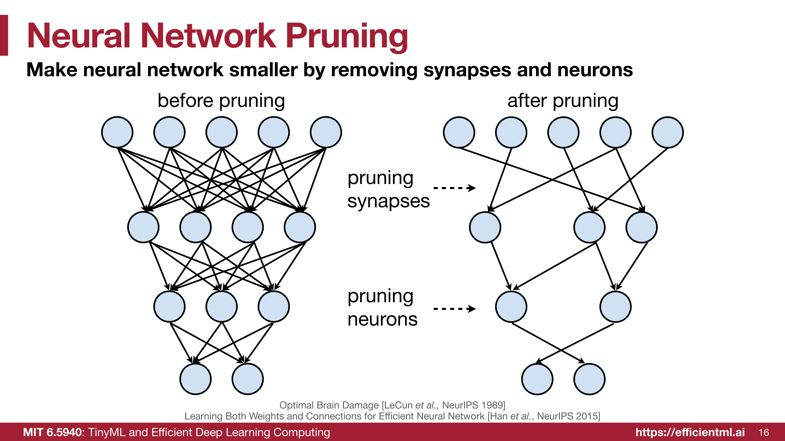
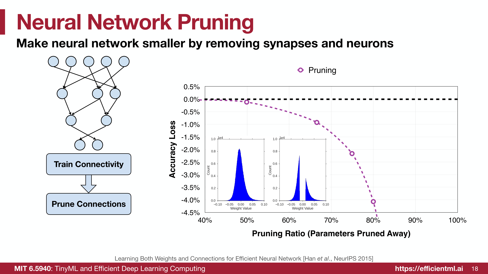
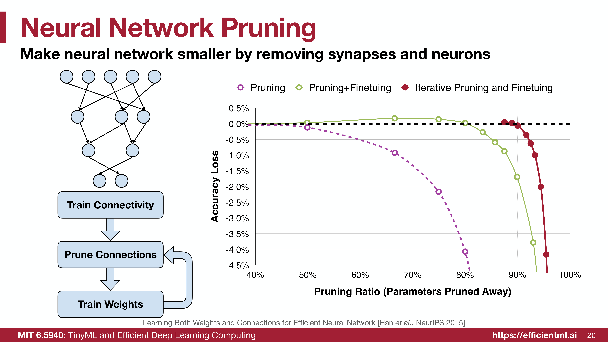
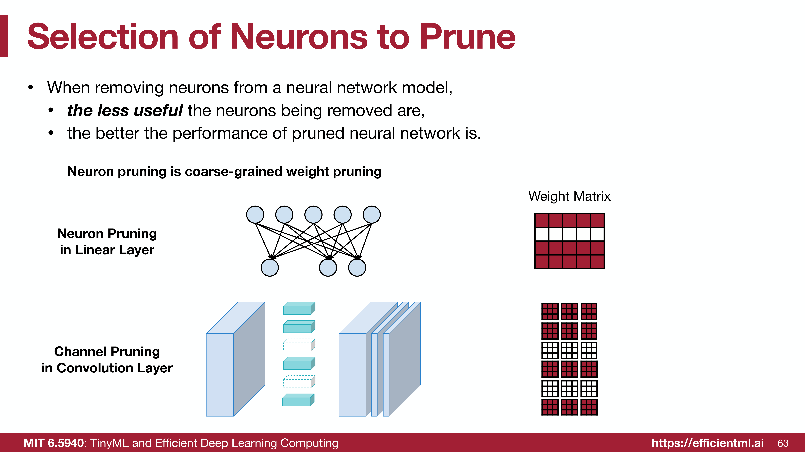
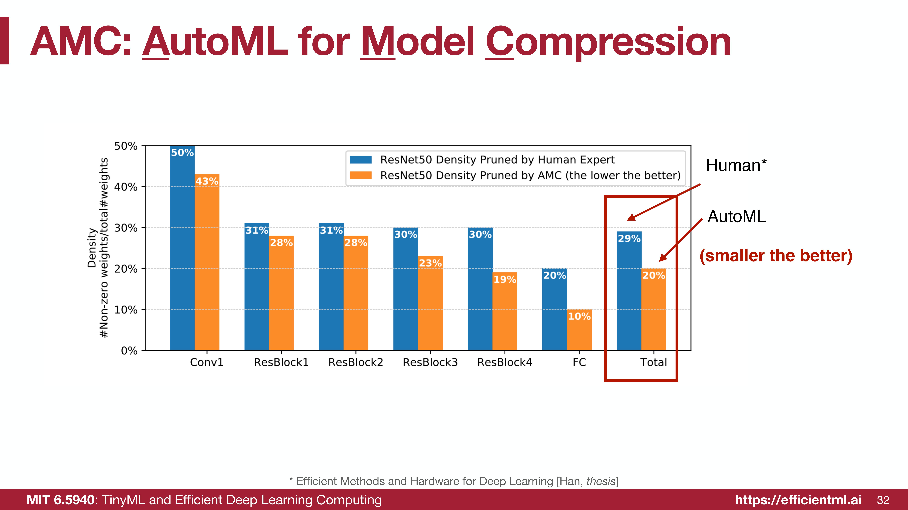
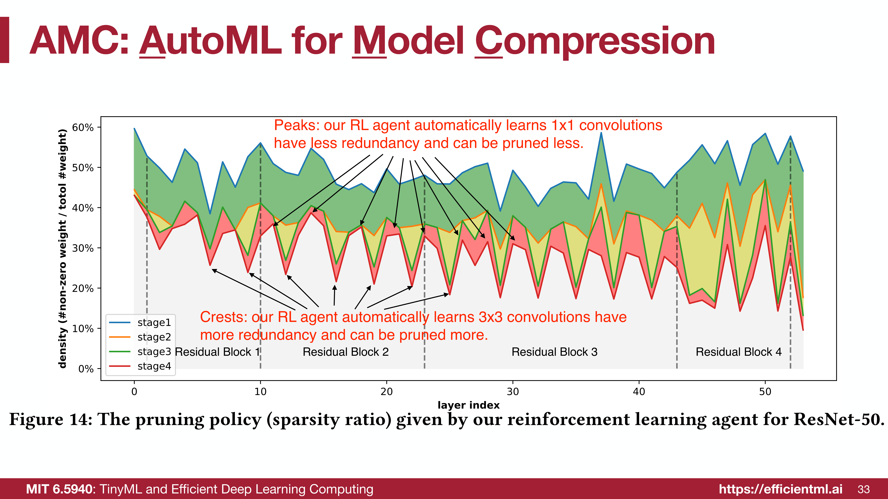
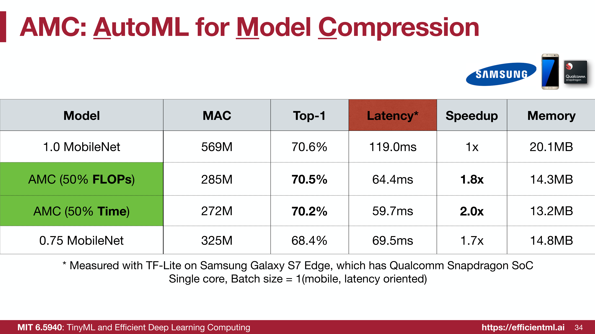
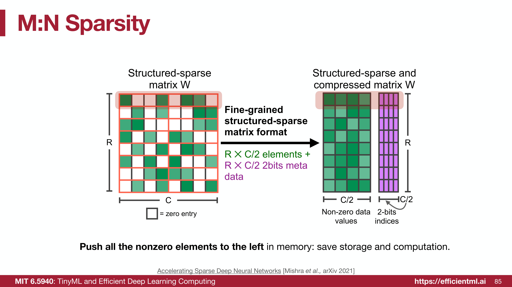
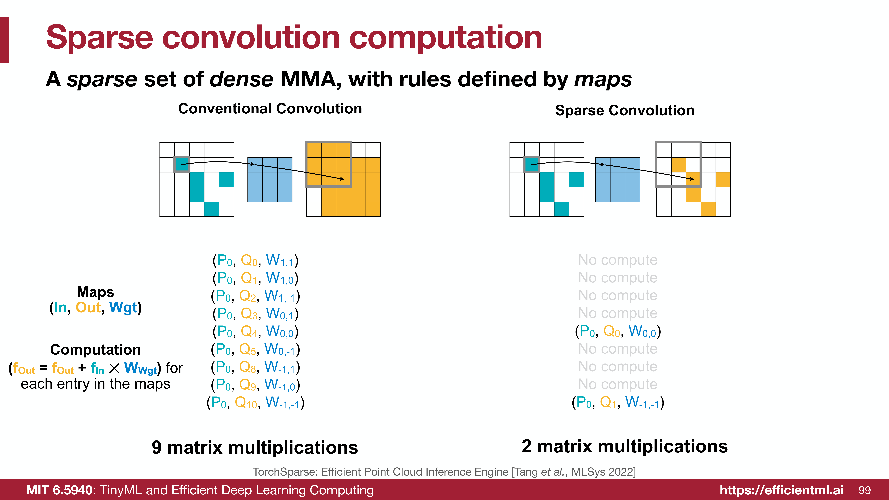
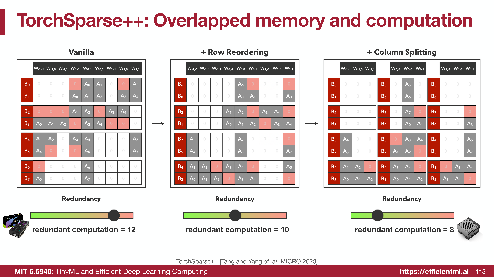

# 剪枝： Pruning and Sparsity 

总体框架：
- 总体概念和流程
- 剪枝粒度：怎么打包，怎么剪？
	- 细粒度/非结构化
	- 粗粒度/结构化
	- 一些常见的剪枝方式
		- **细粒度剪枝 (Fine-grained Pruning)**
		- **向量级剪枝 (Vector-level Pruning**
		- **模式剪枝 (Pattern-based Pruning)**
		- **核级剪枝 (Kernel-level Pruning)**
		- **通道级/滤波器级剪枝 (Channel-level / Filter Pruning)**
- 权重剪枝：我们应该剪掉哪些突触（权重）和神经元？
	- 基本原则：**移除的参数越不重要，剪枝后模型的性能就越好。**
	- 1. 基于幅度的剪枝（单个：取绝对值；结构：Lp范数）
	- 2. 基于缩放因子的剪枝：利用现有的神经网络结构来寻找“不重要”的通道
- 神经元剪枝：（更加粗粒度）移除某个神经元
	- 1. 基于零激活百分比的剪枝：一个神经元的输出如果经常为零就是不重要的
	- 2. 基于回归的剪枝：最小化剪枝对**本层输出的重构误差**
- 剪枝率：为不同层设置不同的稀疏度
	- 1. 通过敏感度分析确定剪枝率
	- 2. 自动剪枝
		- 1. AMC 强化学习
		- 2. NetAdapt
- 后续步骤：
	- 1. 微调
	- 2. 迭代剪枝
	- 3. 正则化
- 系统/硬件对稀疏性的支持：硬件上加速稀疏计算
	- 1. **EIE (Efficient Inference Engine)**: 同时支持权重稀疏性 (Weight Sparsity) 和激活稀疏性 (Activation Sparsity)。
	- 2. **NVIDIA Tensor Core**: 支持 M:N 权重稀疏性。
	- 3. **TorchSparse**
	- 4. **PointAcc**
## 一、剪枝的基本概念 (Neural Network Pruning)

### 1. 剪枝问题的数学形式化

> [!note] 剪枝定义
> 神经网络在训练完成后，通常包含大量的参数（权重），其中很多参数的值非常小，对最终的预测结果贡献微乎其微。剪枝就是把这些“没用”或“不重要”的神经元、连接（权重）直接删掉，从而让模型变得更轻量。
> 
> 

通常，我们可以将剪枝问题形式化为一个带约束的优化问题。

> [!abstract] 定义：剪枝的形式化
> 我们的目标是找到一组被剪枝后的权重 $W_p$，使其在最小化损失函数 $L(x; W_p)$ 的同时，满足一定的稀疏性约束。
> $$
> \arg \min_{W_p} L(x; W_p)
> $$
> subject to
> $$
> ||W_p||_0 < N
> $$
>
> - $L$ 代表神经网络训练的目标函数（损失函数）。
> - $x$ 是输入数据，$W$ 是原始权重，$W_p$ 是剪枝后的权重。
> - $||W_p||_0$ 是 L0 范数，表示 $W_p$ 中非零元素的个数。
> - $N$ 是我们预设的目标非零元素数量上限。

这个过程可以直观地理解为：在尽可能不影响模型表现（最小化 $L$）的前提下，让网络中的非零权重数量尽可能少（满足 $||W_p||_0 < N$）。

### 2. 剪枝的核心流程与效果

一个典型的剪枝流程包含三个关键步骤，并且通过迭代执行可以取得更好的效果：

1.  **训练连接性 (Train Connectivity)**：首先，正常训练一个完整的、密集的神经网络，使其权重得到充分学习。
2.  **剪枝连接 (Prune Connections)**：根据某个重要性标准（例如，权重的大小），移除不重要的连接。这一步会导致模型精度有一定程度的下降，特别是当剪枝率较高时。
    

3.  **重新训练权重 (Train Weights / Fine-tuning)**：固定网络的稀疏结构（即被剪掉的连接不再恢复），**只对剩余的连接进行微调训练**。这一步可以显著恢复甚至超过原始模型的精度。

**通过简单剪枝（紫色曲线），模型精度随剪枝率增加而急剧下降。但经过微调后（绿色曲线），模型精度可以在很高的稀疏度下得以保持。**

> [!warning] 迭代剪枝
> 单次大幅度的剪枝可能会对模型造成不可逆的损害。**采用迭代剪枝 (Iterative Pruning) 的策略，即“剪枝-微调-再剪枝-再微调”的循环，可以逐步达到更高的稀疏度，同时保持优异的性能（红色曲线）。**




> [!hint]- 相关工作
> - https://github.com/mit-han-lab/pruning-sparsity-publications 
> - Optimal Brain Damage
> - Deep Compression
> - EIE
> - Learning both Weights and Connections for Efficient Neural Networks

## 二、剪枝粒度 (Pruning Granularity)

剪枝可以从不同的粒度上进行，从非结构化到结构化，这直接影响了压缩率和硬件加速的难易程度。

我们以一个简单的二维权重矩阵为例来理解不同粒度。
### 1. 非结构化剪枝 vs. 结构化剪枝

- **细粒度/非结构化剪枝 (Fine-grained/Unstructured)**：
	- **定义**：这是最灵活的剪枝方式，允许随意剪掉权重矩阵中的任意独立元素。
	- **优势**：由于选择保留权重的自由度最大，通常能达到最高的**压缩比 (Compression Ratio)**，因为算法可以精准地只保留最重要的连接。
	- **劣势**：导致的稀疏矩阵非常**不规则 (Irregular)**。这种不规则性会导致内存访问效率低下，难以在通用硬件（如 GPU）上实现并行加速
	- **适用场景**：需要极致压缩模型大小，且有专用硬件支持（如 EIE）的场景。
- **粗粒度/结构化剪枝 (Coarse-grained / Structured Pruning)**
	- **定义**：按照规则的几何结构进行剪枝，例如剪掉整个**向量 (Vector)**、**卷积核 (Kernel)** 或 **通道 (Channel)**。
	- **优势**：剪枝后的权重矩阵仍然保持规则形状（只是变小了）。这使得它非常**容易加速 (Easy to accelerate)**，因为可以直接利用现有的密集矩阵计算库（如cuBLAS）和通用硬件。
	- **劣势**：灵活性最差。如果强制剪掉整个通道，可能会误删该通道中某些重要的具体连接，导致要在保持精度的前提下获得高压缩比变得困难

具体的剪枝方式有如下几种，我们假设是一个2D Conv的模型，卷积层的权重张量通常有四维：$[c_o, c_i, k_h, k_w]$

- **细粒度剪枝 (Fine-grained Pruning)**：
    - **定义**：在 $c_o, c_i, k_h, k_w$ 任意维度上独立选择，剪掉独立的权重元素。
    - **特点**：灵活性最高，通常能获得最高的压缩比（Compression Ratio）。
    - **缺点**：生成的稀疏矩阵极**不规则**，导致内存访问效率低，在通用硬件（如 GPU）上**难以加速**，通常需要专门的硬件（如 EIE）支持。
- **向量级剪枝 (Vector-level Pruning**: 
	- **定义：** 对于一个尺寸为 $k_h \times k_w$ 的卷积核（Kernel），向量级剪枝是指剪掉其中的**某一行**（$1 \times k_w$）或者**某一列**（$k_h \times 1$）。
    - **特点**：属于结构化剪枝的一种，但粒度较细。
    - **优点**：比剪掉整个核更灵活，可以只保留核中最重要的行或列特征。
    - **缺点**：虽然比随机剪枝规则，但留下的“残缺”卷积核在常规计算阵列上仍然可能导致索引不连续，加速相对困难。
- **模式剪枝 (Pattern-based Pruning)**：
    - **定义**：规定在任意连续的 **$M$** 个输入通道（或权重元素）中，必须有 **$N$** 个元素被剪掉（置为0）。
    - 这种方式属于**半结构化 (Semi-structured)** 剪枝。它在局部强加了结构约束（每组 $M$ 个），但在局部内部保留了选择权（哪 $N$ 个被剪掉是自由的）。
	- 著名：N:M Sparsity: 每 4 个连续的权重中，保留 2 个非零值，通过将非零值及其索引（只需 2-bit 即可表示 4 个位置中的一个）打包存储，可以节省存储和带宽
- **核级剪枝 (Kernel-level Pruning)**：
    - **定义**：剪掉整个卷积核 ($k_h \times k_w$)。
    - **物理含义**：相当于切断了**第 $i$ 个输入通道**到**第 $o$ 个输出通道**之间的连接。
    - **特点**：比细粒度更有序，但索引仍然具有一定的不规则性。
- **通道级/滤波器级剪枝 (Channel-level / Filter Pruning)**：
    - **定义**：
        - **Filter Pruning**: 剪掉整个 Filter（即移除某个 $c_o$ 对应的所有参数），直接减少输出特征图的数量。
        - **Channel Pruning**: 移除所有 Filter 中的特定输入通道（即移除某个 $c_i$ 对应的所有参数）。
    - **特点**：这是最**粗粒度 (Coarse-grained)** 的剪枝。剪枝后的模型仍然是规则的稠密矩阵（只是变小了），因此**最容易加速 (Easy to accelerate)**，无需特殊硬件支持。
    - **缺点**：灵活性最低，压缩比通常不如细粒度剪枝高。

## 三、权重剪枝

基本原则是：**移除的参数越不重要 (the less important)，剪枝后模型的性能就越好。**

> [!example] 例题
> 假设一个神经元的计算为 $y = \text{ReLU}(10x_0 - 8x_1 + 0.1x_2)$，其权重向量为 $W = [10, -8, 0.1]$。如果要移除其中一个权重，应该移除哪一个？
>
> 直观上，权重 $0.1$ 的绝对值最小，它对输出的贡献也最小，因此最有可能成为被剪枝的对象。

### 1. 基于幅度的剪枝 (Magnitude-based Pruning)

这是一种启发式的、但非常有效且广泛使用的剪枝标准。

> [!abstract] 定义: 基于幅度的剪枝
> 该方法认为，**绝对值越大的权重越重要**，而绝对值越小的权重则越不重要，可以被安全地移除。

- **元素级剪枝 (Element-wise pruning)**：
  $Importance = |W|$
- **结构化剪枝 (如行剪枝)**：
  可以使用 L1-norm 或 L2-norm 来衡量一个结构（如一行权重）的整体重要性。
  - **L1-norm**: $Importance = \sum_{i \in S} |w_i|$
  - **L2-norm**: $Importance = \sqrt{\sum_{i \in S} |w_i|^2}$
  - **通用 Lp-norm**: $||W^{(S)}||_p = \left( \sum_{i \in S} |w_i|^p \right)^{\frac{1}{p}}$


> [!note]+ 基于L1-norm的相关代码
> ```python
> def fine_grained_prune(tensor: torch.Tensor, sparsity : float) -> torch.Tensor:
>     """
>     magnitude-based pruning for single tensor
>     :param tensor: torch.(cuda.)Tensor, weight of conv/fc layer
>     :param sparsity: float, pruning sparsity
>         sparsity = #zeros / #elements = 1 - #nonzeros / #elements
>     :return:
>         torch.(cuda.)Tensor, mask for zeros
>     """
>     sparsity = min(max(0.0, sparsity), 1.0)
>     if sparsity == 1.0:
>         tensor.zero_()
>         return torch.zeros_like(tensor)
>     elif sparsity == 0.0:
>         return torch.ones_like(tensor)
> 
>     num_elements = tensor.numel()
> 
>     # Step 1: calculate the #zeros (please use round())
>     num_zeros = round(sparsity*num_elements)
>     # Step 2: calculate the importance of weight
>     importance = torch.abs(tensor)
>     # Step 3: calculate the pruning threshold
>     threshold = torch.topk(importance.view(-1),num_elements-num_zeros).values.tolist()[-1]
>     # Step 4: get binary mask (1 for nonzeros, 0 for zeros)
>     mask = torch.ge(importance, threshold)
>     # Step 5: apply mask to prune the tensor
>     tensor.mul_(mask)
> 
>     return mask
> ```
> 
> 实际使用时打包成`apply`函数：
> 
> ```python
> class FineGrainedPruner:
>     def __init__(self, model, sparsity_dict):
>         self.masks = FineGrainedPruner.prune(model, sparsity_dict)
> 
>     @torch.no_grad()
>     def apply(self, model):
>         for name, param in model.named_parameters():
>             if name in self.masks:
>                 param *= self.masks[name]
> 
>     @staticmethod
>     @torch.no_grad()
>     def prune(model, sparsity_dict):
>         masks = dict()
>         for name, param in model.named_parameters():
>             if param.dim() > 1: # we only prune conv and fc weights
>                 masks[name] = fine_grained_prune(param, sparsity_dict[name])
>         return masks
> ```


### 2. 基于缩放因子的剪枝 (Scaling-based Pruning)

核心思想：利用现有的神经网络结构来寻找“不重要”的通道

利用BN层：$z_{out} = \gamma \cdot \frac{z_{in} - \mu}{\sqrt{\sigma^2 + \epsilon}} + \beta$.  


为了量化每个通道的重要性，我们给每个通道 $i$ 加上一个系数 $\gamma_i$。该通道所有的输出数值都要乘以这个 $\gamma_i$。

- 如果训练后 $\gamma_i$ 很大，说明这个通道被放大了，很重要。
- 如果训练后 $\gamma_i \approx 0$，说明这个通道所有的输出都被压缩成了 0，它就是我们要找的“废弃通道”。

BN 层的数学公式如下： $$ z_{out} = \gamma \cdot \frac{z_{in} - \mu}{\sqrt{\sigma^2 + \epsilon}} + \beta $$
所做的操作就是将输入 $z_{in}$ 转化成均值为0，方差是1的分布。这里的 $\gamma$ 是可训练参数


**具体操作流程**为：

1. **训练 (Training)**：正常训练模型，但要在损失函数中给 $\gamma$ 加一个 L1 正则化项（L1 Regularization）。
    - 为什么要加 L1： L1 正则化的作用是**稀疏化**，它会强迫那些对模型贡献不大的 $\gamma$ 变得越来越小，趋向于 0。
2. **筛选 (Selection)**：训练完成后，检查所有 BN 层的 $\gamma$ 值。把 $\gamma$ 绝对值很小的那些通道找出来。
3. **剪枝 (Pruning)**：直接把这些 $\gamma \approx 0$ 的通道（以及对应的卷积核）物理删除。
4. **微调 (Fine-tuning)**：重新训练一下剩余的网络，恢复精度。

### 3. 基于二阶信息的剪枝 (Second-Order-based Pruning) - OBD

泰勒级数展开, 有:

$$\begin{aligned}

\delta L &= L(x; W) - L(x; W - \delta W) \\

&\approx \sum_i g_i \delta w_i + \frac{1}{2} \sum_i h_{ii} \delta w_i^2 + \frac{1}{2} \sum_{i \neq j} h_{ij} \delta w_i \delta w_j

\end{aligned}$$

> [!tip]
> 二次项的推导实际上是: 
> $$\frac{1}{2} \delta \mathbf{W}^T \mathbf{H} \delta \mathbf{W} = \frac{1}{2} \sum_i \sum_j \delta w_i \delta w_j h_{ij}$$
> 
> 把 $i=j$ 和 $i \neq j$ 的情况分开写：
> 
> - **对角线项 ($i=j$)**: $\frac{1}{2} \sum_i h_{ii} \delta w_i^2$ 
> - **非对角线项 ($i \neq j$)**: $\frac{1}{2} \sum_{i \neq j} h_{ij} \delta w_i \delta w_j$


由于OBD假设模型已经训练到极小值点，会导致梯度 $g_i \approx 0$，**第一项消失**。同时, 假设每个权重的变化互不影响，即 Hessian 矩阵是一个对角矩阵，所有的 $h_{ij} (i \neq j)$ 都为 0，所以**第三项消失**。从而达到最后只剩下中间那一项 $\frac{1}{2} h_{ii} \delta w_i^2$，**使得算重要性评分时只用看对角线元素**

因此，权重的重要性可以定义为：
  $$
  \text{importance}_{w_i} = |\delta L_i| = \frac{1}{2} h_{ii} w_i^2
  $$
我们会移除重要性得分最低的权重。

> [!warning] 计算难题
> **Hessian 矩阵的计算非常复杂且耗时**，尤其对于大型神经网络。这是二阶方法在实践中不如基于幅度的方法流行的主要原因。

## 四、神经元剪枝

选择剪枝神经元的原则与选择权重类似：**移除越不“有用” (the less useful) 的神经元，剪枝后模型的性能就越好。**
神经元剪枝（或通道剪枝）本质上是一种粗粒度的权重剪枝，因为移除一个神经元等同于移除其所有输入和输出连接对应的权重。



### 1. 基于零激活百分比的剪枝 (Percentage-of-Zero-Based Pruning)

> Network Trimming

由于广泛使用 ReLU 激活函数，很多神经元的输出激活值会是零。如果一个神经元的输出如果经常为零，那么它对网络后续层的贡献就很小，可以被认为是“不活跃”或“不重要”的。
因此**剪枝标准**可以设定为：计算每个神经元（或通道）在给定一批数据下的 **平均零激活百分比 (Average Percentage of Zero activations, APoZ)**。**APoZ 越高的神经元越不重要，应被优先剪枝。**

如下图：Batch=2：输入两个样本，Channel=3：每个样本有 3 个通道（即 3 个神经元/卷积核），Output Activations (4x4)：每个通道输出一个 $4 \times 4$ 的特征图，共有 16 个像素点。


根据上面的计算，Channel 2 含零率最高，所以被优先剪枝掉

### 2. 基于回归的剪枝 (Regression-based Pruning)

> Channel Pruning for Accelerating Very Deep Neural Networks

这种方法不直接关注最终任务的损失函数，而是旨在最小化剪枝对**本层输出的重构误差 (reconstruction error)**。

假设剪枝前某层的输出是 $Z = XW^T$，剪枝后的输出是 $\hat{Z}$。我们希望 $\hat{Z}$ 能尽可能地接近 $Z$。

我们的目标是最小化 $||Z - \hat{Z}||_F^2$。这个问题可以通过引入一个向量 $\beta_c \in \{0,1\}$ 来形式化，其中 $\beta_c=0$ 表示通道 $c$ 被剪枝。
  $$
  \arg \min_{W, \beta} ||Z - \sum_{c=0}^{c_i-1} \beta_c X_c W_c^T ||_F^2
  $$
  约束条件为 $||\beta||_0 \le N_c$ (保留 $N_c$ 个通道)。

采用交替优化的策略优化：
  1.  固定权重 $W$，求解最优的通道选择方案 $\beta$（这是一个 LASSO 回归问题）。
  2.  固定通道选择 $\beta$，通过最小二乘法求解最优的权重 $W$ 来最小化重构误差。

> [!note]- 补充：LASSO回归
> #### 1. 什么是 LASSO 结构及其求解方法？
> 
> **LASSO (Least Absolute Shrinkage and Selection Operator)**，全称是“最小绝对收缩和选择算子”。它的数学表达式通常长这样：
> 
> 
> * **结构特征：** 它由两部分组成。前半部分是**最小二乘项**（衡量预测值与真实值的差距），后半部分是 ** 正则项**（所有系数绝对值的和）。
> * **核心魔力：** 与常见的  正则化（Weight Decay）不同， 范数具有“稀疏诱导”性。它会无情地将许多不重要的系数  直接压缩为 **0**。这在数学上实现了一种**自动的特征选择**。
> * **求解方法：** 由于  项在 0 点处不可导，传统的梯度下降法并不适用。主流解法包括：
> 	* **坐标下降法 (Coordinate Descent)：** 每次只固定其他所有系数，只更新一个 ，通过迭代让结果收敛。
> 	* **近端梯度下降 (Proximal Gradient Descent/ISTA)：** 结合梯度下降与收缩算子（Shrinkage Operator）来处理不可导项。
> 
> 
> 
> ---
> 
> #### 2. 为什么通道剪枝问题符合 LASSO 结构？
> 
> 我们将剪枝的目标函数展开观察：
> $$\arg \min_{W, \beta} ||Z - \sum_{c=0}^{c_i-1} \beta_c (X_c W_c^T) ||_F^2$$
> 
> 为了方便理解，我们可以做如下类比：
> 
> * **目标 ：** 对应原始卷积层输出的特征图 。
> * **输入 ：** 对应每个输入通道  经过权重  变换后的结果。我们可以把  看作是第  个通道对最终输出的“贡献分量”。
> * **系数 ：** 这就是我们要找的**开关**（或者说权重）。 意味着该通道彻底被关闭（剪枝）， 意味着保留。
> 逻辑联系：
> 
> 当我们引入约束 $||\beta||_0 \le N_c$（限制非零开关的个数）时，这在本质上是一个难以求解的组合爆炸问题。通过凸松弛（Convex Relaxation），我们将 $L_0$ 约束转化为 $L_1$ 惩罚项。
> 在原始问题中，约束条件 $||\beta||_0 \le N_c$ 是一个非凸且 NP-Hard 的组合优化问题（你需要从所有可能的通道组合中挑选出最优的 $N_c$ 个）。
> 
> 为了使其可解，通常会将约束转化为惩罚项，并进行松弛：
> 
> $L_0$ 范数（不可导）： 直接统计非零元素的个数。
> 
> $L_1$ 范数（凸函数）： 使用 $||\beta||_1$（各元素绝对值之和）来近似 $L_0$。
> 
> 此时，目标函数转化为：
> 
> $$\arg \min_{\beta} \frac{1}{2} ||Z - \sum_{c=0}^{c_i-1} \beta_c (X_c W_c^T) ||_F^2 + \lambda ||\beta||_1$$
> 此时，寻找“最优通道组合”的问题就完美转化为了一个 LASSO 回归问题：利用 $L_1$ 的特性，让那些对还原 $Z$ 贡献微乎其微的通道系数 $\beta_c$ 自动归零。
> 
> #### 3. 该问题的求解过程
> 
> 在实际操作中，我们通常采用**交替优化（Alternating Optimization）**的策略。
> 
> ##### 第一步：固定权重 $W$，求解通道开关 $\beta$
> 
> 此时问题变成了一个标准的 LASSO 回归。我们使用坐标下降法来寻找最优的 $\beta$：
> 
> 计算每个通道产生的特征分量。
> 
> 通过 LASSO 算法筛选出最具代表性的 $N_c$ 个通道（它们的 $\beta_c \neq 0$）。
> 
> 未被选中的通道对应的 $\beta_c$ 为 0，即完成了“剪枝决策”。
> 
> ##### 第二步：固定开关 $\beta$，更新权重 $W$
> 
> 在选定了保留哪些通道后，我们需要调整这些保留通道的权重 $W$，以进一步减小重建误差 $||Z - \hat{Z}||$。
> 
> 这是一个简单的最小二乘问题。
> 
> 通过闭式解或标准反向传播（SGD）更新权重，使得剩下的通道能“补偿”被剪掉通道流失的信息。

Pruning Demo ： https://colab.research.google.com/drive/1Z3Qne88hrTuojRwigIEyvUK5BCNJXeRZ?usp=sharing

## 五、剪枝率 (Pruning Ratio)

我们已经知道，**非均匀的剪枝策略通常优于简单的均匀缩减**。这意味着为不同层设置不同的稀疏度，比让所有层都压缩相同的比例效果更好。这是因为网络中的不同层对剪枝的“抵抗力”或“敏感度”是不同的。

那么，核心问题就变成了：**我们应该如何科学地为每一层确定其独特的剪枝率呢？**

### 1. 通过敏感度分析确定剪枝率

一种直观的方法是分析网络中每一层对剪枝的敏感度 (sensitivity)。

由于不同层的功能和冗余度各不相同，它们对剪枝的敏感度也存在差异。例如，通常认为网络的第一层负责提取基础特征，因此可能更为敏感；而一些中间层可能存在较多的冗余，对剪枝不那么敏感。

因此，我们可以通过执行**敏感度分析 (sensitivity analysis)** 来量化这种差异，并据此为每一层分配合适的剪枝率。


下面以 VGG-11 模型在 CIFAR-10 数据集上的剪枝为例，介绍敏感度分析的具体步骤：

1.  **选择一个层**：从模型中选取第 $L_i$ 层。
2.  **独立剪枝并评估**：对该层应用一系列不同的剪枝率 $r \in \{0, 0.1, 0.2, ..., 0.9\}$，并观察模型在验证集上准确率的下降情况 $\Delta Acc_r^i$。**在此过程中，模型的其他层保持不变。**
    
3.  **遍历所有层**：对模型中的每一层重复上述过程，为每一层都生成一条“剪枝率-准确率”曲线。
	
4.  **分析结果**：通过绘制出的曲线图，我们可以直观地比较不同层的敏感度。曲线下降平缓的层（如上图中的 L1 层）对剪枝不敏感，可以承受较高的剪枝率;曲线陡峭下降的层（如下图中的 L0 层）对剪枝非常敏感，只能承受较低的剪枝率。
5.  **设定阈值并确定剪枝率**：选择一个可接受的准确率下降阈值 $T$（例如，精度下降不超过 1%）。然后，对于每一层，找到其曲线与阈值线相交的点，该点对应的横坐标即为该层可以使用的最大剪枝率。
    

> [!warning] 敏感度分析的局限性
> 这种方法是**次优的 (sub-optimal)**。因为它在分析每一层时都假定其他层不变，**忽略了不同层之间的相互作用 (interaction)**。例如，同时剪枝两层所带来的影响，可能并不等于单独剪枝这两层影响的简单叠加。因此，我们尝试用自动剪枝的方法来克服这样的局限性

### 2. 自动剪枝 (Automatic Pruning)

自动剪枝的目标是，在给定一个**全局压缩率**的情况下，自动地为我们找到一组最优的**逐层剪枝率**。由于依赖于人类专家的经验和大量的试错，效率低下且难以找到最优解。因此，我们希望用 AutoML (自动化机器学习) 来自动完成这个复杂的搜索过程。

#### 2.1. AMC: 使用强化学习进行模型压缩

AMC (AutoML for Model Compression) 框架创新地将剪枝问题建模为一个强化学习 (Reinforcement Learning, RL) 问题。

>https://arxiv.org/abs/1802.03494 没学过强化学习的知识，具体算法的设计没仔细看

AMC 的强化学习设置如下：
- **环境**：待剪枝的神经网络
- **状态**: 包含层索引、通道数、卷积核大小、FLOPs 等特征。
- **动作**: 一个连续值 $a \in [0, 1)$，代表剪枝率。
- **智能体**: DDPG agent，因为它支持连续动作空间。
- **奖励**: $R = \begin{cases} -\text{Error}, & \text{if satisfies constraints} \\ -\infty, & \text{if not} \end{cases}$。
- **优化目标**: 也可以通过预构建的查找表 (LUT) 来优化**延迟 (latency)** 等硬件相关的指标。

> [!note]- 实验结果
> 
> 在 ResNet50 上的实验表明，AMC 自动找到的剪枝策略（橙色柱）通常比人类专家设计的策略（蓝色柱）更优，能够在大多数层实现更高的压缩率，最终得到一个更小的模型。
> 
> 
> 
> AMC 学习到的剪枝策略揭示了一些深刻的规律：
> - **峰值 (Peaks)**：RL 智能体自动学习到 **1x1 卷积的冗余度较低，因此剪枝较少**。
> - **波谷 (Crests)**：RL 智能体发现 **3x3 卷积的冗余度更高，因此可以被更多地剪枝**。
> 这个发现符合常规的认知，但 AMC 是通过自动化学习过程独立发现的。
> 
> 
> 
> 在移动设备上的实际测试也验证了 AMC 的有效性。通过 AMC 对 MobileNet 进行剪枝，**可以在精度几乎没有损失的情况下，实现 1.8x 到 2.0x 的推理速度提升**。
> 
> 
> 
#### 2.2 NetAdapt: 基于规则的迭代式方法

NetAdapt 是另一种自动寻找逐层剪枝率的方法，它不使用强化学习，而是采用一种**基于规则的迭代式/渐进式 (iterative/progressive) 策略**。

**算法流程**：

该算法以一个全局资源约束（例如，目标延迟）为指导，迭代地进行剪枝。

1.  **设定目标**：在每一轮迭代中，目标是将当前模型的延迟再减少一个固定的量 $\Delta R$（由人工设定）。
2.  **逐层试探**：对于网络中的每一层 $L_k$，尝试对其进行剪枝，直到该层的延迟减少量恰好满足 $\Delta R$。（这通常基于一个预先构建的查找表）。
3.  **短期微调与评估**：对每一种试探性剪枝后的模型进行一次短暂的微调（例如 10k 次迭代），并记录其准确率。
4.  **选择最优**：在所有层的试探结果中，选择那个**准确率最高的方案**，并将其作为本轮迭代的最终剪枝决策。
5.  **循环迭代**：重复以上步骤，直到整个模型的总延迟减少量满足全局约束。
6.  **长期微调**：在所有迭代结束后，对最终得到的剪枝模型进行一次充分的、长期的微调，以完全恢复其性能。


NetAdapt迭代的特性使我们能够自然地获得**一系列具有不同成本（延迟）和性能（准确率）权衡的模型**，从而能供用户根据实际需求进行选择。类似：


## 六、Fine-tuning

确定了剪枝的粒度、标准和比率之后，下一个关键步骤是如何通过训练来提升稀疏模型的性能。
### 6.1. 微调已剪枝的神经网络

剪枝操作，特别是高比例的剪枝，通常会导致模型精度下降。微调 (Fine-tuning) 是恢复精度并进一步推高剪枝率上限的关键步骤。用于微调的学习率通常远小于原始训练的学习率**，一般设为原始学习率的 **1/100 或 1/10**。


代码实现：

```python
num_finetune_epochs = 5
optimizer = torch.optim.SGD(model.parameters(), lr=0.01, momentum=0.9, weight_decay=1e-4)
scheduler = torch.optim.lr_scheduler.CosineAnnealingLR(optimizer, num_finetune_epochs)
criterion = nn.CrossEntropyLoss()

best_sparse_model_checkpoint = dict()
best_accuracy = 0
print(f'Finetuning Fine-grained Pruned Sparse Model')
for epoch in range(num_finetune_epochs):
    # At the end of each train iteration, we have to apply the pruning mask
    #    to keep the model sparse during the training
    train(model, dataloader['train'], criterion, optimizer, scheduler,
          callbacks=[lambda: pruner.apply(model)])
    accuracy = evaluate(model, dataloader['test'])
    is_best = accuracy > best_accuracy
    if is_best:
        best_sparse_model_checkpoint['state_dict'] = copy.deepcopy(model.state_dict())
        best_accuracy = accuracy
    print(f'    Epoch {epoch+1} Accuracy {accuracy:.2f}% / Best Accuracy: {best_accuracy:.2f}%')
```

### 6.2. 迭代剪枝 (Iterative Pruning)

如前所述，一次性进行高比例的“激进”剪枝，往往效果不佳。更好的策略是采用迭代剪枝。

将一次“剪枝 + 微调”视为一轮迭代，在每一轮迭代中，逐步增加目标稀疏度。例如，从 30% -> 50% -> 70%。这个渐进的过程使得网络有时间去适应新的稀疏结构，从而达到更高的最终压缩率。

相比于一步到位的激进剪枝，**迭代剪枝可以将 AlexNet 的剪枝率从 5x 提升到 9x**，性能也更好。


### 6.3. 正则化 (Regularization)

在训练或微调过程中，添加正则化项到损失函数中是一种有效提升剪枝性能的手段。其目标是：
- **惩罚非零参数 (penalize non-zero parameters)**
- **鼓励更小的参数 (encourage smaller parameters)**

最常见的用于剪枝的正则化方法是 L1/L2 正则化。
- **L1-Regularization**: $L' = L(x; W) + \lambda|W|$。L1 正则化天然地会引导权重趋向于零，产生稀疏性。
- **L2-Regularization**: $L' = L(x; W) + \lambda||W||^2$。L2 正则化（权重衰减）会使权重值变小，与基于幅度的剪枝方法相辅相成。

> [!example]-
> - **基于幅度的细粒度剪枝**通常会应用 **L2 正则化**在权重上。
> - **Network Slimming**（一种通道剪枝方法）则是在通道的缩放因子上应用 **smooth-L1 正则化**。
> 

## 七、系统与硬件对稀疏性的支持

算法层面的剪枝最终需要系统和硬件的支持才能转化为实际的性能提升。目前主流的支持方向包括：
- **EIE (Efficient Inference Engine)**: 同时支持权重稀疏性 (Weight Sparsity) 和激活稀疏性 (Activation Sparsity)。
- **NVIDIA Tensor Core**: 支持 M:N 权重稀疏性。
- **TorchSparse & PointAcc**: 专注于激活稀疏性，特别是在处理稀疏输入（如点云）的场景。

### 1. EIE: 高效推理引擎

EIE 是早期针对稀疏和压缩模型的专用 DNN 加速器，核心思想是利用**权重稀疏性**和**激活稀疏性**来避免不必要的计算，因为 $0 \times A = 0$ 和 $W \times 0 = 0$。

EIE 通过专门的硬件设计来处理稀疏矩阵乘法。由于EIE执行的是稀疏向量与稀疏矩阵的乘法，它将稀疏矩阵以压缩格式（例如，CSC 格式，包含非零值、行索引和列指针）存储，并设计了相应的解码和计算单元。

> [!example]
> 

例如：执行如下稀疏矩阵和稀疏向量的计算，其存储格式如下：（下图Physically）


计算架构上：

1. 首先整个大的稀疏的权重矩阵被分成了PE0,PE1,PE2,PE3


2. 由 Central Control 通过总线，广播每一个向量的元素到 PE。

第一个向量元素是0，就什么也不做。

当 $a_1$ 广播过来时，PE0 检查自己负责的行：在位置 1 有非零权重 $w_{0,1}$，于是计算 $w_{0,1} \times a_1$ 并累加到结果 $b_0$。

PE2 检查发现位置 1 有 $w_{2,1}$，于是累加到 $b_2$。

PE1 和 PE3 检查发现自己在位置 1 的权重全是 0（图中加粗的 0），所以它们这一轮什么都不做。

数据流的核心是**跳过所有与零相关的乘法运算**，无论是激活值为零还是权重为零。

> PE的操作是异步的，也就是 $a_1,a_3$ 一起到达PE, 然后根据队列的规则 FIFO

此外，EIE 的每个处理单元 (PE) 都包含专门为稀疏计算设计的微架构，如激活队列、稀疏矩阵访问单元、权重解码器和地址累加器等，以高效地处理不规则的数据访问和计算。


- **负载均衡 (Load Balance)**：通过中央控制器和激活值队列，将非零激活值动态分发给空闲的 PE，以解决稀疏性导致的工作负载不均衡问题。

> [!note]- Pros & Cons
> - **优点 (Pro)**:
>   - 证明了专用硬件处理稀疏操作的成本效益。
>   - 同时利用权重和激活稀疏性，节省能量和计算周期。
>   - 支持细粒度稀疏，并结合 4-bit 量化，W4A16 的思想在现代 LLM 中（如 GPTQ, AWQ）得以“重生”。
> - **缺点 (Con)**:
>   - 不易应用于向量处理器，需要结构化稀疏 (N:M) 来改进。
>   - 控制流和存储开销较大，需要粗粒度稀疏来改进。
>   - 仅支持全连接层（但在 LLM 中以新形式回归）。
>   - 假设所有数据能放入 SRAM，适用于 TinyML，但不适用于 LLM。
> 

### 2. NVIDIA Tensor Core: M:N 权重稀疏性

现代 NVIDIA GPU 通过 Tensor Core 为结构化稀疏提供了硬件支持。
**M:N 稀疏性**，特别是 **2:4 稀疏**，意味着每 4 个连续的权重中有 2 个是非零的。

- **存储**：非零的权重值和它们的相对位置索引（只需 2 bits）被紧凑地存储起来，将存储需求减半。
- **计算**：硬件可以直接利用这些索引来选择性地加载和计算，**跳过与零权重的乘法**，从而将计算吞吐量翻倍。

其物理存储如下：
- **数值提取（绿色部分）**：只保留那两个非零的权重值。因此，原来的 $C$ 列数据变成了 $C/2$ 列。
- **元数据编码（紫色部分）**：因为我们只存了数值，硬件需要知道这些数值原来在 4 个格子里的哪个位置。所以额外需要 **2-bits 的元数据（Metadata）** 来记录索引（Index）。



根据存储的规则设计相应的结构，让硬件根据紫色 2-bit 索引，从 B 矩阵对应的 4 个元素中，“挑出”那 2 个与 A 矩阵非零权重位置相匹配的元素。计算上原本需要做 4 次乘法，现在只做2 次乘法，因此实现了吞吐量翻倍


### 3. TorchSparse

当输入数据本身就是稀疏的，例如 3D 点云，此时的稀疏性主要来自于**激活值 (Activation)**。

- **TorchSparse**: 一个专为稀疏卷积设计的软件库。
- **PointAcc**: 一个专为稀疏卷积设计的硬件加速器。

- **稀疏卷积**：只在输入和输出都存在非零激活值的位置进行计算，从而避免了不必要的计算，并保持了输出的稀疏性。

- 稀疏卷积的计算可以被看作是**一系列由“映射 (maps)”定义的稠密矩阵乘法**。这个“映射”记录了输入、输出和权重之间的哪些位置需要进行计算。常规卷积需要计算所有 9 个位置的映射，而稀疏卷积可能只需要计算 2 个。如下图：



现有的 GPU 稀疏卷积实现是**权重固定 (weight-stationary)** 的，即为每个权重位置（如 $W_{-1,-1}$ , $W_{-1,0}$ 等）调用一次独立的 matmul 内核。

例如下图中，对于$W_{-1,-1}$，左边的索引表列举了其对应的输入、输出对（$P_0 \leftrightarrow Q_1$，$P_3 \leftrightarrow Q_4$）. GPU会逐一的处理相应的权重，做matmul运算：


TorchSparse结构如下图，进行了如下优化：


#### 3.1 Adaptive Grouping (自适应分组)

观察图中中间的 **Matrix-Matrix Multiplication** 部分：

 在稀疏卷积中，有的权重位（如 $W_{-1,1}$）可能只对应 1 个点，有的则对应很多个点。如果单独计算，那个只有 1 个点的计算会非常慢（无法填满 GPU 并行单元）。

TorchSparse 把这些任务进行了“打包”。
- **BMM (Batch Matrix Multiplication)：** 它把任务量相近的几个权重位（如 $W_{-1,-1}$ 到 $W_{1,1}$）归为一组。尽管这些矩阵的行数（点数）原本不一样，但它通过 **Padding（填充）** 的方式把它们对齐。
- **Padding 的意义：** 注意图中 $W_{-1,0}$ 对应的输入框里有绿色的 **"pad"** 虚线。这表示虽然实际上只有 1 个点，但我强行补成 2 个点的长度。虽然多算了一些“废话”，但这样可以使用规整的 **BMM** 指令一气呵成，避开了多次启动小 Kernel 的开销。

#### 3.2 Locality-Aware Access (局部性感知访问)

为了克服随机访存带来的Miss，多加了Gather这一步：

图中左右两边的紫色方块代表了数据的搬运：
- **Gather (聚合)：** 根据 Map 表，把分散在内存里的 $F_0, F_1, F_3...$ 搬运到一起，组成连续的 Buffer 给 BMM 使用。
- **Scatter-Accumulate (离散累加)：** 计算完 Partial Sum (PSUM) 后，再把结果写回到对应的输出点位（如 $F_4$）中。
- **优化点：** TorchSparse 会优化这些点在内存里的排列顺序，尽量让相邻的计算读取相邻的内存，减少 GPU 访存的延迟。


> [!note]- 后续的工作：TorchSparse++
> 简单来说，TorchSparse 解决了“慢”的问题，而 TorchSparse++ 在解决“浪费”的问题。
> 
>  
>
> ---
> 
> #### 1. 核心矛盾：Redundancy（冗余计算）
> 
> 在第一张图中，为了让多个权重位（ 等）能一起跑批处理矩阵乘法（BMM），我们必须进行 **Padding**。图中绿色的 "pad" 就是冗余，也就是第二张图里红色的 **"0"**。
> 
> * **代价：** 虽然计算变规整了，但 GPU 花了大量算力去算 。第二张图的 "Vanilla"（原生分组）方案中，冗余计算量高达 **12**。
> 
> ---
> 
> #### 2. 进化一：Row Reordering（行重排）
> 
> 观察第二张图的中间部分：
> 
> * **操作：** 系统不再死板地按原始顺序排列数据（比如  到 ），而是把**数据分布相似的行**挪到一起。
> * **效果：** 你可以发现， 和  被放在了一个块里，由于它们的非零元素（灰色块 ）位置比较接近，拼凑在一起后，原本需要填充的红色  变少了。
> * **收益：** 冗余计算从 **12** 降到了 **10**。
> 
> ---
> 
> #### 3. 进化二：Column Splitting（列切分）
> 
> 这是最巧妙的一步，对应第二张图的右侧：
> 
> * **原理：** 传统的卷积核（比如 ）必须一次算完所有 9 个位置。但 **Column Splitting** 把这 9 个位置（列）切得更细，分成几个更小的子组。
> * **操作：** 将权重列重新组合。比如把  组成一个小 BMM，把其他位置组成另一个。
> * **效果：** 这样就像玩“俄罗斯方块”一样，我们可以更灵活地把灰色块（有用数据）拼在一起。图中可以看到，通过这种切分，空间利用率大幅提升。
> * **收益：** 冗余计算进一步降到了 **8**。
> 
> ---
> 
> #### 4. 总结：TorchSparse++ 的三重优化
> 
> 结合这两张图，TorchSparse++ 的性能提升逻辑如下：
> 
> | 技术 | 解决的问题 | 图中体现 |
> | --- | --- | --- |
> | **Overlapped M&C** | 搬运数据的等待时间 | 隐藏了第一张图中的 **Gather** 耗时。 |
> | **Row Reordering** | 纵向对齐时的浪费 | 第二张图中间：行顺序变了，红块变少。 |
> | **Column Splitting** | 横向对齐时的浪费 | 第二张图右边：列被拆开了，拼凑更紧密。 |
### 4. PointAcc 硬件加速器

PointAcc 是一个专门为稀疏卷积设计的硬件加速器，主要要就解决的是【找到输入和输出点云之间的映射关系】。

它的核心创新是使用**归并排序 (Merge Sort)** 硬件单元来高效地找到输入和输出点云之间的映射关系。通过对输入坐标进行偏移（对应卷积核的不同位置）并与输出坐标进行排序和比较，可以快速找到需要进行计算的（输入，输出，权重）三元组。


以上图为例，基本步骤如下：

1. 偏移输入（Shift Input）：

对于卷积核中的每一个权重位（例如 $W_{-1,-1}$ 或 $W_{1,1}$），我们将所有输入点（$P_0 \sim P_4$）的坐标根据偏移量进行平移。

例如，要找 $W_{-1,-1}$ 的贡献，就把输入点坐标都加 $(1, 1)$。

2. 归并排序与求交（Merge Sort & Intersection）：

将偏移后的输入点坐标和预设的输出点坐标（$Q_0 \sim Q_4$）放在一起进行排序。

关键点：如果排序后发现两个坐标完全一致（图中带等号的圆圈），就说明找到了一组映射关系。

3. 生成映射表（Maps）：

最终生成一个三元组列表 (In, Out, Wgt)，告诉后续单元：$P_0$ 要和 $W_{-1,-1}$ 相乘，结果累加到 $Q_1$ 上。