# Transformer & Efficient LLM
## 一、Transformer 设计变体

虽然原始 Transformer 设计被广泛使用，但社区提出了许多变体：
*   **架构**：Encoder-decoder (T5), Encoder-only (BERT), Decoder-only (GPT).
*   **位置编码**：绝对位置编码 $\to$ 相对位置编码 (Relative PE).
*   **KV Cache 优化**：MHA $\to$ Multi-Query Attention (MQA) $\to$ Grouped-Query Attention (GQA).
*   **FFN**：FFN $\to$ GLU (Gated Linear Unit).

### 1. Encoder-Decoder 架构 (T5)

[code](https://github.com/google-research/text-to-text-transfer-transformer)

1. 使用 Encoder-Decoder 架构。
2. **T5 (Text-to-Text Transfer Transformer)**：把**所有** NLP 任务都变成了“翻译”任务，提供了一个统一的文本到文本框架，无论是翻译、分类还是摘要，都转换成 "输入文本 $\to$ 输出文本" 的形式。见下图：
	- **分类？** 输入 `sst2 sentence: I like this movie`，让模型生成单词字符串 `"positive"`。
	- **回归？** 输入 `stsb sentence1: ...`，让模型生成代表数值的字符串 `"3.8"`。
	- **摘要？** 输入 `summarize: ...`，生成摘要文本。
*   Prompt 输入 Encoder，Decoder 生成答案。


（图1：统一架构）


（图2：Encoder-Decoder）

### 2. BERT —— Encoder-only 架构

*   **BERT**：仅使用 Transformer 的 Encoder 部分。
*   **预训练目标**：
    1.  **掩码语言模型 (Masked Language Model, MLM)**：随机掩盖 15% 的输入 Token，训练模型预测这些被掩盖的 Token。这是双向的。
    2.  **下一句预测 (Next Sentence Prediction, NSP)**：预测句子 B 是否紧跟句子 A（现在较少使用）。
*   预训练模型通过**微调 (fine-tuned)** 应用于下游任务。

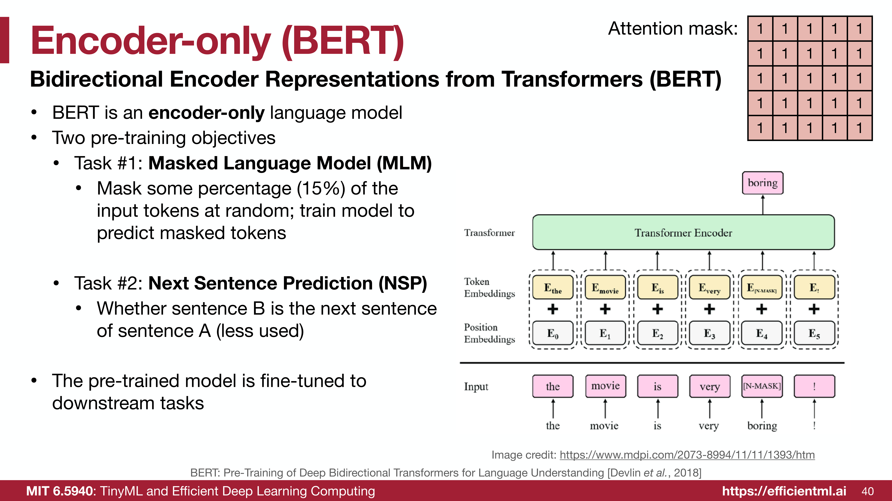

### 3. Decoder-only 架构 (GPT)

*   **GPT**：仅使用 Transformer 的 Decoder 部分。
*   **预训练目标**：**下一词预测 (Next word prediction)**。
    *   公式：$L_1(U) = \sum_i \log P(u_i | u_{i-k}, ..., u_{i-1}; \Theta)$
*   **特点**：
    *   较小的模型 (GPT-2) 进行微调（Fine Tuning）。
    *   较大的模型可以进行 **Zero-shot / Few-shot** 学习，无需微调参数。
*   注意 Mask 矩阵是下三角形式（因果掩码）。

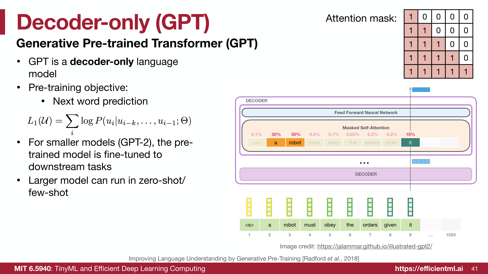


> [!note] 绝对 vs. 相对位置编码
> *   **绝对位置编码**：将位置信息融入输入 Embedding（进而影响 Q/K/V）。信息贯穿整个网络。
> *   **相对位置编码**：通过影响**注意力分数 (attention scores)** 来提供相对距离信息。通常是添加偏置或修改 Query 和 Key，而不直接修改 Value。
>     *   **优势**：具有更好的**外推性 (extrapolation)**，即 "Train short, test long"（在短序列上训练，在长序列上测试）。

### 4. ALiBi (Attention with Linear Biases)


在**标准的自注意力机制 (Self-Attention)** 中，计算查询 (Query) 和键 (Key) 的注意力得分公式为：

$$\text{Attention}(Q, K, V) = \text{softmax}\left(\frac{QK^T}{\sqrt{d_k}}\right)V$$

其中，$Q, K, V$ 分别代表查询、键和值矩阵，$d_k$ 是每个注意力头的维度。传统的做法是在输入 $Q$ 和 $K$ 之前，先将位置编码加到词嵌入 (Token Embedding) 上。

**ALiBi (Attention with Linear Biases)** 抛弃了词嵌入上的位置编码，而是直接在计算出的注意力得分（softmax 之前）上加一个**静态的偏置矩阵**。其公式变为：

$$\text{Attention}(Q, K, V) = \text{softmax}\left(\frac{QK^T}{\sqrt{d_k}} + m \cdot M\right)V$$

我们来拆解这个新增的项 $m \cdot M$：

1. **$M$ (距离矩阵, Distance Matrix)**：
    它衡量的是目标词（Query 的位置 $i$）和上下文词（Key 的位置 $j$）之间的相对距离。
    $$M_{i,j} = -|i - j|$$
    对于自回归（Causal）语言模型，由于只能看到当前及之前的词，通常 $j \le i$，所以距离就是 $-(i - j)$。这表示：**词与词之间的距离越远，惩罚（负值）就越大**。
    
2. **$m$ (特定于头的斜率, Head-specific Slope)**：
    
    这是一个常数标量（不参与训练更新），不同的注意力头 (Attention Head) 有不同的斜率。这样可以让不同的头关注不同范围的上下文。
    
    假设有 $H$ 个注意力头，斜率 $m$ 通常是一个几何数列。例如对于 8 个头，斜率分别是：
    
    $$m = \left\{\frac{1}{2^1}, \frac{1}{2^2}, \frac{1}{2^3}, \dots, \frac{1}{2^8}\right\} = \left\{\frac{1}{2}, \frac{1}{4}, \frac{1}{8}, \dots, \frac{1}{256}\right\}$$

**综合起来**：对于第 $h$ 个注意力头，位置 $i$ 的 Query 和位置 $j$ 的 Key 之间的未归一化注意力得分为：

$$\text{score}_{i,j}^{(h)} = \frac{q_i \cdot k_j}{\sqrt{d_k}} - m^{(h)} |i - j|$$

然后通过 softmax 转化为概率权重。距离越远，$|i-j|$ 越大，减去的值就越多，该位置的注意力权重就成指数级衰减。

```python
import torch
import math

def get_alibi_slopes(num_heads):
    """
    生成 ALiBi 中每个注意力头专属的斜率 (slopes)。
    如果是 8 个头，斜率将是: 1/2, 1/4, 1/8, 1/16, 1/32, 1/64, 1/128, 1/256
    """
    # 找到小于等于 num_heads 的最接近的 2 的幂次方
    closest_power_of_2 = 2 ** math.floor(math.log2(num_heads))
    
    # 计算基础的衰减底数 (例如当头数为 8 时，base 就是 0.5)
    base = 2 ** (-(2 ** -(math.log2(closest_power_of_2) - 3)))
    
    # 生成几何数列作为斜率
    slopes = [math.pow(base, i) for i in range(1, closest_power_of_2 + 1)]
    
    # 将其转换为 Tensor，并调整形状为 (num_heads, 1, 1)，
    # 这样在后续与形状为 (seq_len, seq_len) 的距离矩阵相乘时，可以利用 PyTorch 的广播机制 (Broadcasting)
    return torch.tensor(slopes, dtype=torch.float32).view(-1, 1, 1)

def alibi_attention(Q, K, V, num_heads, mask=None):
    """
    ALiBi 注意力机制的实现。
    参数:
        Q, K, V: 形状均为 (batch_size, num_heads, seq_len, head_dim)
        num_heads: 注意力头的数量
        mask: 掩码 (例如因果掩码 causal mask，用于遮蔽未来的词)
    """
    batch_size, _, seq_len, head_dim = Q.shape
    
    # 第 1 步: 计算标准的缩放点积注意力得分 (对应公式: QK^T / sqrt(d_k))
    # K.transpose(-2, -1) 将最后的序列长度和头部维度转置
    # scores 的形状: (batch_size, num_heads, seq_len, seq_len)
    scores = torch.matmul(Q, K.transpose(-2, -1)) / math.sqrt(head_dim)
    
    # 第 2 步: 创建相对距离矩阵 (对应公式中的 M)
    # position 形状: (seq_len,) -> [0, 1, 2, ..., seq_len-1]
    position = torch.arange(seq_len, device=Q.device)
    
    # 利用广播机制计算任意两个位置之间的距离 (i - j)
    # distance 形状: (seq_len, seq_len)
    distance = position.unsqueeze(1) - position.unsqueeze(0)
    
    # 取绝对值的负数，表示距离越远惩罚越大 (对应公式: -|i - j|)
    distance = -torch.abs(distance) 
    
    # 第 3 步: 获取特定于头的斜率并计算 ALiBi 偏置矩阵 (对应公式: m * M)
    # slopes 形状: (num_heads, 1, 1)
    slopes = get_alibi_slopes(num_heads).to(Q.device)
    
    # 广播相乘后，alibi_bias 形状: (num_heads, seq_len, seq_len)
    alibi_bias = slopes * distance
    
    # 第 4 步: 将 ALiBi 偏置直接加到注意力得分上
    # 这里也用到了广播机制，(num_heads, seq_len, seq_len) 会自动加到每一条 batch 数据上
    scores = scores + alibi_bias
    
    # 第 5 步: 如果有掩码 (如生成任务不能看未来的词)，将需要遮蔽的位置替换为负无穷
    if mask is not None:
        scores = scores.masked_fill(mask == 0, float('-inf'))
        
    # 第 6 步: 进行 Softmax 归一化，转换为注意力权重 (0~1之间)
    attn_weights = torch.softmax(scores, dim=-1)
    
    # 最后将权重乘上 Value 矩阵
    # out 形状: (batch_size, num_heads, seq_len, head_dim)
    out = torch.matmul(attn_weights, V)
    
    return out
```

### 5. 旋转位置编码 (Rotary Positional Embedding, RoPE)

*   目前最流行的相对位置编码（LLaMA 使用）。
*   **核心思想**：在 2D 空间中旋转 Embedding。
    *   将 $d$ 维 Embedding 分为 $d/2$ 对，每一对视为一个 2D 坐标。
    *   根据绝对位置 $m$ 对向量进行旋转。
*   **数学特性**：两个复数向量内积的相位角等于两个向量的相位差（即 $m-n$），从而自然地引入了相对位置信息。
*   公式：
    $$ \langle \text{RoPE}(q, m), \text{RoPE}(k, n) \rangle = \text{RoPE}(q^T k, m-n) $$

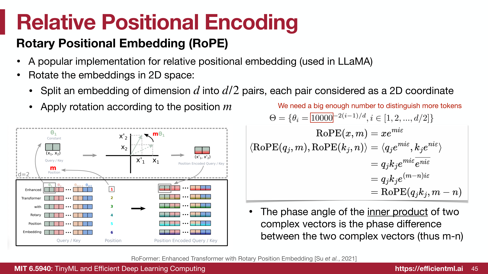
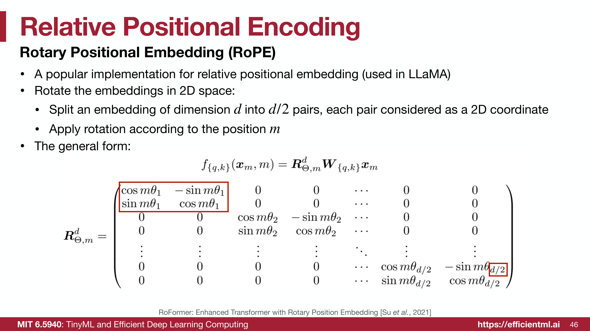

### Slide 47: RoPE 的优势 - 扩展上下文窗口
*   LLM 通常在受限的上下文长度上训练（如 LLaMA 的 2k），直接处理更长文本会失败。
*   通过**插值 (interpolating)** RoPE 的位置编码（即使用更小的 $\theta_i$），可以扩展上下文长度支持。
*   例如：将 LLaMA 从 2k 扩展到 32k。

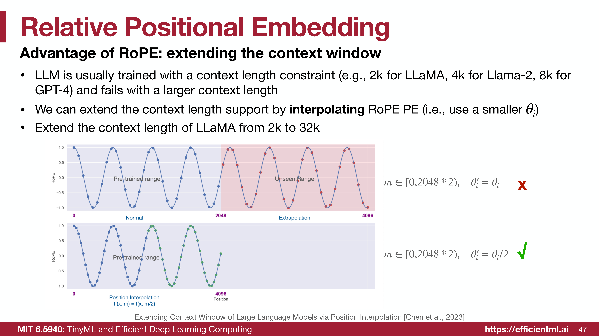

### Slide 49-54: KV Cache 优化
*   **问题**：在 Transformer 解码（GPT 风格）过程中，我们需要存储所有先前 Token 的 Key 和 Value，以便进行注意力计算。这就是 **KV Cache**。
*   **内存占用**：KV Cache 会随着上下文长度增加而变得巨大。
    *   对于 LLaMA-2-70B，如果使用 MHA，Batch Size=16, Seq Len=4096 时，KV Cache 需要 **160GB** 显存（需要两张 A100 GPU！）。
    *   KV Cache 的大小增长速度远快于模型权重。

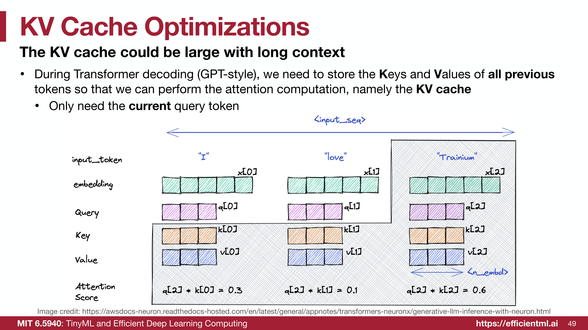
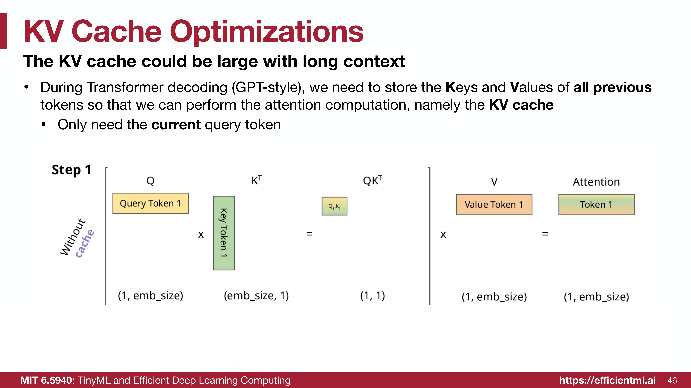
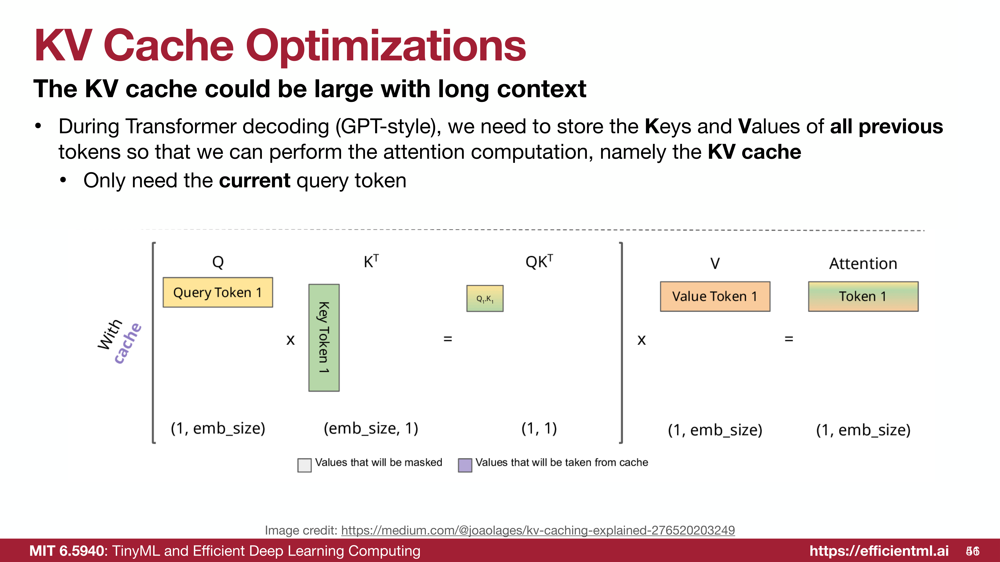
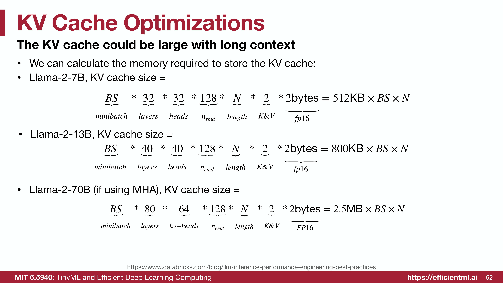
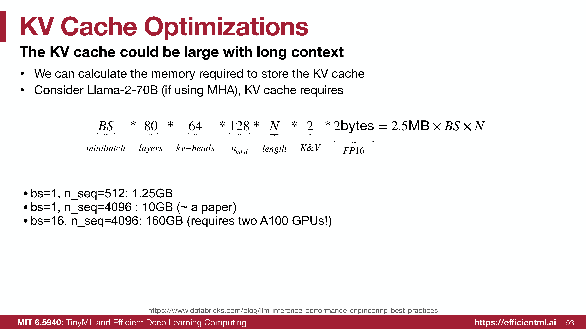
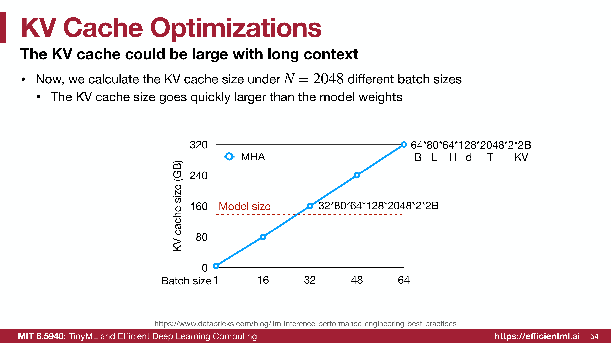

### Slide 55-57: MQA 与 GQA
为了减少 KV Cache 的内存占用：
*   **多头注意力 (MHA)**：$N$ 个 Query 头，$N$ 个 Key/Value 头。
*   **多查询注意力 (Multi-Query Attention, MQA)**：$N$ 个 Query 头，**1** 个 Key/Value 头。极致节省显存，但可能降低精度。
*   **分组查询注意力 (Grouped-Query Attention, GQA)**：$N$ 个 Query 头，$G$ 个 Key/Value 头（通常 $G = N/8$）。
    *   **优势**：GQA 在保持与 MHA 相当精度的情况下，显著减少了内存占用（例如减少 8 倍）。LLaMA-2-70B 和 LLaMA-3 都使用了 GQA。

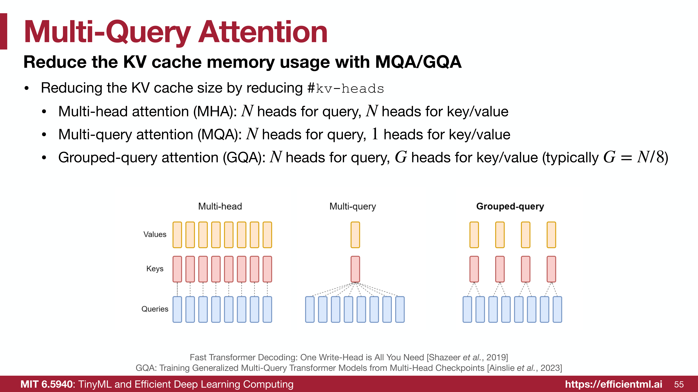
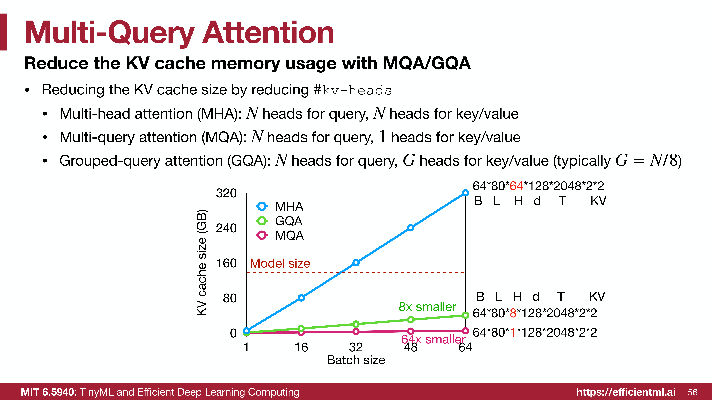
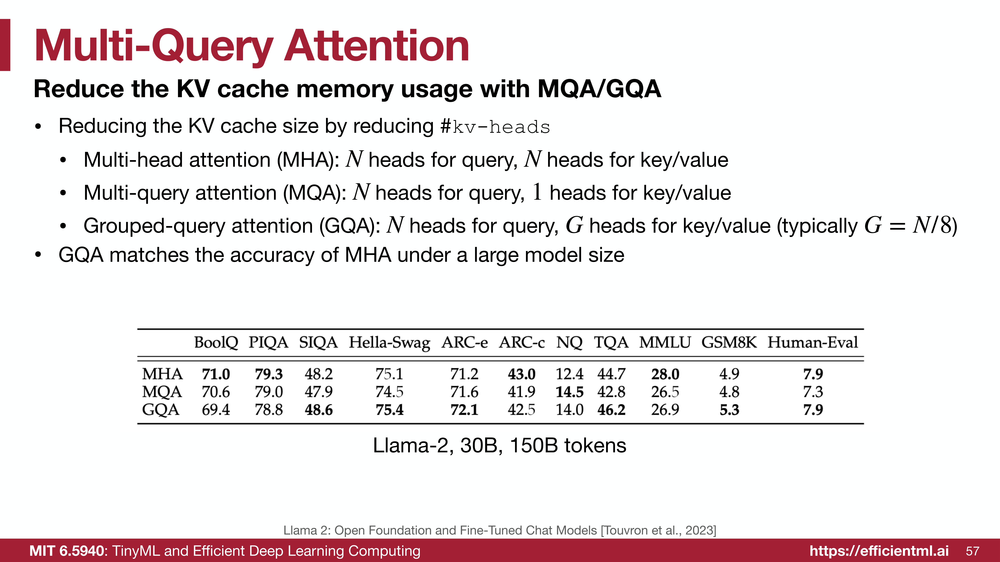

### Slide 59-60: GLU (Gated Linear Unit)
*   **改进 FFN**：用 GLU 替换传统的 FFN 可以提升 Transformer 性能。
*   **SwiGLU**：结合了 Swish 激活函数和 GLU。
    *   公式：$\text{FFN}_{\text{SwiGLU}}(x, W, V, W_2) = (\text{Swish}_1(xW) \otimes xV)W_2$
    *   Swish/SiLU 函数：$y = x \cdot \sigma(x)$。

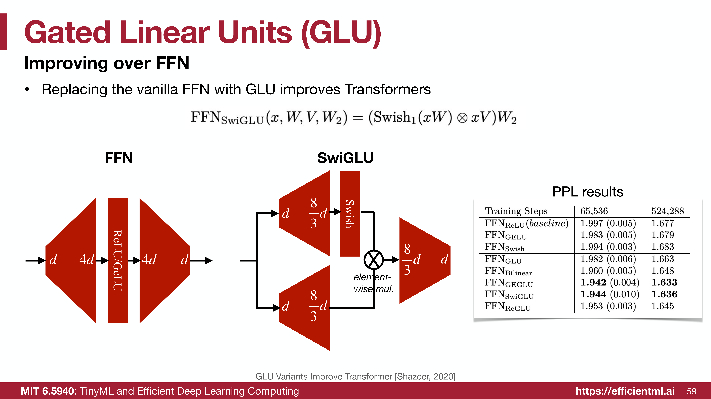
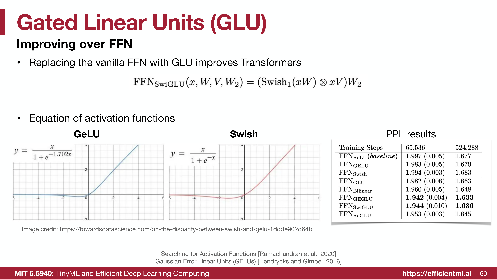
