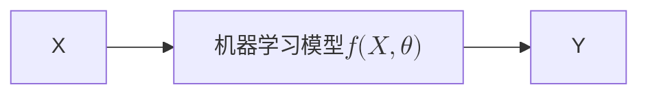
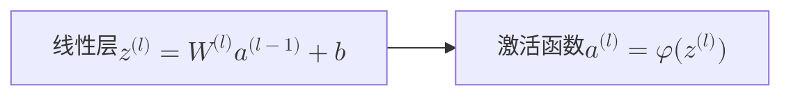
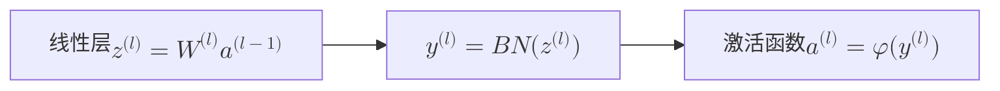
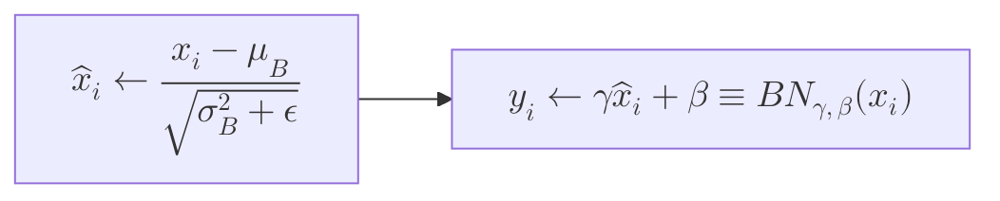

# 人工神经网络

PDF Here (mkdocs对部分mermaid无法支持……)

<object data="../NN.pdf" type="application/pdf" width="100%" height="800">
    <embed src="../NN.pdf" type="application/pdf" />
</object>


## 一、End-to-End Machine Learning Algorithm

### 1.1 核心思想




> [!INFO] 什么是端到端 (End-to-End)？
> 简单来说，就是我们给系统一个输入（Input），它直接给我们一个输出（Output），中间的过程由一个“黑盒子”——也就是**机器学习模型**——来完成。我们不需要手动设计复杂的中间步骤和规则。
>
> *   $X$: 机器学习系统的**输入**。
> *   $Y$: 机器学习系统的**输出**。
> *   $f(X, \theta)$: **机器学习模型**。这个函数$f$的具体形式是我们预先定义好的（比如一个神经网络结构），但它内部的参数 $\theta$ 是未知的。
> *   $\theta$: 模型的**参数**，需要通过训练数据来确定。
>
> **学习的目标**：我们的任务就是从大量的训练数据 $\{(X_i, Y_i)\}_{i=1 \sim N}$ 中，学习到最优的参数 $\theta$，使得对于每一个输入 $X_i$，模型的输出 $f(X_i, \theta)$ 都尽可能地接近真实的输出 $Y_i$。
> $$Y_i \approx f(X_i, \theta)$$

### 1.2 机器学习的两个基本问题

总结一下，所有机器学习问题都可以归结为以下两个基本问题：

> [!IMPORTANT] 机器学习两大核心问题
> 
> 
>  ```mermaid
flowchart LR 
X --> ML["机器学习模型 $$f(X, \theta)$$"] --> Y
> ```
> 
> 1.  **使用什么模型？**：$f(X, \theta)$ 的具体形式是什么？（例如，是选择线性模型，还是复杂的深度神经网络？）
> 2.  **如何学习参数？**：如何使用训练样本 $\{(X_i, Y_i)\}_{i=1 \sim N}$ 来估计参数 $\theta$，使得对每个样本都有 $Y_i \approx f(X_i, \theta)$？

对于问题1，模型的选择会直接影响学习效果。


*   **(a) 欠拟合 (Underfitting)**: 模型过于简单，无法捕捉数据的基本规律。例如用直线去拟合非线性的数据。
*   **(b) 恰当拟合 (Fitting)**: 模型复杂程度恰到好处，既能反映数据规律，又不过分追求完美匹配。
*   **(c) 过拟合 (Overfitting)**: 模型过于复杂，把训练数据中的噪声也学进去了，导致在新的、未见过的数据上表现很差。

## 二、MP -> MLP

### 2.1 神经元的数学模型 - MP模型

> [!abstract]
> 这一部分我更喜欢矩阵论绪论课上程磊老师的讲解，所以我转成markdown把笔记搬过来了。

一个典型的应用是深度学习中的图片分类，例如判断一张图片是猫（输出1）还是狗（输出0）。

**Step 1: 图片 -> RGB -> 向量化**

首先，需要将输入的图片进行处理。例如，一张 $28 \times 28$ 像素的彩色（RGB，3个通道）图片，可以被看作一个 $28 \times 28 \times 3$ 的矩阵或张量。


为了方便后续的数学运算，我们通常会将其“展平”（Flatten），变为一个长向量。这个向量的维度为 $28 \times 28 \times 3 = 2352$。因此，输入的向量可以表示为：
$$ x \in \mathbb{R}^{2352 \times 1} $$

**Step2: 建模**

建模的目标，就是找到一个合适的函数 $f_\theta(x)$，使其能够根据输入的向量 $x$ 得到正确的输出 $y$。
$$ f_\theta(x) = y $$
我们知道输入 $x$ 是一个向量，而分类任务的输出 $y$ (例如，0或1) 是一个标量。根据向量和矩阵的知识，我们可以首先构造一个最简单的线性模型：
$$ W^T x = y $$
这表示为：
$$ [w_1, w_2, \dots, w_n] \begin{bmatrix} x_1 \\ x_2 \\ \vdots \\ x_n \end{bmatrix} = w_1x_1 + w_2x_2 + \dots + w_nx_n = \sum_{i=1}^{n} w_i x_i = y $$
我们称上述模型为**线性组合 (linear combination)**。

> [!warning]
> **问题**: 线性组合模型的输出值域是 $\mathbb{R}$ (整个实数范围)，而我们想要的分类结果 $y$ 往往是一个特定的集合，例如 $\{0, 1\}$。

为了解决这个问题，我们需要引入一个函数，将 $\mathbb{R}$ 映射到$\{0,1\}$区间。一个常用的函数就是 **Sigmoid 函数**：
$$ \sigma(z) = \frac{e^z}{e^z+1} $$
通过 Sigmoid 函数，我们可以将线性组合的结果转换为一个概率值：
- 如果 $\sigma(W^T x) > 0.5$，我们将其归类为 1。
- 如果 $\sigma(W^T x) < 0.5$，我们将其归类为 0。

由于这个模型输出 0 或 1 的结果，它也被称为**逻辑回归 (Logistic Regression)**。

在更一般的MP模型里面，我们会给 $w_{ki}x_i$ 加上一个**偏置项 (bias)** $b_k$， 将求和结果 $v_k$ 输入到一个更一般的**激活函数 (activation function)** $\varphi(\cdot)$ 中，得到最终的输出 $y_k$，因此有如下公式：

> [!NOTE] MP模型公式
> $$ y_k = \varphi(\sum_{i=1}^{m} \omega_{ki}x_i + b_k) $$
> 写成向量形式就是：
> $$ y_k = \varphi(W_k^T X + b) $$

### 2.2 感知器算法

感知器算法本质上是一个非常简单的线性二分类模型，它的模型可以看作是不带激活函数的MP模型（或者说激活函数是符号函数）。

*   **模型形式**: $f(X) = W^T X + b$
*   **目标**: 从训练样本 $\{(X_i, Y_i)\}_{i=1 \sim N}$ 中学习参数 $(W, b)$，使得对于所有的 $i=1 \sim N$，都有 $Y_i \approx W^T X_i + b$。这里，$Y_i$ 的取值为 +1 或 -1，代表两个不同的类别。

> [!EXAMPLE] 感知器算法步骤
> *   **输入**: 训练样本 $\{(X_i, Y_i)\}_{i=1 \sim N}$
> *   **输出**: 参数 $(W, b)$，使得 $f(X) = W^T X + b$ 能正确分类样本。
>
> 1.  **随机初始化** $(W, b)$。
> 2.  **随机选择**一个训练样本 $(X, Y)$。
>     a.  **如果 $W^T X + b > 0$ 但 $Y = -1$** (模型预测为正类，但实际是负类)，说明预测错误，则更新参数：
>         $W = W - X$
>         $b = b - 1$
>     b.  **如果 $W^T X + b < 0$ 但 $Y = +1$** (模型预测为负类，但实际是正类)，说明预测错误，则更新参数：
>         $W = W + X$
>         $b = b + 1$
> 3.  **选择另一个**样本 $(X, Y)$，回到步骤 (2)。
> 4.  **终止条件**：重复以上步骤，直到所有样本都**不再**满足 2(a) 和 2(b) 的条件，即所有样本都被正确分类。

> [!tip] $W=W-X$
> 从感性上认识（这实际上不是梯度下降（？）因为这不是一个优化问题
> 对于函数$W^T \cdot X-b$来说：
> $\frac{\partial(W^T \cdot X)}{\partial{W}}=X$
> 所以要往$X$的负方向下降，选择步长为1，即得$W=W-X$

> [!info] 写成增广形式
> 
> *   原始问题是找到 $(\omega, b)$ 使得：
> 	*   若 $x_i \in C_1$, 则 $\omega^T x_i + b > 0$
> 	*   若 $x_i \in C_2$, 则 $\omega^T x_i + b < 0$
> *   通过定义一个**增广向量**，可以把问题简化。
> 	*   将 $\omega$ 和 $b$ 合并为新的权重向量 $\vec{\omega} = [\omega, b]^T$。
> 	*   将 $x_i$ 扩展为新的样本向量 $\vec{x_i'}$：
> 		*   若 $x_i \in C_1$ (标签为+1)，则 $\vec{x_i'} = \begin{bmatrix} x_i \\ 1 \end{bmatrix}$。
> 		*   若 $x_i \in C_2$ (标签为-1)，则将原始条件乘以-1，变为 $-\omega^T x_i - b > 0$，令 $\vec{x_i'} = \begin{bmatrix} -x_i \\ -1 \end{bmatrix}$。
> *   转化后的问题变为：找到一个增广权重向量 $\vec{\omega}$，使得对于**所有**的增广样本 $\vec{x_i'}$，都满足 $\vec{\omega}^T \vec{x_i'} > 0$。
> - Algorithm：
> 
> 

### 2.3 感知器算法的收敛性证明

即证明：**如果数据集是线性可分的，那么算法保证能在有限步内收敛**，即找到一个能完美分割数据集的超平面。

$\Rightarrow$ 对于 N 个线性可分的样本点，如果存在最优解 $\omega_{opt}$ ，使得对于所有 $i$ 都有 $\omega_{opt}^T \vec{x_i} > 0$ 成立 **（Notice：我们修改后，算法的最终目标）** ，则证明了感知器算法一定能在有限步内找到一个将所有样本正确分类的解 $\omega$。

**证明**:

假设最优解 $\omega_{opt}$ 是一个单位向量，即 $\|\omega_{opt}\| = 1$。定义 $\omega(k)$ 为在第 $k$ 次迭代时的权重向量。算法的目标是找到一个 $\omega$，使得对所有 $i$ 都有 $\omega^T \vec{x_i} > 0$。

1. 若 $\omega(k)^T \vec{x_i} > 0$ 对所有的 $i=1 \sim N$ 都成立，意味着当前的 $\omega(k)$ 已经将所有样本正确分类，算法停止，定理得证。

2. 否则，存在至少一个样本 $\vec{x_i}$ 被错误分类，此时 $\omega(k)^T \vec{x_i} \le 0$。根据感知器算法的更新规则，我们会用这个错误样本来更新权重：$$ \omega(k+1) = \omega(k) + \vec{x_i} $$
我们的目标是证明，每次发生错误更新时，当前的解 $\omega(k)$ 都会向最优解 $\omega_{opt}$ “靠近”一点，即
$\|\omega(k+1) - \omega_{opt}\|<\|\omega(k) - \omega_{opt}\|$

考虑向量 $\omega(k+1) - \omega_{opt}$ 的模长平方：
$$ \|\omega(k+1) - \omega_{opt}\|^2 $$
将更新规则 $\omega(k+1) = \omega(k) + \vec{x_i}$ 代入：
$$ = \|\omega(k) + \vec{x_i} - \omega_{opt}\|^2 $$
将 $\omega(k) - \alpha\omega_{opt}$ 看作一项，$\vec{x_i}$ 看作另一项，展开这个平方项：
$$ = \|\omega(k) - \omega_{opt}\|^2 + \|\vec{x_i}\|^2 + 2(\omega(k) - \omega_{opt})^T \vec{x_i} $$
$$ = \|\omega(k) - \omega_{opt}\|^2 + \|\vec{x_i}\|^2 + 2\omega(k)^T \vec{x_i} - 2\omega_{opt}^T \vec{x_i} $$

 $\because \omega(k)^T \vec{x_i} \le 0 \Rightarrow 2\omega(k)^T \vec{x_i} \le 0$：
$$ \therefore \|\omega(k+1) - \omega_{opt}\|^2 \le \|\omega(k) - \omega_{opt}\|^2 + \|\vec{x_i}\|^2 - 2\omega_{opt}^T \vec{x_i} $$

对于 $\|\vec{x_i}\|^2 - 2\omega_{opt}^T \vec{x_i}$ ，一定存在 $x_i$ 使得这一项小于0.

> [!info]- 解释
> 对于这个问题，原课件上面是这么写的：
> 
> $$ \|\omega(k+1) - \alpha\omega_{opt}\|^2 \le \|\omega(k) - \alpha\omega_{opt}\|^2 - 1 $$
> 这个不等式是整个证明的关键。它表明：
> *   **每当算法因为一次错误分类而更新时，当前解与目标解的（缩放）距离的平方至少会减小 1。**
> *   距离的平方 $\|\cdot\|^2$ 永远是非负的，它不能无限减小。
> *   既然每次错误都会使这个值稳定地减小一个固定的量，那么错误发生的次数必然是**有限的**。
> *   因此，感知器算法必定会在有限的迭代次数后停止更新，此时它已经找到了一个能够正确分类所有样本的解。
> 
> **证明完毕。**
> 
> 我个人认为这个证明的$\alpha$很奇怪（在我看来$||\omega||$就应该是1？），以及我觉得也没必要证明说一定会下降1，收敛又不是这个算法非停不可，所以就只能草率的证明到这里了。

## 三、多层神经网络

**多层感知器 (Multi-layer Perceptron, MLP)** —— 单层感知机无法解决线性不可分问题

### 3.1 两层神经网络结构


这是一个经典的两层神经网络（输入层通常不计入层数）。
*   **输入层**: 接收原始数据 $x_1, x_2$。
*   **隐藏层**: 包含神经元 $z_1, z_2$。它们接收来自输入层的信号，经过加权求和与激活函数 $\varphi(\cdot)$ 处理后，得到输出 $a_1, a_2$。
*   **输出层**: 包含神经元 $y$。它接收来自隐藏层的信号，进行加权求和（这里为了简化，输出层没有激活函数），得到最终输出。

**输入-输出关系**：
*   $z_1 = \omega_{11}x_1 + \omega_{12}x_2 + b_1$
*   $z_2 = \omega_{21}x_1 + \omega_{22}x_2 + b_2$
*   $a_1 = \varphi(z_1)$
*   $a_2 = \varphi(z_2)$
*   $y = \omega_1 a_1 + \omega_2 a_2 + b_3$

将它们合并成一个复杂的公式：
$y = \omega_1 \varphi(\omega_{11}x_1 + \omega_{12}x_2 + b_1) + \omega_2 \varphi(\omega_{21}x_1 + \omega_{22}x_2 + b_2) + b_3$

使用矩阵表示会更加简洁：

$$\text{定义} X = \begin{bmatrix} x_1 \\ x_2 \end{bmatrix}, \omega_{(1)} = \begin{bmatrix} \omega_{11}, & \omega_{12} \\ \omega_{21}, & \omega_{22} \end{bmatrix}, b = \begin{bmatrix} b_1 \\ b_2 \end{bmatrix}, z = \begin{bmatrix} z_1 \\ z_2 \end{bmatrix}, a = \begin{bmatrix} a_1 \\ a_2 \end{bmatrix}, \omega_{(2)} = \begin{bmatrix} \omega_1 \\ \omega_2 \end{bmatrix}$$

$$ y = \omega^{(2)T} \varphi(\omega^{(1)T}X + b^{(1)}) + b_3 $$

更大的神经网络：


### 3.2 神经网络的万能近似定理

多层神经网络的强大之处在于，它有能力拟合**任何**复杂的函数。

> [!IMPORTANT] 三层神经网络是万能估计器 (Unanimous Estimator)
> **定理**：如果激活函数是阶跃函数（step function），并且我们允许每层的神经元数量是无限的，那么一个三层神经网络可以模拟**任何**预测函数。
>
> **理解**：
>
> 1.   一个神经元（感知器）可以在空间中画出一条直线（决策边界）。
> 2. 隐藏层的多个神经元可以画出多条直线。通过将这些神经元的输出在下一层进行组合（逻辑“与”操作），可以圈出一个**凸多边形区域**。例如，图中的三条直线圈出了一个三角形。
> 3. 通过增加隐藏层神经元的数量，我们可以用足够多的直线来逼近**任何形状的凸区域**，甚至任意形状的区域（通过组合多个凸区域）。
> 4.  通过第二隐藏层（构成三层网络），我们可以将多个由第一隐藏层形成的凸区域进行组合（逻辑“或”操作），从而形成更复杂的、非连通的区域。
>
> 理论上，一个足够大的三层神经网络可以像搭积木一样，用简单的决策边界搭建出任意复杂的决策区域，从而拟合任何函数。


## 四、神经网络的训练：梯度下降与反向传播

理论证明了多层神经网络的强大能力，但下一个关键问题是：**如何训练它？** 即如何找到成千上万个参数 $\omega$ 和 $b$ 的最优值？

### 4.1 梯度下降法 (Gradient Descent)

训练的核心思想是定义一个**损失函数 (Loss Function)** 或 **目标函数 (Objective Function)**，用来衡量当前模型预测值 $y$ 与真实值 $Y$ 之间的差距。然后，我们的目标就是调整参数，使得这个损失函数的值**最小化**。

例如，我们可以用**均方误差 (Mean Square Error)** 作为损失函数：
$E(\omega, b) = E_{(X,Y)}[(Y - y)^2]$

**梯度下降法**是实现最小化最常用的方法。

> [!info]
> 梯度下降算法更多可以参考矩阵论课程的讲解，这里直接贴笔记了。


交替分块优化（类似 BCD？）


### 4.2 反向传播算法 (Backpropagation, BP)


对于如上神经网络，每次**迭代**都需要计算：

$$\left\{ \frac{\partial E}{\partial \omega_{11}}, \frac{\partial E}{\partial \omega_{12}}, \frac{\partial E}{\partial \omega_{21}}, \frac{\partial E}{\partial \omega_{22}}, \frac{\partial E}{\partial \omega_1}, \frac{\partial E}{\partial \omega_2}, \frac{\partial E}{\partial b_1}, \frac{\partial E}{\partial b_2}, \frac{\partial E}{\partial b_3} \right\}$$

梯度下降法告诉我们**更新参数的方向**（负梯度方向），但**如何高效地计算**这个包含成千上万个偏导数的梯度呢？—— 这就是**反向传播算法 (BP)** 要解决的问题。

BP算法利用了神经网络的层级结构和链式法则，高效地计算出损失函数对网络中所有参数的梯度。

> [!IMPORTANT] BP算法核心思想
> BP算法分为两个阶段：
> 1.  **前向传播 (Forward Propagation)**：输入信号从输入层开始，逐层向前传播，直到输出层计算出最终的预测值$y$和损失值$E$。
> 2.  **反向传播 (Back Propagation)**：损失值$E$从输出层开始，将“误差”逐层向后（反向）传播。在传播过程中，根据链式法则，计算出每一层参数对最终损失的梯度。

**BP算法推导示例 (针对前面的两层网络)**：

我们的目标是计算损失 $E$ 对所有9个参数 ($\omega_{11}, \omega_{12}, \omega_{21}, \omega_{22}, b_1, b_2, \omega_1, \omega_2, b_3$) 的梯度。


若$E=\frac{1}{2}(Y-y)^2$ ， 我们先计算图中三个红圈:

*   $\frac{\partial E}{\partial y} = y - Y$ 
*   $\frac{\partial E}{\partial z_1} = \frac{\partial E}{\partial y} \frac{\partial y}{\partial a_1} \frac{\partial a_1}{\partial z_1} = (y-Y)\omega_1\varphi'(z_1)$
*   $\frac{\partial E}{\partial z_2} = \frac{\partial E}{\partial y} \frac{\partial y}{\partial a_2} \frac{\partial a_2}{\partial z_2} = (y-Y)\omega_2\varphi'(z_2)$

这三个是倒数一层、倒数二层的梯度，对于内层梯度的计算，有如下的例子：

> [!example] Sample1
> 
> $\because \frac{\partial E}{\partial y} = y - Y， y=\omega_1 a_1 + \omega_2 a_2 + b_3$， 所以有：
> 
> *   $\frac{\partial E}{\partial \omega_1} = \frac{\partial E}{\partial y} \frac{\partial y}{\partial \omega_1} = (y-Y)a_1$
> *   $\frac{\partial E}{\partial \omega_2} = (y-Y)a_2$
> *   $\frac{\partial E}{\partial b_3} = (y-Y)$

> [!example] Sample2
> $\because \frac{\partial E}{\partial z_1} = (y-Y)\omega_1\varphi'(z_1), z_1 = \omega_{11}x_1+\omega_{12}x_2+b_1$, 有：
> $$\begin{align*}
\frac{\partial E}{\partial \omega_{11}} &= \frac{\partial E}{\partial z_1} \frac{\partial z_1}{\partial \omega_{11}} = (y - Y) \omega_1 \varphi'(z_1) x_1 \\
\frac{\partial E}{\partial \omega_{12}} &= \frac{\partial E}{\partial z_1} \frac{\partial z_1}{\partial \omega_{12}} = (y - Y) \omega_1 \varphi'(z_1) x_2 \\
\frac{\partial E}{\partial b_1} &= \frac{\partial E}{\partial z_1} \frac{\partial z_1}{\partial b_1} = (y - Y) \omega_1 \varphi'(z_1)
\end{align*}$$


> [!example] Sample2
> $\because \frac{\partial E}{\partial z_2} = (y-Y)\omega_2\varphi'(z_2), z_2 = \omega_{21}x_1+\omega_{22}x_2+b_2$, 有：
> $$\begin{align*}
\frac{\partial E}{\partial \omega_{21}} &= \frac{\partial E}{\partial z_2} \frac{\partial z_2}{\partial \omega_{21}} = (y - Y) \omega_2 \varphi'(z_2) x_1 \\
\frac{\partial E}{\partial \omega_{22}} &= \frac{\partial E}{\partial z_2} \frac{\partial z_2}{\partial \omega_{22}} = (y - Y) \omega_2 \varphi'(z_2) x_2 \\
\frac{\partial E}{\partial b_2} &= \frac{\partial E}{\partial z_2} \frac{\partial z_2}{\partial b_2} = (y - Y) \omega_2 \varphi'(z_2)
\end{align*}$$


由上我们会发现，计算隐藏层梯度时，我们复用了上一层（更靠近输出的层）计算出的误差项。这就是“反向传播”的精髓所在，它避免了大量的重复计算。

### 4.3 激活函数及其导数

从BP推导中可以看到，计算梯度需要用到激活函数的导数 $\varphi'(z)$。这也是为什么我们不能用阶跃函数的原因（其导数在不为0处为0，在0处不可导）。常用函数图象和表达式如下：


> [!NOTE] 常用激活函数-具体介绍
> 
> 1.  **Sigmoid** :
>     *   $\varphi(x) = \frac{1}{1+e^{-x}}$
>     *   $\varphi'(x) = \varphi(x)(1-\varphi(x))$
>     *   优点：输出在(0,1)之间，像概率。缺点：容易导致梯度消失。
>
> 2.  **tanh** :
>     *   $\varphi(x) = \frac{e^x - e^{-x}}{e^x + e^{-x}}$
>     *   $\varphi'(x) = 1 - \varphi(x)^2$
>     *   优点：输出在(-1,1)之间，零中心。缺点：仍有梯度消失问题。
>
> 3.  **ReLU**:
>     *   $\varphi(x) = \max(0, x)$
>     *   $\varphi'(x) = \begin{cases} 1, & \text{if } x > 0 \\ 0, & \text{if } x \le 0 \end{cases}$
>     *   优点：计算简单，收敛快，有效缓解梯度消失。目前最常用的激活函数之一。

### 4.4 通用BP算法 (L层网络)

对于一个通用的L层深层神经网络，BP算法可以总结为一套优美的公式。

1. 对于**前向传播**，由下面的推导，能得到 $y=a^{(L)}=\varphi(z^{(L)})$。其中$z^{(l)} = \omega^{(l)} a^{(l-1)} + b^{(l)} ,\,\,\,\, a^{(l)} = \varphi \left( z^{(l)} \right)$。


我们有如下说明：
1. 神经网络有$L$层，我们用$S_m$（$m = 1 \sim L$）来表示第$m$层的神经元数量。
2. 输入$X$是一个向量，其维度为$S_0$。我们用$X = \{x_1, x_2, ..., x_{S_0}\}$来表示它的分量。
3. 输出是$y$，这也是第$L$层的输出。$y$也是一个向量。我们用$y = \{y_1, y_2, ..., y_{S_L}\}$来表示它的分量。
4. 中间变量$z^{(m)}$，$b^{(m)}$和$a^{(m)}$是向量，它们的维度是$S_m$。我们用$z_i^{(m)}$，$b_i^{(m)}$和$a_i^{(m)}$来表示第$i$个分量（$m = 1 \sim S_m$）。
5. $\omega^{(m)}$是一个$S_m \times S_{m-1}$矩阵，我们用$\omega_{ij}^{(m)}$来表示位于第$i$行第$j$列的分量（$i = 1 \sim S_m, j = 1 \sim S_{m-1}$）。
6. 激活函数$\varphi$可以是向量形式，这意味着激活函数的输入是一个向量，激活函数的输出也是一个与输入维度相同的向量。

**目标函数/损失函数**：$E = \frac{1}{2} \| y - Y \|^2 = \frac{1}{2} \sum_{i=1}^{S_L} (y_i - Y_i)^2$（MSE，均方误差）

 > 前面的 $\frac{1}{2}$ 是为了后面求导计算方便，可以抵消平方项求导后产生的系数2。 $S_L$ 是输出层神经元的数量。

引入中间变量 $\delta_i^{(m)} = \frac{\partial E}{\partial z_i^{(m)}}$，代表了总误差 $E$ 对第 $m$ 层第 $i$ 个神经元的**加权输入** $z_i^{(m)}$ 的偏导数

> [!tip]- 物理意义/直观理解
> $\delta_i^{(m)}$ 衡量的是，当我们稍微改变神经元 $i$ 在激活前的加权输入 $z_i^{(m)}$ 时，对最终的总误差 $E$ 会产生多大的影响。这个值越大，说明这个神经元对最终误差的“责任”越大。

从输出层开始计算 $\delta^{(L)}$，有：$$\delta_i^{(L)} = \frac{\partial E}{\partial z_i^{(L)}} = \frac{\partial E}{\partial y_i} \frac{\partial y_i}{\partial z_i^{(L)}}$$
分别计算：
$$
    \frac{\partial E}{\partial y_i} = y_i - Y_i
$$

由  $y_i = a_i^{(L)} = \varphi(z_i^{(L)})$，有：

$$
    \frac{\partial y_i}{\partial z_i^{(L)}} = \varphi'(z_i^{(L)})
    $$
$$ \therefore 
\delta_i^{(L)} = (y_i - Y_i) \varphi'(z_i^{(L)}) $$

下面**计算隐藏层的 $\delta_i^{(m-1)}= \frac{\partial E}{\partial z_i^{(m-1)}}$**, 和前面类似的，我们使用最后一层的$z_j^{(m)}$ 套链式法则：
$$
\delta_i^{(m-1)} = \frac{\partial E}{\partial z_i^{(m-1)}} = \sum_{j=1}^{S_m} \frac{\partial E}{\partial z_j^{(m)}} \frac{\partial z_j^{(m)}}{\partial z_i^{(m-1)}}
$$
注意到 $\frac{\partial E}{\partial z_j^{(m)}}$ 正是我们定义的下一层的误差项 $\delta_j^{(m)}$！所以上式可以写成：
$$
\delta_i^{(m-1)} = \sum_{j=1}^{S_m} \delta_j^{(m)} \frac{\partial z_j^{(m)}}{\partial z_i^{(m-1)}}
$$

接下来，我们只需要计算 $\frac{\partial z_j^{(m)}}{\partial z_i^{(m-1)}}$ 这一项，又有 $\frac{\partial z_j^{(m)}}{\partial z_i^{(m-1)}} = \frac{\partial z_j^{(m)}}{\partial a_i^{(m-1)}} \frac{\partial a_i^{(m-1)}}{\partial z_i^{(m-1)}}$。

1.  **$\frac{\partial z_j^{(m)}}{\partial a_i^{(m-1)}}$**: 回忆一下最后一层里 $z_j^{(m)}$ 的定义：$z_j^{(m)} = \sum_{k=1}^{S_{m-1}} \omega_{jk}^{(m)} a_k^{(m-1)} + b_j^{(m)}$。对这个式子求关于 $a_i^{(m-1)}$ 的偏导，只有当 $k=i$ 的那一项不为零，其结果就是连接这两个神经元的权重 $\omega_{ji}^{(m)}$。
2.  **$\frac{\partial a_i^{(m-1)}}{\partial z_i^{(m-1)}}$**: 因为 $a_i^{(m-1)} = \varphi(z_i^{(m-1)})$，所以这部分的导数就是 $\varphi'(z_i^{(m-1)})$。

两者相乘得到：
$$
\frac{\partial z_j^{(m)}}{\partial z_i^{(m-1)}} = \omega_{ji}^{(m)} \varphi'(z_i^{(m-1)})
$$

因此，我们合计有了：

$$
\delta_i^{(m-1)} = \left( \sum_{j=1}^{S_m} \delta_j^{(m)} \omega_{ji}^{(m)} \right) \varphi'(z_i^{(m-1)})
$$
>[!SUCCESS] 
>**直观理解:** 第 $m-1$ 层某个神经元的误差项 = (所有与之相连的下一层神经元的误差项 $\delta_j^{(m)}$ 按连接权重 $\omega_{ji}^{(m)}$ 加权求和) $\times$ (该神经元激活函数的导数)。
>
> 这就是“**反向传播**”这个名字的由来：第 $m$ 层的误差 $\delta^{(m)}$ 被“传播”回了第 $m-1$ 层。


最后，借助 $\delta$ 的梯度，可以更容易的计算损失 $E$ 对权重 $\omega$ 和偏置 $b$ 的偏导数：

1. **对权重的梯度 $\frac{\partial E}{\partial \omega_{ji}^{(m)}}$:**
我们再次使用链式法则：
$$
\frac{\partial E}{\partial \omega_{ji}^{(m)}} = \frac{\partial E}{\partial z_j^{(m)}} \frac{\partial z_j^{(m)}}{\partial \omega_{ji}^{(m)}}
$$
*   第一项 $\frac{\partial E}{\partial z_j^{(m)}}$ 就是我们定义的 $\delta_j^{(m)}$。
*   第二项 $\frac{\partial z_j^{(m)}}{\partial \omega_{ji}^{(m)}}$，对 $z_j^{(m)} = \sum_{k} \omega_{jk}^{(m)} a_k^{(m-1)} + b_j^{(m)}$ 求导，结果是 $a_i^{(m-1)}$。
*   所以，最终结果为：
$$
\frac{\partial E}{\partial \omega_{ji}^{(m)}} = \delta_j^{(m)} a_i^{(m-1)}
$$

2.  **对偏置的梯度 $\frac{\partial E}{\partial b_j^{(m)}}$:**
同样使用链式法则：
$$
\frac{\partial E}{\partial b_j^{(m)}} = \frac{\partial E}{\partial z_j^{(m)}} \frac{\partial z_j^{(m)}}{\partial b_j^{(m)}}
$$
*   第一项是 $\delta_j^{(m)}$。
*   第二项 $\frac{\partial z_j^{(m)}}{\partial b_j^{(m)}}$ 求导结果是 1。
*   所以，最终结果为：
$$
\frac{\partial E}{\partial b_j^{(m)}} = \delta_j^{(m)}
$$
> [!note] BP算法流程
> 1. **Initialization:** 随机设置所有层的权重 $\omega_{ji}^{(m)}$ 和偏置 $b_j^{(m)}$ 的值。
> 2. **前向计算（Forward Calculation）**（需要**保存每一层的加权输入 $z^{(m)}$ 和激活值 $a^{(m)}$**）
>    1. 将输入样本 $X$ 赋值给输入层的激活值：$a^{(0)} = X$。
>    2. 从第一层 ($m=1$) 开始，逐层向前计算，直到最后一层 ($m=L$)：
>       - 计算第 $m$ 层的加权输入：$z^{(m)} = \omega^{(m)} a^{(m-1)} + b^{(m)}$
>       - 通过激活函数得到该层的输出：$a^{(m)} = \varphi(z^{(m)})$
>    3. 最后一层的输出 $a^{(L)}$ 就是网络对输入 $X$ 的预测值 $y$。
> 3. **反向传播**：
>    1. 计算总误差 $E = \frac{1}{2} \|y - Y\|^2 = \frac{1}{2} \sum_{i=1}^{S_L} (y_i - Y_i)^2$
>    2. 反向计算误差项 $\delta$：
>       - 对于输出层：$\delta_i^{(L)} = (y_i - Y_i) \varphi'(z_i^{(L)})$
>       - 对于隐藏层：$\delta_i^{(m-1)} = \left( \sum_{j=1}^{S_m} \delta_j^{(m)} \omega_{ji}^{(m)} \right) \varphi'(z_i^{(m-1)})$
>    3. 计算梯度：
>       - 对权重 $\omega$ 的梯度：$\frac{\partial E}{\partial \omega_{ji}^{(m)}} = \delta_j^{(m)} a_i^{(m-1)}$
>       - 对偏置 $b$ 的梯度：$\frac{\partial E}{\partial b_j^{(m)}} = \delta_j^{(m)}$
> 4. **更新参数**：
> 	- 权重更新：$\omega_{ji}^{(m)} = \omega_{ji}^{(m)} - \alpha \frac{\partial E}{\partial \omega_{ji}^{(m)}}$
> 	- 偏置更新：$b_j^{(m)} = b_j^{(m)} - \alpha \frac{\partial E}{\partial b_j^{(m)}}$
> 5. Terminate

## 五、神经网络训练技巧 (Neural Network Training Tips)

仅仅知道BP算法的原理是不够的，在实践中，有很多技巧可以帮助我们更快更好地训练神经网络。

### 5.1 随机梯度下降 (SGD)

如果每次更新参数都用上**所有**的训练数据（称为批量梯度下降），计算量会非常大。实际中我们常用 **随机梯度下降 (Stochastic Gradient Descent, SGD)**。

*   **Mini-Batch**: 我们不一次只用一个样本，也不用全部样本，而是在每次迭代中，随机选取一小部分样本，称为一个**批次 (batch 或 mini-batch)**。
*   **计算平均梯度**: 我们计算这个batch中所有样本梯度的**平均值**，并用这个平均梯度来更新参数。
*   **Batch Size**: 一个batch中样本的数量。通常设为50-200。如果任务困难或数据噪声大，可以适当增大batch size。

```python
def nn_train(nn, option, train_x, train_y):
    iteration = option.iteration
    batch_size = option.batch_size
    m = train_x.shape[0]
    num_batches = m / batch_size
    for k in range(iteration):
        kk = np.random.permutation(m)
        for l in range(int(num_batches)):
            batch_x = train_x[kk[l * batch_size : (l + 1) * batch_size], :]
            batch_y = train_y[kk[l * batch_size : (l + 1) * batch_size], :]
            nn = nn_forward(nn, batch_x, batch_y)
            nn = nn_backpropagation(nn, batch_y)
            nn = nn_applygradient(nn)
    return nn
```
### 5.2 数据和参数的初始化

#### 训练数据初始化 (归一化)


*   **目的**：将原始数据（图中 original data）的分布调整为零均值、单位方差的标准分布（图中 normalized data）。
*   **好处**：可以加速收敛，提高训练稳定性。
*   **公式**: $NewX = \frac{X - mean(X)}{std(X)}$

```python
[U,V] = size(xTraining);
avgX = mean(xTraining);
sigma = std(xTraining);
xTraining = (xTraining - repmat(avgX,U,1)) ./ repmat(sigma,U,1);
```
#### 参数初始化

*   **梯度消失问题 (Vanishing Gradient Problem)** ：在使用Sigmoid或tanh激活函数时，如果输入值 $|W^T X + b|$ 过大，函数会进入饱和区，其梯度（导数）会趋近于0。这会导致在反向传播时，梯度逐层衰减，使得靠近输入层的网络层几乎无法得到更新。
*   **解决方法**:
    1.  **让初始输出值接近0**: 初始化参数时，要让 $W^T X + b \approx 0$。一个简单的策略是让 $W, b$ 从一个均值为0的均匀分布中采样，例如 $(W,b) \in U(-\frac{1}{\sqrt{n}}, \frac{1}{\sqrt{n}})$，其中 $n$ 是输入的神经元数量.
		- 原因：可以证明 $(W,b) \in U(-\frac{1}{\sqrt{n}}, \frac{1}{\sqrt{n}})$， $X \in N(0,1)$ ，$W^T X+b \in N(0,\frac{1}{3})$，聚集在 0 附近不会进入饱和区。
		- `nn.b{k} = 2*rand(height, 1)/sqrt(width) - 1/sqrt(width);`
		- `nn.W{k} = 2*rand(height, width)/sqrt(width) - 1/sqrt(width);`
    2.  **使用ReLU**: ReLU激活函数在正数区的梯度恒为1，不存在梯度消失问题。
    3.  **Xavier初始化** : 一种更高级的初始化方法，目标是让每一层输出的方差和输入的方差保持一致，从而维持信息流的稳定。
		- 其核心思想是，如果信息（在这里用方差来衡量）在网络中向前传播时，每经过一层，其“强度”既不急剧放大，也不急剧衰减，那么信号就能更稳定地流动，梯度也能更稳定地反向传播。

> [!note] Xavier 初始化
> 从目标出发，我们希望 $Var(a^{(l)}) = Var(a^{(l-1)})$。为了达到这个目标，Xavier 初始化提出如下策略：
> 1. 将权重 $W_{ij}^{(l)}$ 从一个**均值为0，方差为 $\frac{1}{n^{(l-1)}}$ 的正态分布**中采样。$n^{(l-1)}$ 是输入神经元的数量（即上一层的神经元个数）。
> $$
> W_{ij}^{(l)} \in N(0, \frac{1}{n^{(l-1)}})
> $$
> 2. 将偏置 $b^{(l)}$ 初始化为 0。
> 
> > [!tip] 数学证明
> > 证明：
> > 
> > 我们希望$Var(a_i^{(l)})$不变，$a^{(l)}=\varphi(z^{(l)})$，而又因为我们想让 $z$ 在0附近，所以激活函数 $\varphi(z_i^{(l)})$ 近似等于 $z_i^{(l)}$。（**注**：激活函数（如 tanh）在0附近近似于线性函数，即 $\varphi(z) \approx z$）
> > 
> > 代入 $z_i^{(l)} = \sum_{j=1}^{n^{(l-1)}} w_{ij}^{(l)} a_j^{(l-1)}$：【$n^{(l-1)}$ 是输入神经元的数量（即上一层的神经元个数）】
> > 
> > $Var(a_i^{(l)})= Var(z_i^{(l)})= Var(\sum_{j=1}^{n^{(l-1)}} w_{ij}^{(l)} a_j^{(l-1)})= \sum_{j=1}^{n^{(l-1)}} Var(w_{ij}^{(l)} a_j^{(l-1)})= \sum_{j=1}^{n^{(l-1)}} Var(w_{ij}^{(l)}) Var(a_j^{(l-1)})$ （各项独立）
> > 
> >  假设所有 $w_{ij}^{(l)}$ 的方差都相同，记为 $Var(W^{(l)})$；所有 $a_j^{(l-1)}$ 的方差都相同，记为 $Var(a^{(l-1)})$。那么求和就变成了 $n^{(l-1)}$ 次的相同项相加。则原式 $= n^{(l-1)} Var(W^{(l)}) Var(a^{(l-1)})$
> > 
> > 我们得到了关系式：
> > $$
> > Var(a^{(l)}) = n^{(l-1)} \cdot Var(W^{(l)}) \cdot Var(a^{(l-1)})
> > $$
> > 
> > 为了实现我们的最初目标 $Var(a^{(l)}) = Var(a^{(l-1)})$，我们只需要让中间的乘数项等于1即可：
> > $$
> > n^{(l-1)} \cdot Var(W^{(l)}) = 1
> > $$
> > 移项后，我们就得到了权重的方差应该满足的条件：
> > $$
> > Var(W^{(l)}) = \frac{1}{n^{(l-1)}}
> > $$
> > 这就是Xavier初始化方法的理论依据。
> 
> 代码实现:
> ```python
> nn.b{k} = zeros(height, 1)
> nn.w{k} = 2*randn(height, width)/sqrt(width)
> ```

> [!tip]- 拓展阅读
> 
> 1. Understanding the difficulty of training deep feedforward neural networks by Glorot and Bengio, 2010
> 2. Exact solutions to the nonlinear dynamics of learning in deep linear neural networks by Saxe et al, 2013
> 3. Random walk initialization for training very deep feedforward networks by Sussillo and Abbott, 2014
> 4. Delving deep into rectifiers: Surpassing human-level performance on ImageNet classification by He et al., 2015
> 5. Data-dependent Initializations of Convolutional Neural Networks by Krähenbühl et al., 2015
> 6. All you need is a good init, Mishkin and Matas, 2015
>    ...

### 5.3 批归一化 (Batch Normalization, BN)

BN是Google在2015年提出的强大技术，它将数据归一化的思想用到了网络的**每一层**。

*   **思想**: 既然我们希望每层激活函数的输入值接近0，为什么不直接在每一层后面强制进行归一化呢？

> [!tip] 为什么我们希望输入接近0呢？
> 
>  
> 
>以Sigmoid函数为例：
> - $x \rightarrow -\infty$：趋近于0，梯度消失
> -  $x \rightarrow +\infty$：不断变大，梯度变化慢
> 
> 只有在零附近的时候，梯度变化明显 $\rightarrow$ 健康的梯度！

*   **做法**: 在网络的每个全连接层(FC)或卷积层之后，激活函数之前，插入一个BN层。BN层会对当前batch的数据计算均值和方差，并进行归一化。


原先的做法：（单层）



现在的做法：



其中BN的流程：



学习的参数也变成了$\gamma$, $\beta$;

*   **好处:
    *   极大提升训练速度和稳定性。
    *   允许使用更高的学习率。
    *   降低了对参数初始化的依赖。
    *   自带正则化效果，有时可以替代Dropout。

- forward:
```python
y = nn.W{k-1} * nn.a{k-1} + repmat(nn.b{k-1},1,m);
if nn.batch_normalization
    nn.E{k-1} = nn.E{k-1}*nn.vecNum + sum(y,2);
    nn.S{k-1} = nn.S{k-1}.^2*(nn.vecNum-1) + (m-1)*std(y,0,2).^2;
    nn.vecNum = nn.vecNum + m;
    nn.E{k-1} = nn.E{k-1}/nn.vecNum;
    nn.S{k-1} = sqrt(nn.S{k-1}/(nn.vecNum-1));
    y = (y - repmat(nn.E{k-1},1,m)) ./ repmat(nn.S{k-1}+0.0001*ones(size(nn.S{k-1})),1,m);
    y = nn.Gamma{k-1}*y+nn.Beta{k-1};
end;
```

- BP:
```python
nn.theta{k} = ((nn.W{k}'*nn.theta{k+1}) .* nn.a{k} .* (1 - nn.a{k}))
if nn.batch_normalization
    x = nn.W{k-1} * nn.a{k-1} + repmat(nn.b{k-1},1,m);
    x = (x - repmat(nn.E{k-1},1,m)) ./ repmat(nn.S{k-1}+0.0001*ones(size(nn.S{k-1})),1,m)
    temp = nn.theta{k}.*x
    nn.Gamma_grad{k-1} = sum(mean(temp,2))
    nn.Beta_grad{k-1} = sum(mean(nn.theta{k},2))
    nn.theta{k} = nn.Gamma{k-1}*nn.theta{k}./repmat((nn.S{k-1}+0.0001),1,m);
end
nn.W_grad{k-1} = nn.theta{k}*nn.a{k-1}'/m + nn.weight_decay*nn.W{k-1}
nn.b_grad{k-1} = sum(nn.theta{k},2)/m
```

### 5.4 目标函数 (损失函数)

除了均方误差(MSE)，还有其他常用的损失函数。

*   **带正则项的损失函数 (Regularization)** 【更多参考-矩阵论】
    *   **目的**: 防止过拟合。
    *   **做法**: 在原始损失函数后加上一个**正则项**，用来惩罚过大的权重参数。最常用的是L2正则化。
    *   $L(W) = E(W) + \beta R(W) = \frac{1}{2}\sum(y_i - Y_i)^2 + \beta \sum W^2$
    *   **正则化定义**: 正则化是将在机器学习中，将一个**病态问题 (ill-posed problem)** 转化为一个 **适定问题 (well-posed problem)** 的过程。
	
Forward Calculation:
```python
cost2 = cost2 + sum(sum(nn.W{k-1}.^2));
nn.cost(s) = 0.5 / m * sum(sum((nn.a{k} - batch_y).^2)) + 0.5 * nn.weight_decay * cost2;
```
bp:
```python
Backpropagation:
nn.W_grad{k-1} = nn.theta{k}*nn.a{k-1}'/m + nn.weight_decay*nn.W{k-1};
```

使用场景：
1. 无解$\rightarrow$有解
2. 多解$\rightarrow$唯一解
3. trival$\rightarrow$non-trival

-   **Softmax + 交叉熵损失 (Cross Entropy)**
    *   **适用场景**: 多分类问题。


- One-Hot编码：对于K-dimensional one-hot vector:
$$
Y = \begin{bmatrix} 1 \\ 0 \\ 0 \\ \vdots \\ 0 \end{bmatrix} \in C_1, Y = \begin{bmatrix} 0 \\ 1 \\ 0 \\ \vdots \\ 0 \end{bmatrix} \in C_2, \ldots, Y = \begin{bmatrix} 0 \\ 0 \\ 0 \\ \vdots \\ 1 \end{bmatrix} \in C_n
$$

- Softmax function：$y_i = \frac{\exp(z_i)}{\sum_j \exp(z_j)}$, 可以视作将$y_i$化作概率，满足 $y_i > 0$ 且 $\sum y_i = 1$。
- Cross Entropy Loss Function: 用来衡量模型预测的概率分布 $y$ 和真实的概率分布 $Y$ (One-Hot向量) 之间的差距：$E(y) = -\sum_i Y_i \log(y_i)$
	- $E(y)\ge 0$
	- 若$Y_i$是已知的概率分布，$y_i$是未知的分布。可以证明，当$y_i=Y_i$时，$E(y)$取到最小值。【Reference：证明（1）】
	- 若 $y_i = \frac{\exp(z_i)}{\sum_j \exp(z_j)}$, $E(y) = -\sum_i Y_i \log(y_i)$. 那么$\frac{\partial E}{\partial z_i}=y_i-Y_i$【Reference：证明（2）】

> [!note] 证明（1）【拉格朗日乘子法】
> 

> [!note] 证明（2）
> 
> 

代码实现：


在实践中我们一般不再独立设置softmax层，而是将softmax $y_i = \frac{\exp(z_i)}{\sum_j \exp(z_j)}$  和交叉熵 $E(y) = -\sum_i Y_i \log(y_i)$ 结合起来，推导如下：

1. $z \rightarrow p: p_j=\frac{\exp(z_j)}{\sum \exp(z_i)}$
2. 对于单个样本，$L=-\sum y_k \log(p_k)$。由于真实标签 y 是 one-hot 编码的，只有真实类别 y_true 对应的位置是 1，故$L = -\log(p_{y\_true})$

$\therefore L=-\log(p_{y\_true})=-\log[\frac{\exp{z_{y\_true}}}{\sum \exp(z_i)}]= -[z_{y\_true} - \log(\sum \exp(z_i))]=\log(\sum \exp(z_i))-z_{y\_true}$

- 数值稳定性问题：$p_j = \frac{\exp(z_j - \max(z))}{\sum \exp(z_i - \max(z))}$ ，防止$\exp{(\cdot)}$ 项上溢；


### 5.5 参数更新策略 (优化器)

#### 1. Vanilla Stochastic Gradient Descent

即我们之前的更新策略。
$$
\omega_{n+1} = \omega_n - \alpha \frac{\partial E}{\partial \omega} \bigg|_{(\omega_n, b_n)}, \quad b_{n+1} = b_n - \alpha \frac{\partial E}{\partial b} \bigg|_{(\omega_n, b_n)}
$$
这种方法存在两种可能的问题：

1. 优化过程呈“之”字形（Zigzag Route）


问题的根源在于，损失函数在不同维度上的“陡峭程度”（即梯度的分量大小）不同，而原始的SGD对所有维度都使用**同一个学习率**。对于陡峭的维度，这个学习率太大了；对于平缓的维度，这个学习率又太小了。

2. 优化路线是随机的（Random Route）


 **SGD的做法**是，我们不看全部数据，而是每次只随机抽取一个 mini-batch，用这一小撮数据来**估算**一个梯度。

但是因为每一个mini-batch都是随机抽取的，所以它们各自计算出的梯度方向也带有随机性，所以最终走出的路线是一条上图所示的摇摇晃晃、充满噪声的曲线，甚至最后可能不会精确地停在最优点，而是在最优点附近徘徊。

#### 2. AdaGrad

核心思想：为神经网络中的**每一个参数**都独立地维护一个自适应的学习率。具体的策略是：对于**之前梯度一直很大**的参数，就让它的学习率**变小一些**；对于**之前梯度一直很小**的参数，就让它的学习率**变大一些**。


解释：

1. 维护一个变量$r$, 维度和参数 $\theta$ 和$\omega$，$b$ 完全一样。
2. 计算完梯度后（和普通SGD一致）：$r\leftarrow r+g ⊙ g$ 
	- `⊙` 代表**逐元素相乘 (element-wise product)**。也就是说，我们把梯度向量 `g` 中的每一个元素都自己平方。例如，如果 $g = [g1, g2]$，那么 $g ⊙ g = [g1², g2²]$。
	- 经过很多次迭代后，$r$ 中存储的就是**历史上所有梯度值的平方和**。如果某个参数的梯度一直很大，那么它在 $r$ 中对应的那个累加值就会非常大；反之，则会很小
3. $\Delta \theta \leftarrow -\frac{\epsilon}{\delta+\sqrt{r}} ⊙ g$（普通的 $\Delta \theta = \epsilon$ ） （梯度值越大，得到的有效学习率就越小，实现了自适应）
4. $\theta \leftarrow \theta + \Delta \theta$

代码：

```python
nn.rW{k} = nn.rW{k} + nn.W_grad{k}.^2; 
nn.rb{k} = nn.rb{k} + nn.b_grad{k}.^2;
nn.W{k} = nn.W{k} - nn.learning_rate*nn.W_grad{k}./(sqrt(nn.rW{k})+0.001);
```

AdaGrad的缺点：

1.  **学习率单调递减**：因为 $r$ 是梯度的平方和，它在训练过程中只会不断累加，永远不会减小。
2. **训练提前停止**：随着训练的进行，$r$ 会变得越来越大，导致分母 $\sqrt{r}$ 也越来越大，最终使得有效学习率 $\epsilon/\sqrt{r}$ 趋近于0，导致模型在还远未达到最优解时，就因为学习率过小而无法继续学习。

#### 3. RMSProp

修改更新$r$的策略：$r ← ρr + (1 - ρ)g ⊙ g$ （加权平均：主要由近期的梯度平方决定，之前的$r$的影响会越来越小）

#### 4. Momentum

物理意义：球在滚动的过程中会积累**动量（Momentum）**。它的下一步方向，不仅取决于当前位置的坡度（当前的梯度），还很大程度上取决于它**上一刻的速度和方向（历史积累的动量）**

具体实现：不直接基于梯度变化更新$\omega$和$b$，而是多一步速度的计算（加一个$\rho v_t$）
$v_{t+1}=\rho v_t + \nabla f(x_t)$
$x_{t+1}=x_t-\alpha v_{t+1}$


#### 5. Adam

维护一阶矩：$r$ 和二阶矩：$s$ （相当于把Momentum和RMSProp拼起来）


代码实现参考：

```python
if method == 'Adam':
    rho1 = 0.9
    rho2 = 0.999

    nn.sW[k] = rho1 * nn.sW[k] + (1 - rho1) * nn.W_grad[k]**2
    nn.sb[k] = rho1 * nn.sb[k] + (1 - rho1) * nn.b_grad[k]**2
    nn.rW[k] = rho2 * nn.rW[k] + (1 - rho2) * nn.W_grad[k]**2
    nn.rb[k] = rho2 * nn.rb[k] + (1 - rho2) * nn.b_grad[k]**2

    newS = nn.sW[k] / (1 - rho1**nn.AdamTime)
    newR = nn.rW[k] / (1 - rho2**nn.AdamTime)
    nn.W[k] = nn.W[k] - nn.learning_rate * newS / np.sqrt(newR + 0.00001)
    nn.b[k] = nn.b[k] - nn.learning_rate * newS / np.sqrt(newR + 0.00001)
```
