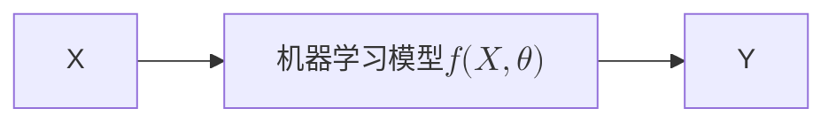

好的，没问题！这是一份根据您提供的PPT精心制作的中文版Markdown学习笔记。笔记内容完全覆盖了PPT上的知识点，并用更易于理解的语言为新手进行了解释。重点和示例都使用了Obsidian callout进行突出显示，所有公式都已使用`$`包裹。

---

# 神经网络学习笔记

## 一、End-to-End Machine Learning Algorithm

### 1.1 核心思想

> [!INFO] 什么是端到端 (End-to-End)？
> 简单来说，就是我们给系统一个输入（Input），它直接给我们一个输出（Output），中间的过程由一个“黑盒子”——也就是**机器学习模型**——来完成。我们不需要手动设计复杂的中间步骤和规则。
>
> *   $X$: 机器学习系统的**输入**。
> *   $Y$: 机器学习系统的**输出**。
> *   $f(X, \theta)$: **机器学习模型**。这个函数$f$的具体形式是我们预先定义好的（比如一个神经网络结构），但它内部的参数 $\theta$ 是未知的。
> *   $\theta$: 模型的**参数**，需要通过训练数据来确定。
>
> **学习的目标**：我们的任务就是从大量的训练数据 $\{(X_i, Y_i)\}_{i=1 \sim N}$ 中，学习到最优的参数 $\theta$，使得对于每一个输入 $X_i$，模型的输出 $f(X_i, \theta)$ 都尽可能地接近真实的输出 $Y_i$。
> $$Y_i \approx f(X_i, \theta)$$

### 1.2 实例讲解

让我们通过几个例子来理解输入$X$和输出$Y$的维度。

> [!EXAMPLE] 案例1：人脸识别系统
> [请在此处插入第 4 页的图片]
> *   **输入 $X$**: 一张人脸图片。
> *   **$X$的维度**: `宽 * 高 * 通道数`。例如，一张 $225 \times 225$ 的彩色（RGB, 3通道）图片，其维度就是 $225 \times 225 \times 3 = 151,875$。这是一个非常高维的向量。
> *   **输出 $Y$**: 这个人的身份ID。
> *   **$Y$的维度**: 取决于你要识别多少人。如果有1000个人，那么Y的维度就是1000（通常会用一个向量来表示，比如第i个人就是第i个位置为1，其余为0）。

> [!EXAMPLE] 案例2：目标检测系统
> [请在此处插入第 5 页的图片]
> *   **输入 $X$**: 一张包含物体的图片，维度同样是 `宽 * 高 * 通道数`。
> *   **输出 $Y$**: 图片中所有物体的**位置**和**类别**。
> *   **$Y$的维度**: `4个坐标值 * 物体数量`。每个物体的位置通常用一个边界框（bounding box）的4个坐标（如左上角x,y和右下角x,y）来表示。

> [!EXAMPLE] 案例3：语音识别系统
> [请在此处插入第 6 页的图片]
> *   **输入 $X$**: 一段语音信号。
> *   **$X$的维度**: `采样频率/秒 * 秒数`。例如，8kHz采样率的3秒语音，维度就是 $8000 \times 3 = 24000$。
> *   **输出 $Y$**: 语音对应的文字。
> *   **$Y$的维度**: 文字的维度。

> [!EXAMPLE] 案例4：AlphaGo
> [请在此处插入第 7 页的图片]
> *   **输入 $X$**: 当前的围棋棋盘状态。
> *   **$X$的维度**: 围棋棋盘有 $19 \times 19 = 361$ 个交叉点，每个点有三种状态（黑子、白子、空）。所以棋盘状态最多有 $3^{361}$ 种可能性。此外，还需要一个状态表示轮到哪一方下棋（黑或白）。
> *   **输出 $Y$**: 下一步棋的最佳位置。
> *   **$Y$的维度**: 一个从0到361的数字，表示下在哪个位置（或者不下）。

### 1.3 现代深度学习的特点

随着技术发展，端到端的机器学习呈现出以下特点：

[请在此处插入第 8 页的图片]

1.  **模型极其复杂**：函数 $f(X, \theta)$ 的形式变得越来越复杂（例如从简单的神经网络到复杂的Transformer网络），其中包含数百万甚至数十亿的自由参数 $\theta$。
2.  **需要海量数据**：为了训练如此复杂的模型，我们需要海量的训练样本 $N$。在现代深度学习系统中，$N$ 的数量级可以达到数百万甚至数十亿。
3.  **计算量巨大**：以ChatGPT为例，它基于Transformer网络，拥有1750亿个自由参数 $\theta$，进行一次推理（从输入X到输出Y的计算）就需要 $3.14 \times 10^{23}$ FLOPS。

> [!NOTE] 什么是FLOPS？
> FLOPS (Floating point Operations Per Second) 指的是每秒浮点运算次数，用来衡量计算性能。在神经网络中，它通常指从输入 $X$ 到输出 $Y$ 的一次前向计算所需要的加法和乘法运算的总次数。

### 1.4 机器学习的两个基本问题

总结一下，所有机器学习问题都可以归结为以下两个基本问题：

> [!IMPORTANT] 机器学习两大核心问题
> [请在此处插入第 9 页的图片]
> 1.  **模型的形式问题**：$f(X, \theta)$ 的具体形式是什么？（例如，是选择线性模型，还是复杂的深度神经网络？）
> 2.  **参数的学习问题**：如何使用训练样本 $\{(X_i, Y_i)\}_{i=1 \sim N}$ 来估计参数 $\theta$，使得对每个样本都有 $Y_i \approx f(X_i, \theta)$？

对于问题1，模型的选择会直接影响学习效果。

[请在此处插入第 10 页的图片]

*   **(a) 欠拟合 (Underfitting)**: 模型过于简单，无法捕捉数据的基本规律。例如用直线去拟合非线性的数据。
*   **(b) 恰当拟合 (Fitting)**: 模型复杂程度恰到好处，既能反映数据规律，又不过分追求完美匹配。
*   **(c) 过拟合 (Overfitting)**: 模型过于复杂，把训练数据中的噪声也学进去了，导致在新的、未见过的数据上表现很差。

---

## 二、从神经元到感知器

### 2.1 神经元的数学模型 (MP模型)

1943年，科学家 McCulloch 和 Pitts 受生物神经元的启发，建立了第一个神经元的数学模型，称为 **MP模型**。

[请在此处插入第 11 页的图片]

*   **生物神经元** (The Neuron)：由树突（输入）、细胞核（处理）、轴突（输出）组成。
*   **MP模型** (The MP model)：
    *   接收来自其他 $m$ 个神经元的输入信号 $x_1, x_2, ..., x_m$。
    *   这些输入信号通过带权重的连接 $\omega_{k1}, \omega_{k2}, ..., \omega_{km}$ 进行传递。权重代表了连接的强度。
    *   神经元内部将所有加权后的输入信号求和，并加上一个**偏置项 (bias)** $b_k$。偏置项可以看作是神经元被激活的难易程度。
    *   将求和结果 $v_k$ 输入到一个**激活函数 (activation function)** $\varphi(\cdot)$ 中，得到最终的输出 $y_k$。

> [!NOTE] MP模型公式
> $$ y_k = \varphi(\sum_{i=1}^{m} \omega_{ki}x_i + b_k) $$
> 写成向量形式就是：
> $$ y_k = \varphi(W_k^T X + b) $$

### 2.2 感知器算法 (The Perceptron Algorithm)

1957年，Frank Rosenblatt 重新研究了MP模型，并提出了一个可以从训练数据中学习到参数 $(W, b)$ 的算法，他将其命名为**感知器算法**。这是第一个真正意义上的机器学习算法。

感知器算法本质上是一个非常简单的线性二分类模型，它的模型可以看作是不带激活函数的MP模型（或者说激活函数是符号函数）。

*   **模型形式**: $f(X) = W^T X + b$
*   **目标**: 从训练样本 $\{(X_i, Y_i)\}_{i=1 \sim N}$ 中学习参数 $(W, b)$，使得对于所有的 $i=1 \sim N$，都有 $Y_i \approx W^T X_i + b$。这里，$Y_i$ 的取值为 +1 或 -1，代表两个不同的类别。

> [!EXAMPLE] 感知器算法步骤
> [请在此处插入第 13 页的图片]
> *   **输入**: 训练样本 $\{(X_i, Y_i)\}_{i=1 \sim N}$
> *   **输出**: 参数 $(W, b)$，使得 $f(X) = W^T X + b$ 能正确分类样本。
>
> 1.  **随机初始化** $(W, b)$。
> 2.  **随机选择**一个训练样本 $(X, Y)$。
>     a.  **如果 $W^T X + b > 0$ 但 $Y = -1$** (模型预测为正类，但实际是负类)，说明预测错误，则更新参数：
>         $W = W - X$
>         $b = b - 1$
>     b.  **如果 $W^T X + b < 0$ 但 $Y = +1$** (模型预测为负类，但实际是正类)，说明预测错误，则更新参数：
>         $W = W + X$
>         $b = b + 1$
> 3.  **选择另一个**样本 $(X, Y)$，回到步骤 (2)。
> 4.  **终止条件**：重复以上步骤，直到所有样本都**不再**满足 2(a) 和 2(b) 的条件，即所有样本都被正确分类。

#### 感知器算法演示

下面的动图展示了感知器算法如何通过不断调整，最终找到一条直线来完美分开源泉和星号两类数据点。

[请在此处插入第 15-34 页中的任意一张图片作为算法演示]

### 2.3 感知器算法的收敛性证明

感知器算法有一个非常好的性质：**如果数据集是线性可分的，那么算法保证能在有限步内收敛**，即找到一个能完美分割数据集的超平面。

> [!NOTE] 什么是线性可分？
> 简单说，就是存在一条直线（二维）、一个平面（三维）或一个超平面（更高维），能把两类数据点完全分在平面的两侧。

**证明思路概览**：

1.  **问题转化 (Slide 35-36)**：
    *   原始问题是找到 $(\omega, b)$ 使得：
        *   若 $x_i \in C_1$, 则 $\omega^T x_i + b > 0$
        *   若 $x_i \in C_2$, 则 $\omega^T x_i + b < 0$
    *   通过定义一个**增广向量**，可以把问题简化。
        *   将 $\omega$ 和 $b$ 合并为新的权重向量 $\vec{\omega} = [\omega, b]^T$。
        *   将 $x_i$ 扩展为新的样本向量 $\vec{x_i'}$：
            *   若 $x_i \in C_1$ (标签为+1)，则 $\vec{x_i'} = [x_i, 1]^T$。
            *   若 $x_i \in C_2$ (标签为-1)，则将原始条件乘以-1，变为 $-\omega^T x_i - b > 0$，令 $\vec{x_i'} = [-x_i, -1]^T$。
    *   转化后的问题变为：找到一个增广权重向量 $\vec{\omega}$，使得对于**所有**的增广样本 $\vec{x_i'}$，都满足 $\vec{\omega}^T \vec{x_i'} > 0$。

2.  **收敛性定理证明 (Slide 38-39)**：
    *   **定理**: 对于N个向量，如果存在一个最优解 $\omega_{opt}$ 使得 $\omega_{opt}^T \vec{x_i'} > 0$ 对所有 $i$ 成立，那么感知器算法一定能找到一个解 $\omega$ 满足条件。
    *   **证明**:
        *   假设存在最优解 $\omega_{opt}$。
        *   在每次迭代中，如果当前解 $\omega(k)$ 分类错误（即 $\omega(k)^T \vec{x_i'} \le 0$），算法会更新：$\omega(k+1) = \omega(k) + \vec{x_i'}$。
        *   通过数学推导可以证明，每次错误的更新都会让当前的解 $\omega(k)$ 向最优解 $\omega_{opt}$ "靠近"一点。具体来说，$\|\omega(k+1) - \alpha\omega_{opt}\|^2$ 会比 $\|\omega(k) - \alpha\omega_{opt}\|^2$ 小一个固定的量。
        *   因为每次迭代都会稳定地减小这个"距离"，而这个"距离"又不能无限减小（最小为0），所以算法必定在有限的步数内停止更新，即找到一个正确分类所有点的解。

### 2.4 感知器的局限性与AI的第一次冬天

尽管感知器算法在理论上很优美，但它有一个致命的缺陷。

[请在此处插入第 40 页的图片]

1969年，AI领域的先驱 Marvin Minsky 发表了《Perceptrons》一书，书中明确指出了感知器的局限性：
*   **感知器只能解决线性可分的问题**。
*   对于**线性不可分**的问题，感知器算法将永远无法收敛，会不停地振荡。
*   Minsky 还举例证明，现实世界中大量的分类问题（如下面的连通图问题）都是线性不可分的。

> [!EXAMPLE] 连通图分类问题 (线性不可分)
> [请在此处插入第 42 页的图片]
>
> 任务：判断一个图形是否是连通的。
>
> *   (a) 和 (b) 是连通图，我们希望模型输出 > 0。
> *   (c) 和 (d) 是非连通图，我们希望模型输出 < 0。
>
> 假设这个问题是线性可分的，那么存在权重 $\omega_1, ..., \omega_7$ 和偏置 $b$。根据图中线段的编号，我们可以列出不等式：
>
> (a): $\omega_1+\omega_2+\omega_3+\omega_5+\omega_6+b > 0$
> (b): $\omega_1+\omega_2+\omega_3+\omega_4+\omega_7+b > 0$
> (c): $\omega_1+\omega_2+\omega_3+\omega_4+\omega_5+b < 0$
> (d): $\omega_1+\omega_2+\omega_3+\omega_6+\omega_7+b < 0$
>
> 将(a)和(b)相加，得到: $2(\omega_1+\omega_2+\omega_3+b) + \omega_4+\omega_5+\omega_6+\omega_7 > 0$
> 将(c)和(d)相加，得到: $2(\omega_1+\omega_2+\omega_3+b) + \omega_4+\omega_5+\omega_6+\omega_7 < 0$
>
> 这两个结论是**相互矛盾**的！因此，不存在这样的线性模型，这个问题是线性不可分的。

Minsky的这本书极大地打击了当时对神经网络研究的热情，导致了人工智能领域的第一次“寒冬”。

---

## 三、多层神经网络 (Multi-Layer Neural Networks)

为了克服单个感知器的局限性，研究者们提出了将多个神经元组织成网络结构，这就是**多层神经网络 (Multi-Layer Neural Networks)**，也称为**多层感知器 (Multi-layer Perceptron, MLP)**。

### 3.1 两层神经网络结构

[请在此处插入第 43 页的图片]

这是一个经典的两层神经网络（输入层通常不计入层数）。
*   **输入层**: 接收原始数据 $x_1, x_2$。
*   **隐藏层**: 包含神经元 $z_1, z_2$。它们接收来自输入层的信号，经过加权求和与激活函数 $\varphi(\cdot)$ 处理后，得到输出 $a_1, a_2$。
*   **输出层**: 包含神经元 $y$。它接收来自隐藏层的信号，进行加权求和（这里为了简化，输出层没有激活函数），得到最终输出。

**输入-输出关系**：
*   $z_1 = \omega_{11}x_1 + \omega_{12}x_2 + b_1$
*   $z_2 = \omega_{21}x_1 + \omega_{22}x_2 + b_2$
*   $a_1 = \varphi(z_1)$
*   $a_2 = \varphi(z_2)$
*   $y = \omega_1 a_1 + \omega_2 a_2 + b_3$

将它们合并成一个复杂的公式：
$y = \omega_1 \varphi(\omega_{11}x_1 + \omega_{12}x_2 + b_1) + \omega_2 \varphi(\omega_{21}x_1 + \omega_{22}x_2 + b_2) + b_3$

使用矩阵表示会更加简洁：
[请在此处插入第 44 页的图片]
$$ y = \omega^{(2)T} \varphi(\omega^{(1)T}X + b^{(1)}) + b_3 $$

### 3.2 神经网络的万能近似定理

多层神经网络的强大之处在于，它有能力拟合**任何**复杂的函数。

> [!IMPORTANT] 三层神经网络是万能估计器 (Unanimous Estimator)
> **定理**：如果激活函数是阶跃函数（step function），并且我们允许每层的神经元数量是无限的，那么一个三层神经网络可以模拟**任何**预测函数。这就是著名的**万能近似定理 (Universal Approximation Theorem)**。
>
> **证明思路 (直观理解)**：
>
> 1.  [请在此处插入第 46 页的图片]
>     *   一个神经元（感知器）可以在空间中画出一条直线（决策边界）。
> 2.  [请在此处插入第 47 页的图片]
>     *   隐藏层的多个神经元可以画出多条直线。通过将这些神经元的输出在下一层进行组合（逻辑“与”操作），可以圈出一个**凸多边形区域**。例如，图中的三条直线圈出了一个三角形。
> 3.  [请在此处插入第 48-49 页的图片]
>     *   通过增加隐藏层神经元的数量，我们可以用足够多的直线来逼近**任何形状的凸区域**，甚至任意形状的区域（通过组合多个凸区域）。
> 4.  [请在此处插入第 50 页的图片]
>     *   通过第二隐藏层（构成三层网络），我们可以将多个由第一隐藏层形成的凸区域进行组合（逻辑“或”操作），从而形成更复杂的、非连通的区域。
>
> **结论**：理论上，一个足够大的三层神经网络可以像搭积木一样，用简单的决策边界搭建出任意复杂的决策区域，从而拟合任何函数。这解决了Minsky提出的线性不可分问题。

---

## 四、神经网络的训练：梯度下降与反向传播

理论证明了多层神经网络的强大能力，但下一个关键问题是：**如何训练它？** 即如何找到成千上万个参数 $\omega$ 和 $b$ 的最优值？

### 4.1 梯度下降法 (Gradient Descent)

训练的核心思想是定义一个**损失函数 (Loss Function)** 或 **目标函数 (Objective Function)**，用来衡量当前模型预测值 $y$ 与真实值 $Y$ 之间的差距。然后，我们的目标就是调整参数，使得这个损失函数的值**最小化 (Minimize)**。

[请在此处插入第 51 页的图片]
例如，我们可以用**均方误差 (Mean Square Error)** 作为损失函数：
$E(\omega, b) = E_{(X,Y)}[(Y - y)^2]$

**梯度下降法**是实现最小化最常用的方法。

> [!INFO] 梯度下降法直观理解
> [请在此处插入第 52 页的图片]
> 想象一下你在一个山谷里，想走到谷底（最低点）。最快的方法是什么？就是沿着当前位置**最陡峭的下坡方向**走一小步，然后重复这个过程。
>
> *   在数学中，函数在某一点的**梯度 (gradient)** 指向该点函数值**增加最快**的方向。
> *   因此，**梯度的反方向**就是函数值**下降最快**的方向。
>
> **算法步骤 (1D情况)**:
> 1.  随机选择一个初始点 $x_0$。
> 2.  计算函数在 $x_0$ 点的梯度（导数）$\frac{df}{dx}|_{x_0}$。
> 3.  沿着梯度的反方向更新 $x$: $x_1 = x_0 - \alpha \frac{df}{dx}|_{x_0}$。
>     *   $\alpha$ 被称为**学习率 (learning rate)**，它控制了每一步走多远。
> 4.  重复迭代 $x_{n+1} = x_n - \alpha \frac{df}{dx}|_{x_n}$，直到梯度约等于0，此时就到达了一个**局部最小值 (local minimum)**。

**为什么梯度下降法有效？(Slide 53)**
根据泰勒展开式，$f(x+\Delta x) \approx f(x) + f'(x)\Delta x$。如果我们令 $\Delta x = -\alpha f'(x)$，那么 $f(x_{n+1}) \approx f(x_n) - \alpha (f'(x_n))^2$。因为 $(f'(x_n))^2 \ge 0$ 且 $\alpha > 0$，所以 $f(x_{n+1}) < f(x_n)$，函数值确实在减小。

对于神经网络中成千上万的参数，我们使用多维的梯度下降法，即分别计算损失函数对每个参数的**偏导数 (partial derivative)**，然后沿着负梯度方向更新所有参数。
[请在此处插入第 54 页的图片]

### 4.2 反向传播算法 (Backpropagation, BP)

梯度下降法告诉我们**更新参数的方向**（负梯度方向），但**如何高效地计算**这个包含成千上万个偏导数的梯度呢？—— 这就是**反向传播算法 (BP)** 要解决的问题。

BP算法由 Rumelhart, Hinton, 和 Williams 在1986年的Nature论文中提出，它利用了神经网络的层级结构和链式法则，高效地计算出损失函数对网络中所有参数的梯度。

> [!IMPORTANT] BP算法核心思想
> BP算法分为两个阶段：
> 1.  **前向传播 (Forward Propagation)**：输入信号从输入层开始，逐层向前传播，直到输出层计算出最终的预测值$y$和损失值$E$。
> 2.  **反向传播 (Back Propagation)**：损失值$E$从输出层开始，将“误差”逐层向后（反向）传播。在传播过程中，根据链式法则，计算出每一层参数对最终损失的梯度。

**BP算法推导示例 (针对前面的两层网络)**：

我们的目标是计算损失 $E$ 对所有9个参数 ($\omega_{11}, \omega_{12}, \omega_{21}, \omega_{22}, b_1, b_2, \omega_1, \omega_2, b_3$) 的梯度。

1.  **定义误差项 (Slide 58)**：首先，我们计算一些关键节点的“误差”，这些误差将被用来计算具体的参数梯度。
    *   $\frac{\partial E}{\partial y} = y - Y$ (如果 $E=\frac{1}{2}(Y-y)^2$)
    *   $\frac{\partial E}{\partial z_1} = \frac{\partial E}{\partial y} \frac{\partial y}{\partial a_1} \frac{\partial a_1}{\partial z_1} = (y-Y)\omega_1\varphi'(z_1)$
    *   $\frac{\partial E}{\partial z_2} = \frac{\partial E}{\partial y} \frac{\partial y}{\partial a_2} \frac{\partial a_2}{\partial z_2} = (y-Y)\omega_2\varphi'(z_2)$

2.  **计算输出层梯度 (Slide 59)**：利用 $\frac{\partial E}{\partial y}$
    *   $\frac{\partial E}{\partial \omega_1} = \frac{\partial E}{\partial y} \frac{\partial y}{\partial \omega_1} = (y-Y)a_1$
    *   $\frac{\partial E}{\partial \omega_2} = (y-Y)a_2$
    *   $\frac{\partial E}{\partial b_3} = (y-Y)$

3.  **计算隐藏层梯度 (Slide 60-61)**：利用 $\frac{\partial E}{\partial z_1}$ 和 $\frac{\partial E}{\partial z_2}$
    *   $\frac{\partial E}{\partial \omega_{11}} = \frac{\partial E}{\partial z_1} \frac{\partial z_1}{\partial \omega_{11}} = ((y-Y)\omega_1\varphi'(z_1)) x_1$
    *   $\frac{\partial E}{\partial b_1} = \frac{\partial E}{\partial z_1} \frac{\partial z_1}{\partial b_1} = (y-Y)\omega_1\varphi'(z_1)$
    *   ... 其他隐藏层参数同理。

你会发现，计算隐藏层梯度时，我们复用了上一层（更靠近输出的层）计算出的误差项。这就是“反向传播”的精髓所在，它避免了大量的重复计算。

### 4.3 激活函数及其导数

从BP推导中可以看到，计算梯度需要用到激活函数的导数 $\varphi'(z)$。这也是为什么我们不能用阶跃函数的原因（其导数在不为0处为0，在0处不可导）。

> [!NOTE] 常用激活函数
> [请在此处插入第 62 页的图片]
>
> 1.  **Sigmoid** (Slide 63):
>     *   $\varphi(x) = \frac{1}{1+e^{-x}}$
>     *   $\varphi'(x) = \varphi(x)(1-\varphi(x))$
>     *   优点：输出在(0,1)之间，像概率。缺点：容易导致梯度消失。
>
> 2.  **tanh** (Slide 64):
>     *   $\varphi(x) = \frac{e^x - e^{-x}}{e^x + e^{-x}}$
>     *   $\varphi'(x) = 1 - \varphi(x)^2$
>     *   优点：输出在(-1,1)之间，零中心。缺点：仍有梯度消失问题。
>
> 3.  **ReLU (Rectified Linear Units)** (Slide 65):
>     *   $\varphi(x) = \max(0, x)$
>     *   $\varphi'(x) = \begin{cases} 1, & \text{if } x > 0 \\ 0, & \text{if } x \le 0 \end{cases}$
>     *   优点：计算简单，收敛快，有效缓解梯度消失。目前最常用的激活函数之一。

### 4.4 通用BP算法 (L层网络)

[请在此处插入第 66 页的图片]

对于一个通用的L层深层神经网络，BP算法可以总结为一套优美的公式。

> [!IMPORTANT] 通用BP算法总结 (Slide 72-74)
> 1.  **前向传播**: 从输入 $a^{(0)}=X$ 开始，逐层计算：
>     $z^{(m)} = \omega^{(m)} a^{(m-1)} + b^{(m)}$
>     $a^{(m)} = \varphi(z^{(m)})$
>     直到计算出最终输出 $y = a^{(L)}$ 和 损失 $E$。
>
> 2.  **反向传播**:
>     *   **计算输出层误差**: $\delta^{(L)} = (y - Y) \odot \varphi'(z^{(L)})$  （$\odot$表示逐元素相乘）
>     *   **逐层反向传播误差**: 对于 $m = L-1, ..., 1$:
>         $\delta^{(m)} = ((\omega^{(m+1)})^T \delta^{(m+1)}) \odot \varphi'(z^{(m)})$
>
> 3.  **计算梯度**:
>     *   **权重梯度**: $\frac{\partial E}{\partial \omega^{(m)}} = \delta^{(m)} (a^{(m-1)})^T$
>     *   **偏置梯度**: $\frac{\partial E}{\partial b^{(m)}} = \delta^{(m)}$
>
> 4.  **更新参数**: 使用计算出的梯度，通过梯度下降法更新所有 $\omega^{(m)}$ 和 $b^{(m)}$。

---

## 五、神经网络训练技巧 (Neural Network Training Tips)

仅仅知道BP算法的原理是不够的，在实践中，有很多技巧可以帮助我们更快更好地训练神经网络。

### 5.1 随机梯度下降 (SGD)

如果每次更新参数都用上**所有**的训练数据（称为批量梯度下降），计算量会非常大。实际中我们常用 **随机梯度下降 (Stochastic Gradient Descent, SGD)**。

*   **Mini-Batch**: 我们不一次只用一个样本，也不用全部样本，而是在每次迭代中，随机选取一小部分样本，称为一个**批次 (batch 或 mini-batch)**。
*   **计算平均梯度**: 我们计算这个batch中所有样本梯度的**平均值**，并用这个平均梯度来更新参数。
*   **Batch Size**: 一个batch中样本的数量。通常设为50-200。如果任务困难或数据噪声大，可以适当增大batch size。

### 5.2 数据和参数的初始化

#### 训练数据初始化 (归一化)

[请在此处插入第 79 页的图片]

*   **目的**：将原始数据（图中 original data）的分布调整为零均值、单位方差的标准分布（图中 normalized data）。
*   **好处**：可以加速收敛，提高训练稳定性。
*   **公式**: $NewX = \frac{X - mean(X)}{std(X)}$

#### 参数初始化

*   **梯度消失问题 (Vanishing Gradient Problem)** (Slide 80)：在使用Sigmoid或tanh激活函数时，如果输入值 $|W^T X + b|$ 过大，函数会进入饱和区，其梯度（导数）会趋近于0。这会导致在反向传播时，梯度逐层衰减，使得靠近输入层的网络层几乎无法得到更新。
*   **解决方法**:
    1.  **让初始输出值接近0**: 初始化参数时，要让 $W^T X + b \approx 0$。一个简单的策略是让 $W, b$ 从一个均值为0的均匀分布中采样，例如 $U(-\frac{1}{\sqrt{n}}, \frac{1}{\sqrt{n}})$，其中 $n$ 是输入的神经元数量。
    2.  **使用ReLU**: ReLU激活函数在正数区的梯度恒为1，不存在梯度消失问题。
    3.  **Xavier初始化** (Slide 82-83): 一种更高级的初始化方法，目标是让每一层输出的方差和输入的方差保持一致，从而维持信息流的稳定。

### 5.3 批归一化 (Batch Normalization, BN)

BN是Google在2015年提出的强大技术，它将数据归一化的思想用到了网络的**每一层**。

*   **思想**: 既然我们希望每层激活函数的输入值接近0，为什么不直接在每一层后面强制进行归一化呢？
*   **做法**: 在网络的每个全连接层(FC)或卷积层之后，激活函数之前，插入一个BN层。BN层会对当前batch的数据计算均值和方差，并进行归一化。
*   **好处 (Slide 86)**:
    *   极大提升训练速度和稳定性。
    *   允许使用更高的学习率。
    *   降低了对参数初始化的依赖。
    *   自带正则化效果，有时可以替代Dropout。

### 5.4 目标函数 (损失函数)

除了均方误差(MSE)，还有其他常用的损失函数。

*   **带正则项的损失函数 (Regularization)** (Slide 89)
    *   **目的**: 防止过拟合。
    *   **做法**: 在原始损失函数后加上一个**正则项**，用来惩罚过大的权重参数。最常用的是L2正则化。
    *   $L(W) = E(W) + \beta R(W) = \frac{1}{2}\sum(y_i - Y_i)^2 + \beta \sum W^2$
    *   **正则化定义**: 正则化是将在机器学习中，将一个**病态问题 (ill-posed problem)** 转化为一个 **适定问题 (well-posed problem)** 的过程。

*   **Softmax + 交叉熵损失 (Cross Entropy)** (Slide 91-96)
    *   **适用场景**: 多分类问题。
    *   **步骤**:
        1.  **One-Hot编码**: 将类别标签（如1, 2, 3）转换为向量形式（如,,）。
        2.  **Softmax层**: 网络最后一层的输出 $z$ 会通过Softmax函数，将其转换为一个概率分布 $y$。
            $y_i = \frac{\exp(z_i)}{\sum_j \exp(z_j)}$
            Softmax的输出满足 $y_i > 0$ 且 $\sum y_i = 1$。
        3.  **交叉熵损失**: 用来衡量模型预测的概率分布 $y$ 和真实的概率分布 $Y$ (One-Hot向量) 之间的差距。
            $E(y) = -\sum_i Y_i \log(y_i)$

    > [!NOTE] Softmax+交叉熵的优美特性
    > 经过数学推导可以证明 (Slide 95-96)，当使用Softmax作为输出、交叉熵作为损失时，损失函数对Softmax输入 $z_i$ 的梯度**形式极其简单**：
    > $$ \frac{\partial E}{\partial z_i} = y_i - Y_i $$
    > 即 **预测概率 - 真实概率**。这个简洁的形式使得反向传播非常方便和高效。

### 5.5 参数更新策略 (优化器)

除了最基础的SGD，还有很多更先进的优化算法，它们能更智能地调整学习率，加速收敛。

> [!EXAMPLE] 常用优化器
>
> *   **Vanilla SGD 的问题 (Slide 101)**:
>     1.  如果损失函数的等高线是“狭长”的，SGD的更新路径会呈“之”字形，收敛缓慢。
>     2.  由于每次用不同的mini-batch，更新路径是随机的，不稳定。
>
> *   **AdaGrad (Slide 102)**: 对不同参数使用不同的学习率。对于更新频繁的参数，学习率会变小；对于更新稀疏的参数，学习率会变大。适合处理稀疏数据。
>
> *   **RMSProp (Slide 104)**: AdaGrad的改进版，解决其学习率会不断单调下降导致过早停止训练的问题。
>
> *   **Momentum (动量法) (Slide 106)**: 引入“动量”的概念。参数更新时，不仅考虑当前梯度，还考虑了上一次的更新方向。这有助于冲出局部最小值或鞍点，并加速在正确方向上的收敛。
>
> *   **Adam (Adaptive Moment Estimation) (Slide 108)**: **目前最常用**的优化器之一。它结合了RMSProp（自适应学习率）和Momentum（动量）的优点。

---

## 六、总结

这篇笔记涵盖了神经网络的基础知识，从单个神经元的数学模型，到解决线性不可分问题的多层网络，再到训练神经网络的核心算法——梯度下降和反向传播，最后介绍了一系列实用的训练技巧。希望这份笔记能帮助你扎实地入门神经网络！

**谢谢大家！**