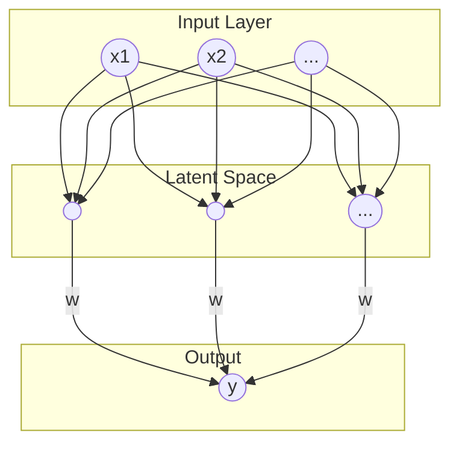

好的，我已经将您图片中的手写笔记转换成了 Markdown 格式，并与您提供的补充笔记内容进行了整合和优化，形成了一份结构清晰、内容连贯的学习笔记。

---

# Lecture 8. Introduction

## 术语 (Terminology)
*   **矩阵 (matrix)**
*   **向量 (vector)**
*   **标量 (scalar)**
*   **张量 (tensor)**

## 矩阵的应用：深度学习

## 建模：从线性组合到逻辑回归

### 2.1 神经元的数学模型 - MP模型

> [!abstract]
> 这一部分我更喜欢矩阵论绪论课上程磊老师的讲解，所以我转成markdown把笔记搬过来了。

1943年，科学家 McCulloch 和 Pitts 受生物神经元的启发，建立了第一个神经元的数学模型，称为 **MP模型**。

*   **生物神经元** (The Neuron)：由树突（输入）、细胞核（处理）、轴突（输出）组成。
*   **MP模型** (The MP model)：
    *   接收来自其他 $m$ 个神经元的输入信号 $x_1, x_2, ..., x_m$。
    *   这些输入信号通过带权重的连接 $\omega_{k1}, \omega_{k2}, ..., \omega_{km}$ 进行传递。权重代表了连接的强度。
    *   神经元内部将所有加权后的输入信号求和，并加上一个**偏置项 (bias)** $b_k$。偏置项可以看作是神经元被激活的难易程度。
    *   将求和结果 $v_k$ 输入到一个**激活函数 (activation function)** $\varphi(\cdot)$ 中，得到最终的输出 $y_k$。

> [!NOTE] MP模型公式
> $$ y_k = \varphi(\sum_{i=1}^{m} \omega_{ki}x_i + b_k) $$
> 写成向量形式就是：
> $$ y_k = \varphi(W_k^T X + b) $$

### 2.2 感知器算法 (The Perceptron Algorithm)

1957年，Frank Rosenblatt 重新研究了MP模型，并提出了一个可以从训练数据中学习到参数 $(W, b)$ 的算法，他将其命名为**感知器算法**。这是第一个真正意义上的机器学习算法。

感知器算法本质上是一个非常简单的线性二分类模型，它的模型可以看作是不带激活函数的MP模型（或者说激活函数是符号函数）。

*   **模型形式**: $f(X) = W^T X + b$
*   **目标**: 从训练样本 $\{(X_i, Y_i)\}_{i=1 \sim N}$ 中学习参数 $(W, b)$，使得对于所有的 $i=1 \sim N$，都有 $Y_i \approx W^T X_i + b$。这里，$Y_i$ 的取值为 +1 或 -1，代表两个不同的类别。

> [!EXAMPLE] 感知器算法步骤
> [请在此处插入第 13 页的图片]
> *   **输入**: 训练样本 $\{(X_i, Y_i)\}_{i=1 \sim N}$
> *   **输出**: 参数 $(W, b)$，使得 $f(X) = W^T X + b$ 能正确分类样本。
>
> 1.  **随机初始化** $(W, b)$。
> 2.  **随机选择**一个训练样本 $(X, Y)$。
>     a.  **如果 $W^T X + b > 0$ 但 $Y = -1$** (模型预测为正类，但实际是负类)，说明预测错误，则更新参数：
>         $W = W - X$
>         $b = b - 1$
>     b.  **如果 $W^T X + b < 0$ 但 $Y = +1$** (模型预测为负类，但实际是正类)，说明预测错误，则更新参数：
>         $W = W + X$
>         $b = b + 1$
> 3.  **选择另一个**样本 $(X, Y)$，回到步骤 (2)。
> 4.  **终止条件**：重复以上步骤，直到所有样本都**不再**满足 2(a) 和 2(b) 的条件，即所有样本都被正确分类。

#### 感知器算法演示

下面的动图展示了感知器算法如何通过不断调整，最终找到一条直线来完美分开源泉和星号两类数据点。

[请在此处插入第 15-34 页中的任意一张图片作为算法演示]

## 从单层到多层神经网络
上面讨论的逻辑回归模型 $\sigma(W^T x) = y$ 只有一个输出，可以看作是单个神经元。为了改善模型的效果，我们可以将多个神经元组织起来，形成“层”（Layer）。

如上图所示，输入层 $X^{(1)}$ 的信号通过带权重的连接，被送到一个“隐藏层”（Latent space）。隐藏层中的每个神经元都会进行一次类似逻辑回归的计算。

以隐藏层的第j个神经元 $x_j^{(2)}$ 为例，它的计算过程是：
$$ x_j^{(2)} = \sigma(\sum_i x_i^{(1)} w_{ij}^{(1)}) = \sigma([W_j^{(1)}]^T X^{(1)}) $$
这里 $[W_j^{(1)}]$ 是从输入层连接到第j个隐藏神经元的所有权重组成的向量。

将隐藏层的所有神经元放在一起，整个层的计算就可以用矩阵形式表示：
$$ X^{(2)} = \sigma((W^{(1)})^T X^{(1)}) $$
这就构成了一个**单层神经网络**。

### 多层连接 (Deep Neural Network)
我们可以将多个这样的层连接起来，形成一个深度神经网络。前一层的输出作为后一层的输入，层层递进：
$$ X^{(2)} = \sigma((W^{(1)})^T X^{(1)} + b^{(1)}) $$
$$ X^{(3)} = \sigma((W^{(2)})^T X^{(2)} + b^{(2)}) $$
$$ \dots $$
$$ y = \text{output\_activation}((W^{(L)})^T X^{(L)} + b^{(L)}) $$
将它们嵌套在一起，就得到了深度学习模型的基本形式。