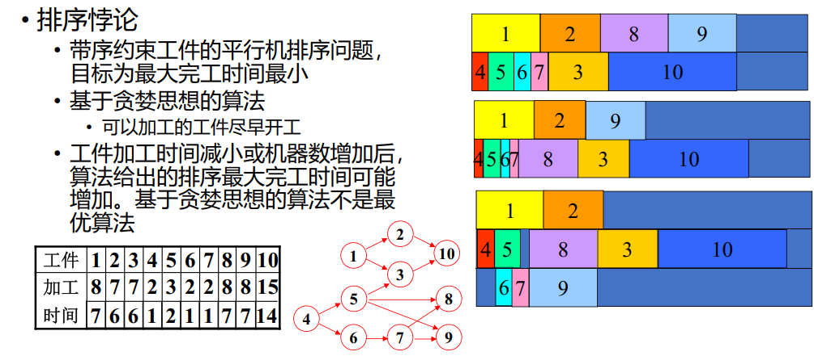

# 组合优化

## 一、基础概念
- 定义：应用于离散对象的，从有限多个可行解中找出使某个目标函数达到最优的解的优化问题
- 组合优化是离散数学（Discrete Mathematics）与最优化的交叉学科分支
- 特点：解的数量比较多，通常不能通过穷举所有可能的解加以比较来求解

## 二、实际问题背景
### 2.1 背包问题
#### 2.1.1 连续优化

!!! info "Background"
	现有 $n$ 件物品，物品 $j$ 的价值为$p_j$,大小为 $w_j$。 物品质地均匀，可任意切割，将若干物品的全部或部分放入容量为$C$的背包中，在放入背包物品大小之和不超过背包容量的前提下，使放入背包物品价值之和尽可能大.

- 第一反应：装**单位体积最值钱的**
- 优化写法：
	- 目标函数是：$max \sum^n_{j=1} p_j x_j$
- 证明：
	- 1.最优解的包一定是放满的(如果不放满，则放满更优)
	- 2.如果不是最优解，假设存在一个更优解，再进行替换

#### 2.1.2 组合优化 -- 背包问题

!!! info "Background"
	现有 $n$ 件物品，物品 $j$ 的价值为$p_j$,大小为 $w_j$。~~物品可随意切割~~，将若干物品~~的全部或部分~~放入容量为$C$的背包中，在放入背包物品大小之和不超过背包容量的前提下，使放入背包物品价值之和尽可能大.

此时$x_i=\begin{cases}0\\1\end{cases}$

#### 2.1.3 分类
- 0-1背包：本来的问题（放/不放）
- 无限背包：物品$j$有无限个
- 整数背包：物品$j$有$n_j$个
- 多背包
- 多维背包：大小/重量 都不能超过某个$M$值
	- 多维几何背包

## 2.3 旅行商问题 - TSP
- 一推销员想在若干个城市中推销自己的产品。计划从某个城市出发，经过每个城市恰好一次，最后回到出发的城市
- 城市之间距离已知
- 如何选择环游路线，使推销员走的路程最短
可行解（环游）
- 每一条环游路线由 $n$ 段两个城市之间的旅行路线连接而成，对应于 $1,2,\cdots,n$ 的一个圆周排列

### 2.4 车辆路径问题 - VRP
- $n$个顾客，顾客$i$位于地点$i$,需求为$q$,$i=0,1,\dots,n$
- $K$辆相同的车，容量均为$Q$
- 仓库位于地点0，从地点$i$到地点$j$的距离为$c_{ij},i,j=0,1,\dots,n$
![[Pasted image 20241007142208.png]]
- 由TSP发展而来，不仅要考虑距离，还要考虑**容量的限制**

### 2.5 指派问题 - 婚姻问题

### 2.6 排序问题

## 三、算法与计算复杂性
#### 3.1 算法
- 一系列将**输入**转化为**输出**的计算步骤
- 计算复杂性：确定一个问题的所有可能性
#### 3.2  $P\;v.s.\;NP$ 问题
$P$ 和 $NP$ 问题的通俗解释：
- $P$：有（确定性）多项式时间算法的问题
- $NP$：有非确定性多项式时间算法的问题
!!! info "非确定性算法"
  - 在现实中不存在？
  - e.g. 数独：$9\times 9$
  	- 1. 猜出一个解
  	- 2. 验证是否正确
  	- 时间复杂度只取决于验证是否正确所花费的时间

- 确定性算法是一种特殊的非确定性算法，故 $P\subseteq NP$
- 关于$P\;v.s\;NP$ 问题：目前仍然未被证明 
- $NP – C$：$NP$ 类中最难的问题
    - 若一个 $NP – C$ 问题有多项式时间算法，所有 $NP$ 问题都有多项式时间算法
- $NP – hard$：不比 $NP – C$ 问题容易的问题
    - 在 $P\neq NP$ 假设下， $NP$ - 难 问题不存在多项式时间最优算法

#### 3.n 贪心算法
**贪心算法**：在每一次决策时，选择当前可行且最有利的决策
- 局部最优解未必是全局最优解
##### 3.n.1 场馆安排问题
- 某场馆收到$n$项借用申请，第$i$项申请的活动开始时间为$s_i$,结束时间为$t_i$,持续时间为$d_i=t_i-s_i$
- 场馆在同一时刻只能进行一项活动，一项活动开始后必须连续进行直至结束
- 希望选择接收部分申请，使得场馆能开展的活动数量尽可能多

- 贪心算法：
	- 将所有申请按某种顺序排列，依次考虑各项申请
	- 若当前申请涉及的活动所需时段未被已接受的申请涉及的活动占用，则接受该申请，否则拒绝该申请
- 排列顺序？
	- 按持续时间从小到大顺序排列
	- 按开始时间从小到大顺序排列
		- 若无P解，则可以比较1，2的排列那个更优
		- 若有多项式时间算法，则$\dots$
	- 按结束时间从小到大顺序排列 √
	- 最优性证明：
		- 存在一个最优解$\sigma$, 接受结束时间最早的申请$i_0$
			- 反证法：假设$\sigma$中$i_0$被拒绝
			- 若在$i_0$的持续时间内，场馆空闲
				- 增加接受$i_0$,接受申请数增加，与$\sigma$是最优解矛盾
			- 若在$i_0$的持续时间内，场馆在一段时间内被其他接受申请$i$占用
				- 由于$i_0$是结束时间最早的申请，$i$的结束时间晚于$i_0$
				- 换一换，相当于原活动结束得更早，后面的活动不受影响
		- 考虑开始时间晚于$i_0$的结束时间的所有申请，继续运用上述性质
##### 3.n.1 排序悖论
- 排序悖论
	- 带序约束共建的平行机排序问题，目标为最大完工时间最小
	- 基于贪婪思想的算法有问题（x

10优先加工：应该优先加入2和3，这条是关键路径

有序关系：还是要有先后关系

