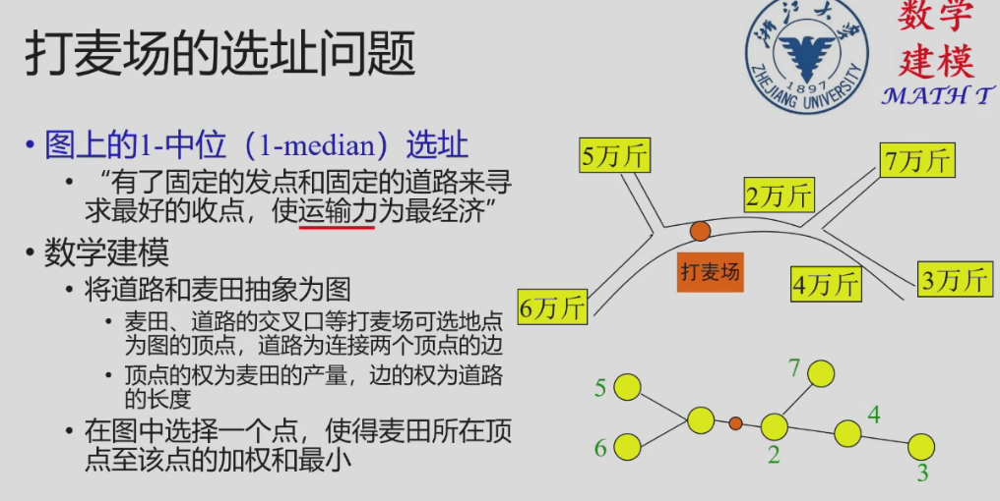
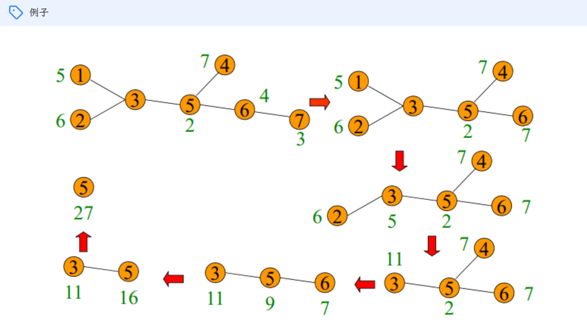
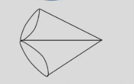
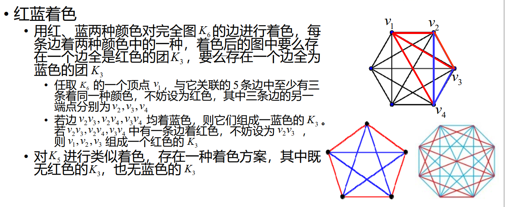
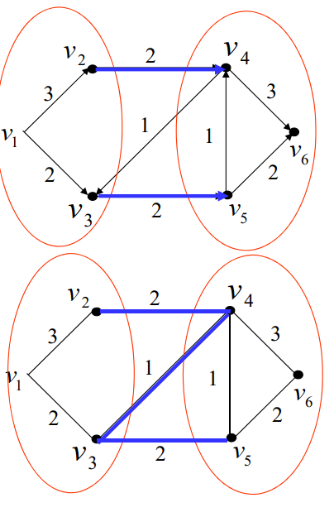

  
  
>Putnam 2012B3  
  
引理1：任取$m$天，必有至少$m$支队在这$m$天中至少获胜一场  
  
!!! note "Proof."
	1. 任取m支球队  
	2. 如果不合要求，则一定有$\geq1$个队伍不合要求，该队伍在$m$天全输$\rightarrow$，它的 $m$ 支队伍符合要求  
  

  
抽签问题：要保证当下抽签的选项中存在==完美匹配==  
  
>打麦场问题  
  
  
  
1. 道路无回环（圈），抓各端（叶子），最小的进一站。  
  
  
  
进一站→删除运算  
  
打麦场设在5  
  
  
!!! note "Proof."  
	从简单到复杂...  
	- 若只有两站，建在少的那里  
	- 若大于两类：  
	  
	- 分类讨论：  
		- 若在1、2之间，则，都需要通过2进行运输，则对于除了1、2之外的麦子，可以分成two step:  
			- 其他麦子运到2  
			- 1和2再进行运输  
		- 此时化归到第一种情况，即运到麦子更多的那个，所以必然是在2建站，从而满足了最小的进一站  
		- 若不在①处或①②之间建场， ①的麦子进入麦场必经过②，则可以将1，2合并，则满足了最小的进一站  
 
  
2. 道路有回环，每圈甩一段；化为无回环，然后照样算；甩法有不同，结果一一算；算后再比较，最优可立断。  
  
  
### 七桥问题：  
  
!!! quote "Background."  
	有七座桥梁建在河上，是否有一条从城中某处出发，经过每座桥梁恰好一次，最后回到出发点？  
 
  
Step1: 桥作为顶点/桥作为边  
  
>Euler图：  
> 经过图的所有边恰好一次的闭迹是Euler回路；存在Euler回路的图为Euler图。  
  
>充要条件是图中没有奇度顶点!  
  
建模：以河流分割而成的城市区域为顶点，桥梁为边，边的端点为该桥梁连接的两片区域。七桥问题等价于在该区域里寻找一片闭迹。  
  
## 中国邮递员问题：  
  
  
  
  
  
赋权图不是Euler图，则寻找一条总长度最短的回路，该回路可能经过某些边两次以上  
  
  
  
  
## Ramsey 数  
  
  
  
定理 1.1 (Ramsey). 对任意正整数 s, t, 存在正整数 N, 使得完全图 $K_N$​ 的任意二染色 (下文中均指红蓝二染色) 必包含红色 Ks​ 或蓝色 Kt​. 这样的最小的正整数 N 记为 R(s,t).  
  
## 割  
  
- 定义：设$S \subseteq V$为图$G=(V,E)$顶点集的任一子集，$\overline{S}=V \setminus S$边集$(S,\overline(S))$称为$G$的割.  
	- 【通俗来讲】，图G上的一点连出去的一条边  
  
		- 若$G$为无向图：$S-\overline{S}$  
		- 若$G$为有向图：$S\rightarrow\overline{S}$  
- 赋权图中割的权之和是**割量**  
	- 割量最小的割是**最小割**  
	- 割量最大的割是**最大割**  
  
  
## 网络流  
  
- [csdn-blog](https://blog.csdn.net/Nopoduct/article/details/123298182)  
  
- 有向图$N=(V,A)$  
	- 以$v$为起点和终点的弧的集合分别记作$v^+,v^-$  
- 定义：  
	- 对任一弧$a \in A$, 其容量为非负数$u(a)$,费用为数$c(a)$  
	- 对任一顶点$v \in V$, 平衡量是$b(v)$  
		- $\sum_{v\in V}b(v)=0$  
	- 网络流：对任一弧$a \in A$， 流经弧$a$的流量为非负数$f(a)$  
		- 弧容量限制：$f(a) \leq u(a)$  
		- 顶点容量限制：$\sum_{a\in v^+}f(a)-\sum_{a\in v^-}f(a)=b(v)$  
- 最小费用流  
	- 求$\sum_{a\in v}f(a)c(a)$最小的可行流  
- 最大流  
	- 除顶点$s,t$外，其余顶点的平衡量为0【输入量等于输出量，达到平衡】  
	- 求顶点$s$平衡量的最大值，即网络中从$s$到$t$的**最大流量**  
- 最大流最小割定理  
	- 任一网络中，最大流量等于最小割量  
  
!!! tip 
	最大割的数学规划
  
$x_i=\begin{cases}1,v_i \in S\\-1, v_i\in \overline{S}\end{cases}$  
  
Explanation:  
  
| $u_i \in S$    | $v_i \notin S$ | 1   |  
| -------------- | -------------- | --- |  
| $u_i \notin S$ | $v_i \in S$    | 1   |  
| $u_i \in S$    | $v_i \in S$    | -1  |  
  
$\sum\sum w_{uv}x_u x_v$ 其中，$w_{uv}$是权值,$x_u \in \{-1,1\}$  
## 欧拉图  
  
> self-learning from [oi-wiki](https://oi.wiki/graph/euler/)  
  
### 定义：  
  
- **欧拉回路**：通过图中每条边恰好一次的回路  
- **欧拉通路**：通过图中每条边恰好一次的通路  
- **欧拉图**：具有欧拉回路的图  
- **半欧拉图**：具有欧拉通路但不具有欧拉回路的图  
  
### 性质：  
  
- 欧拉图中所有顶点的度数都是偶数  
  
!!! note "Proof."  
	**因为欧拉回路的要求是走遍所有边恰好一次，不难发现，所有点的“进出”次数应该是一样的（出和入是对应的，一定会成对出现），也就是度数都为偶数**。 因此若图 G 存在欧拉回路，则图 G 一定连通且所有顶点度都是偶数。  

  
- 若$G$是欧拉图，则它为若干个环的并，且每条边被包含在奇数个环内。  
  
### 判别法  
  
1. 无向图是欧拉图当且仅当：  
    - 非零度顶点是连通的  
    - 顶点的度数都是偶数  
2. 无向图是半欧拉图当且仅当：  
    - 非零度顶点是连通的  
    - 恰有 2 个奇度顶点  
3. 有向图是欧拉图当且仅当：  
    - 非零度顶点是强连通的  
    - 每个顶点的入度和出度相等  
4. 有向图是半欧拉图当且仅当：  
    - 非零度顶点是弱连通的  
    - 至多一个顶点的出度与入度之差为 1  
    - 至多一个顶点的入度与出度之差为 1  
    - 其他顶点的入度和出度相等  
  
### 求欧拉回路或欧拉路  
  
#### 1. Fleury (弗罗莱) 算法  
  
