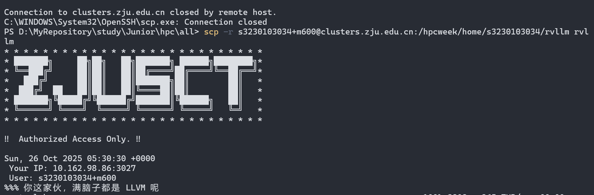

# HPCWeek - 2025

> [!abstract]
> 参赛Writeup - rk 17 虽然没有名次……但是第一次做感觉已经尽力了。

纪念：




## 环境配置相关

### ssh 连接

#### 1. 在 Windows 上查找你已配置的 SSH Key

1.  打开文件资源管理器。
2.  在地址栏中输入 `%USERPROFILE%\.ssh` 然后按回车键。
    *   `%USERPROFILE%` 是一个系统变量，它会自动指向你当前用户的文件夹，例如 `C:\Users\YourUsername`。
3.  进入 `.ssh` 文件夹后，你会看到一些文件。这些就是你的 SSH Key 文件：
    *   `id_rsa` 或 `id_ed25519`: 这是你的**私钥 (Private Key)**。 **绝对不要泄露或分享这个文件！**
    *   `id_rsa.pub` 或 `id_ed25519.pub`: 这是你的**公钥 (Public Key)**。这个文件可以安全地分享给你需要连接的服务器（如 GitHub, GitLab, 或你的云主机）。
    *   `known_hosts`: 这个文件记录了你曾经连接过的服务器的指纹，用于防止中间人攻击。
    *   `config`: (可选) 这是一个配置文件，你可以用它来为不同的主机设置别名和特定的连接参数。

#### 2. ZJULab 配置 ssh

在 [这里](https://git.zju.edu.cn/-/user_settings/ssh_keys) 复制`id_rsa.pub`。

#### 3. 终端 ssh 连接


### Vscode in WSL

#### 开权限

```bash
slowist@Slowist:/home/HPC$ sudo chown -R slowist:slowist /home/HPC
```

## Quine

[【翻译】Quine - 自我复制的程序（上） - 知乎](https://zhuanlan.zhihu.com/p/549183520)

[笨方法写Quine](https://blog.mistivia.com/posts/2024-09-21-quine/)

“Quine” 也可称为 "selfrep"，是一个计算机程序，执行后，打印出自身源码。

首先定义字符串`*DNA*`。这里我们不知道“DNA”的内容，所以先用emoji符号代替。因为这个
字符串里面包含了两部分内容：头和尾，我们假设头是老虎，尾巴是蛇：

```python
dna = '🐱,🐍'
```

然后把头和尾巴取出来：

```python
head, tail = dna.split(',')
```

因为我们打算用16进制编码，所以这里要把头和尾都用16进制解码恢复成原来的样子：

```python
head = bytes.fromhex(head).decode('utf-8')
tail = bytes.fromhex(tail).decode('utf-8')
```

最后，我们把头、DNA、尾巴，这三部分拼接起来，一起输出：
```python
print(head + dna + tail)
```

现在的程序是这样的：

```python
dna = '🐱,🐍'
head, tail = dna.split(',')
head = bytes.fromhex(head).decode('utf-8')
tail = bytes.fromhex(tail).decode('utf-8')
print(head + dna + tail)
```

类似的思路写Shell

```shell
dna='646e613d27,270d0a4946533d272c273b20736574202d2d2024646e613b20686561643d24313b207461696c3d24320d0a686561643d24286563686f2022246865616422207c20787864202d72202d70290d0a7461696c3d24286563686f2022247461696c22207c20787864202d72202d70290d0a6563686f2022246865616424646e61247461696c22'

IFS=','; set -- $dna; head=$1; tail=$2

head=$(echo "$head" | xxd -r -p)

tail=$(echo "$tail" | xxd -r -p)

echo "$head$dna$tail"
```

## Parallel Compress

### 1. 跑通Baseline

下载Baseline，安装依赖，然后make

```bash
slowist@Slowist:/home/HPC/parallel_compress$ tar -xzf baseline.tar.gz
slowist@Slowist:/home/HPC/parallel_compress$ sudo apt install libhts-dev
slowist@Slowist:/home/HPC/parallel_compress$ sudo apt install gcc
slowist@Slowist:/home/HPC/parallel_compress/baseline$ sh compile.sh
rm -f compress
gcc -Wall -Wextra -O3 -fopenmp -o compress compress.c -lhts -lpthread
slowist@Slowist:/home/HPC/parallel_compress/baseline$ ./compress
Usage: ./compress <infile> <outfile>
```

可以看到一般的执行，由于没有输入输出是不行的。在GPT的指导下随机生成512M文件：

```bash
slowist@Slowist:/home/HPC/parallel_compress/baseline$ dd if=/dev/urandom of=test.dat bs=1M count=512
512+0 records in
512+0 records out
536870912 bytes (537 MB, 512 MiB) copied, 1.29533 s, 414 MB/s
```

至此Baseline跑通；

### 2. `htslib` 提供接口加速

根据题目提示，去找C接口的定义；

官方文档：[here](htslib/htslib/bgzf.h at develop · samtools/htslib](https://github.com/samtools/htslib/blob/develop/htslib/bgzf.h#L378) 在Gemini的帮助下还是看得懂的。

找到`bgzf_thread_pool`的函数定义：

```c
int bgzf_thread_pool(BGZF *fp, hts_tpool *pool, int qsize) {
    // No gain from multi-threading when not compressed
    if (!fp->is_compressed)
        return 0;

    mtaux_t *mt;
    mt = (mtaux_t*)calloc(1, sizeof(mtaux_t));
    if (!mt) return -1;
    fp->mt = mt;

    mt->pool = pool;
    mt->n_threads = hts_tpool_size(pool);
    if (!qsize)
        qsize = mt->n_threads*2;
    if (!(mt->out_queue = hts_tpool_process_init(mt->pool, qsize, 0))) {
        free(mt);
        return -1;
    }
    hts_tpool_process_ref_incr(mt->out_queue);

    mt->job_pool = pool_create(sizeof(bgzf_job));

    pthread_mutex_init(&mt->job_pool_m, NULL);
    pthread_mutex_init(&mt->command_m, NULL);
    pthread_mutex_init(&mt->idx_m, NULL);
    pthread_cond_init(&mt->command_c, NULL);
    mt->flush_pending = 0;
    mt->jobs_pending = 0;
    mt->free_block = fp->uncompressed_block; // currently in-use block
    mt->block_address = fp->block_address;
    pthread_create(&mt->io_task, NULL,
                   fp->is_write ? bgzf_mt_writer : bgzf_mt_reader, fp);

    return 0;
}
```


```c
int bgzf_thread_pool(BGZF *fp, hts_tpool *pool, int qsize);
```

*   **`BGZF *fp`**: 一个已经通过 `bgzf_open()` 打开的BGZF文件句柄。必须是以写入（"w"）或读取（"r"）模式打开的。
*   **`hts_tpool *pool`**: 指向一个已经初始化的HTSlib线程池的指针。**这是关键**：调用者负责创建和销毁这个线程池。
*   **`int qsize`**: 内部任务队列的大小。如果传入0，函数会根据线程池中的线程数量选择一个合理的默认值（通常是 `线程数 * 2`）。

然后利用这个API编写代码：

```c
#include <stdio.h>
#include <stdlib.h>
#include <string.h>

// 关键头文件
#include "htslib/bgzf.h"
#include "htslib/thread_pool.h"

int main() {
    // --- Step 1: 创建 HTSlib 线程池 ---
    int n_threads = 4;
    hts_tpool *pool = hts_tpool_init(n_threads);
    if (!pool) {
        fprintf(stderr, "Error creating thread pool\n");
        return 1;
    }
    printf("Created a thread pool with %d threads.\n", n_threads);

    // --- Step 2: 打开 BGZF 文件 ---
    const char *filename = "output.threaded.gz";
    // "w" 表示写入，也可以添加压缩级别，如 "w4"
    BGZF *fp = bgzf_open(filename, "w");
    if (fp == NULL) {
        fprintf(stderr, "Could not open %s for writing\n", filename);
        hts_tpool_destroy(pool); // 清理线程池
        return 1;
    }
    printf("Opened %s for writing.\n", filename);

    // --- Step 3: 关联线程池 ---
    // qsize 设置为 0，使用默认队列大小
    if (bgzf_thread_pool(fp, pool, 0) < 0) {
        fprintf(stderr, "Error associating thread pool with BGZF handle\n");
        bgzf_close(fp);
        hts_tpool_destroy(pool);
        return 1;
    }
    printf("Successfully associated thread pool with BGZF file.\n");

    // --- Step 4: 执行写操作 (和单线程代码一样) ---
    const char *data = "This is a line of text that will be compressed. It will be written many times to create a large file.\n";
    size_t data_len = strlen(data);
    long total_written = 0;
    
    printf("Writing data...\n");
    for (int i = 0; i < 100000; ++i) {
        if (bgzf_write(fp, data, data_len) != data_len) {
            fprintf(stderr, "Error writing to BGZF file\n");
            break;
        }
        total_written += data_len;
    }
    printf("Finished writing. Total uncompressed bytes: %ld\n", total_written);

    // --- Step 5: 关闭 BGZF 文件 ---
    // bgzf_close() 会等待所有后台压缩任务完成
    printf("Closing BGZF file (this will flush all remaining blocks)...\n");
    if (bgzf_close(fp) < 0) {
        fprintf(stderr, "Error on bgzf_close\n");
    }

    // --- Step 6: 销毁线程池 ---
    // 必须在 bgzf_close() 之后调用
    printf("Destroying thread pool.\n");
    hts_tpool_destroy(pool);

    printf("Done.\n");
    return 0;
}
```

最后把线程数开到52；
## CT

### FFT优化

一开始看到有很多卷积操作，然后开始FFT优化；因为没法调库，所以只能手写Radix-4 FFT；


```cpp
#include <cmath>
#include <algorithm>
#include <vector>

#include <omp.h>
#include <arm_neon.h>

#include "fbp.h"
#include <complex> // 新增的包含，确保 std::complex 可用

constexpr double PI = 3.14159265358979323846;

/**
 * Generate Ramp filter kernel in spatial domain
 * 
 * @param len  Kernel length (will be made odd if even)
 * @param d    Detector pixel spacing (default 1.0)
 * @return     Symmetric filter kernel centered at middle
 */
static std::vector<float> ramp_kernel(int len, float d = 1.0f) {
    if (len % 2 == 0) len += 1;  // Ensure odd length for symmetry
    int K = len / 2;  // Center index
    
    std::vector<float> h(len, 0.0f);
    
    // Center value
    h[K] = 1.0f / (4.0f * d * d);
    
    // Symmetric side lobes (only odd positions have non-zero values)
    for (int n = 1; n <= K; ++n) {
        if (n % 2 == 1) {
            float val = -1.0f / (float(PI) * float(PI) * n * n * d * d);
            h[K + n] = val;
            h[K - n] = val;
        }
    }
    
    return h;
}

// =================================================================
// FFT-based convolution and related functions
// =================================================================

/**
 * @brief 执行 in-place Radix-4 快速傅里叶变换 (FFT) 或其逆变换 (IFFT)。
 * 
 * 该函数使用 Decimation-In-Time (DIT) Radix-4 算法。
 * 为获得最佳性能，输入向量的大小必须是4的幂。
 * 
 * @param data    一个复数向量。函数将直接修改此向量。其大小必须是4的幂。
 * @param inverse 如果为 false (默认)，则计算正向FFT。
 *                如果为 true，则计算逆向FFT。
 *                注意：此函数不执行逆变换后的 1/N 缩放，调用者需要自行处理。
 */
void radix4_fft(std::vector<std::complex<float>>& data, bool inverse = false) {
    const size_t N = data.size();

    // --- 1. 输入验证 ---
    if (N == 0) {
        return;
    }

    // 检查N是否为4的幂 (如果输入保证正确可以注释掉以提升性能)
    // size_t temp_check = N;
    // if ((N & (N - 1)) != 0 && N != 1) { // 快速检查是否是2的幂
    //     throw std::invalid_argument("Vector size for Radix-4 FFT must be a power of 4.");
    // }
    // while (temp_check > 1) {
    //     if (temp_check % 4 != 0) {
    //         throw std::invalid_argument("Vector size for Radix-4 FFT must be a power of 4.");
    //     }
    //     temp_check /= 4;
    // }


    // --- 2. 4基位反转 (Radix-4 Bit-Reversal Permutation) ---
    // 这个步骤将数据重新排序，以便蝶形运算可以就地执行。
    // j 是 i 的4基反转后的索引。
    size_t j = 0;
    for (size_t i = 1; i < N; ++i) {
        size_t k = N / 4;
        while (j >= 3 * k) {
            j -= 3 * k;
            k /= 4;
        }
        j += k;

        if (i < j) {
            std::swap(data[i], data[j]);
        }
    }

    // --- 3. 蝶形运算 (Butterfly Operations) ---
    // 确定旋转因子的角度符号
    const float angle_sign = inverse ? 1.0f : -1.0f;
    const std::complex<float> j_factor(0, angle_sign); // 代表 -j (正向) 或 +j (逆向)

    // 逐级计算DFT，从大小为4的DFT开始，直到大小为N
    for (size_t m = 4; m <= N; m *= 4) {
        const float angle_base = angle_sign * 2.0f * static_cast<float>(PI) / m;
        
        // 遍历每个DFT块
        for (size_t i = 0; i < N; i += m) {
            // 遍历每个块内的蝶形运算
            for (size_t k = 0; k < m / 4; ++k) {
                // --- 计算旋转因子 (Twiddle Factors) ---
                // W_m^k, W_m^(2k), W_m^(3k)
                auto w1 = std::polar(1.0f, angle_base * k);
                auto w2 = std::polar(1.0f, angle_base * (2 * k));
                auto w3 = std::polar(1.0f, angle_base * (3 * k));

                // --- Radix-4 蝶形运算 ---
                // 从向量中取出4个点
                const size_t idx0 = i + k;
                const size_t idx1 = i + k + m / 4;
                const size_t idx2 = i + k + m / 2;
                const size_t idx3 = i + k + 3 * m / 4;

                auto c0 = data[idx0];
                auto c1 = data[idx1];
                auto c2 = data[idx2];
                auto c3 = data[idx3];

                // 先将后三个点乘以旋转因子
                auto p1 = c1 * w1;
                auto p2 = c2 * w2;
                auto p3 = c3 * w3;
                
                // 执行高效的4点DFT计算
                auto q1 = c0 + p2;
                auto q2 = c0 - p2;
                auto q3 = p1 + p3;
                auto q4 = (p1 - p3) * j_factor;

                // 将结果存回原位
                data[idx0] = q1 + q3;
                data[idx1] = q2 + q4;
                data[idx2] = q1 - q3;
                data[idx3] = q2 - q4;
            }
        }
    }
}

/**
 * Apply Ramp filter to all projections in a sinogram (in-place convolution) using FFT.
 * 
 * @param sino        Sinogram data [n_total_angles, n_det] - modified in-place
 * @param n_total_angles Total number of projections to filter (e.g., n_slices * n_angles)
 * @param n_det       Number of detector pixels
 * @param fft_kernel  Pre-computed FFT of the Ramp filter kernel
 */
static void filter_projections_fft(
    float* sino, 
    int n_total_angles, 
    int n_det, 
    const std::vector<std::complex<float>>& fft_kernel // 预计算好的
) {
    int fft_len = fft_kernel.size();
	std::vector<std::complex<float>> proj_padded(fft_len);
	for (int a = 0; a < n_total_angles; ++a) {
		float* row = &sino[a * n_det];

		// 1. 填充数据
		for (int i = 0; i < n_det; ++i) {
			proj_padded[i] = {row[i], 0.0f};
		}
		std::fill(proj_padded.begin() + n_det, proj_padded.end(), 0.0f);

		// 2. 正向FFT
		radix4_fft(proj_padded, false); // <--- MODIFIED: Corrected function name

		// 3. 频域乘积 (Hadamard product)
		for (int i = 0; i < fft_len; ++i) {
			proj_padded[i] *= fft_kernel[i];
		}

		// 4. 逆向FFT
		radix4_fft(proj_padded, true); // <--- MODIFIED: Corrected function name

		// 5. 写回结果 (注意归一化)
		float scale = 1.0f / fft_len;
		for (int i = 0; i < n_det; ++i) {
			row[i] = proj_padded[i].real() * scale;
		}
	}
}


// This is the original direct convolution function, kept here for reference or testing.
static void filter_projections(float* sino, int n_angles, int n_det, const std::vector<float>& kernel) {
    int K = int(kernel.size() / 2);

    std::vector<float> tmp(n_det);
    
    for (int a = 0; a < n_angles; ++a) {
        float* row = &sino[a * n_det];
        
        // 1D Convolution: filtered[x] = sum(row[x+k] * kernel[K+k])
        for (int x = 0; x < n_det; ++x) {
            float acc = 0.0f;
            
            // Only convolve within valid detector range
            int k_start = std::max(-K, -x);
            int k_end = std::min(K, n_det - 1 - x);
            
            for (int k = k_start; k <= k_end; ++k) {
                acc += row[x + k] * kernel[K + k];
            }
            
            tmp[x] = acc;
        }
        
        // Write filtered values back to input array
        for (int x = 0; x < n_det; ++x) {
            row[x] = tmp[x];
        }
    }
}

void fbp_reconstruct_3d(
    float* sino_buffer,
    float* recon_buffer,
    int n_slices,
    int n_angles,
    int n_det,
    const std::vector<float>& angles_deg
) {
    size_t slice_size = size_t(n_angles) * n_det;
    size_t recon_size = size_t(n_det) * n_det;
    
    // ============================================================
    // STEP 0: Precomputation
    // ============================================================
    
    // Compute ramp filter kernel once (shared by all slices)
    auto kernel_spatial = ramp_kernel(n_det | 1);

    // ============================================================
    // NEW: Prepare the FFT of the Kernel
    // This is done only ONCE for all slices and projections.
    // ============================================================
    
    // 1. Determine the FFT length. It must be a power of 4 and large enough for linear convolution.
    int min_len = n_det + kernel_spatial.size() - 1;
    int fft_len = 1;
    if (min_len > 1) {
        // A simple loop to find the next power of 4
        while (fft_len < min_len) {
            fft_len *= 4;
        }
    }
    
    // 2. Create a complex vector for the kernel, zero-pad it, and align its center.
    std::vector<std::complex<float>> fft_kernel(fft_len, {0.0f, 0.0f});
    int K = kernel_spatial.size() / 2; // Center index of the spatial kernel

    // The center of the spatial kernel (at index K) goes to the beginning of the padded vector (index 0).
    fft_kernel[0] = {kernel_spatial[K], 0.0f};
    
    // The right part of the kernel (from K+1 to end) goes to the start of the vector.
    for (int i = 1; i <= K; ++i) {
        fft_kernel[i] = {kernel_spatial[K + i], 0.0f};
    }
    // The left part of the kernel (from 0 to K-1) is wrapped around to the end of the vector.
    for (int i = 1; i <= K; ++i) {
        fft_kernel[fft_len - i] = {kernel_spatial[K - i], 0.0f};
    }

    // 3. Perform FFT on the padded and shifted kernel to get the frequency-domain filter.
    radix4_fft(fft_kernel, false);


    // Precompute trigonometric values for all projection angles
    std::vector<float> cos_theta(n_angles);
    std::vector<float> sin_theta(n_angles);
    const float deg2rad = float(PI) / 180.0f;
    
    for (int ai = 0; ai < n_angles; ++ai) {
        float th = angles_deg[ai] * deg2rad;
        cos_theta[ai] = std::cos(th);
        sin_theta[ai] = std::sin(th);
    }
    
    // Image geometry parameters
    const float cx = (n_det - 1) * 0.5f;      // Image center X
    const float cy = (n_det - 1) * 0.5f;      // Image center Y
    const float t_half = (n_det - 1) * 0.5f;  // Detector offset to center
    const float scale = float(PI) / float(n_angles);  // Normalization factor from Radon inversion
    
    // ============================================================
    // STEP 1: Filter all projections (Ramp filtering)
    // ============================================================
    // We call the new FFT-based filter function.
    // The OpenMP parallelization is now inside filter_projections_fft.
    // We pass the entire buffer and the total number of projections.
    filter_projections_fft(sino_buffer, n_slices * n_angles, n_det, fft_kernel);
    
    // ============================================================
    // STEP 2: Backprojection
    // ============================================================
    #pragma omp parallel for
    for (int slice_id = 0; slice_id < n_slices; ++slice_id) {
        // Pointers to input (filtered sinogram) and output (reconstructed image)
        const float* sino_slice = sino_buffer + slice_id * slice_size;
        float* recon_slice = recon_buffer + slice_id * recon_size;
        
        // For each pixel in the reconstructed image
        for (int y = 0; y < n_det; ++y) {
            float yr = y - cy;  // Y coordinate relative to image center
            float* recon_row = recon_slice + y * n_det;
            
            for (int x = 0; x < n_det; ++x) {
                float xr = x - cx;  // X coordinate relative to image center
                float acc = 0.0f;
                
                // Accumulate contributions from all projection angles
                for (int ai = 0; ai < n_angles; ++ai) {
                    float c = cos_theta[ai];
                    float s = sin_theta[ai];
                    
                    // Radon transform: t = x*cos(θ) + y*sin(θ)
                    // This is the position where pixel (x,y) projects onto detector at angle θ
                    float t = xr * c + yr * s;
                    
                    // Convert to detector coordinate (0 to n_det-1)
                    float u = t + t_half;
                    
                    // Integer and fractional parts for interpolation
                    int u0 = int(u);
                    float du = u - u0;
                    int u1 = u0 + 1;
                    
                    // Bilinear interpolation between adjacent detector pixels
                    float w0 = (u0 >= 0 && u0 < n_det) ? (1.0f - du) : 0.0f;
                    float w1 = (u1 >= 0 && u1 < n_det) ? du : 0.0f;
                    
                    // Read filtered projection values
                    const float* sino_row = sino_slice + ai * n_det;
                    float v0 = (u0 >= 0 && u0 < n_det) ? sino_row[u0] : 0.0f;
                    float v1 = (u1 >= 0 && u1 < n_det) ? sino_row[u1] : 0.0f;
                    
                    // Accumulate interpolated value
                    acc += w0 * v0 + w1 * v1;
                }
                
                // Apply normalization factor (π / N_angles from Radon inverse formula)
                recon_row[x] = acc * scale;
            }
        }

    }
}
```

但是把这个代码放到OJ上跑，正确率不通过，而且性能差别微乎其微。正确率上实在不知道为什么，性能上发现FFT只能改变滤波的效率，但是主要的性能瓶颈在Backprojection.

### OpenMP 优化

尝试加了几个OpenMP，然后性能迅速提上来了[ac01] ，具体见《并行计算导论》和最终代码；

### SIMD优化

因为引用了头文件`<arm_neon.h>`，所以使用AVX-512加速，主要就是重写指令；

### 访存优化

但是OpenMP有内存写竞争很严重。

- `#pragma omp parallel for`用在了最外层的slice_id循环上。这本身是一个很好的粗粒度并行策略。

- 由于其内部算法存在严重的内存写竞争，这种并行策略反而放大了问题。线程数越多，竞争可能越激烈，性能甚至可能不升反降。

一开始以ai和u_idx为外层循环的结构重构了代码，这样内存读就是连续的，结果性能不如以图像像素坐标y和x为最外层循环

后来发现是 **内存写不连续的影响大于内存读不连续**

> 对内存，Cache命中，性能这些的概念了解太少了

## Conway Game of Life

### C++ 重构

python的运行速度显著慢于C++，所以用C++重构这个函数来降低通信的时间成本；

### uv使用

这道题要用到python，所以使用了uv.

```bash
curl -LsSf https://astral.sh/uv/install.sh | sh
```

安装后重启Shell

```bash
exec $SHELL
```

```bash
uv --version
```

然后进入项目文件夹

```bash
uv venv
source .venv/bin/activate # 激活
```

安装

```bash
# 安装单个包 
uv pip install requests 
# 同时安装多个包 
uv pip install numpy pandas matplotlib 
# 从 requirements.txt 文件安装 
uv pip install -r requirements.txt
```

编译一个cpp模块，让他变成python可以import的模块

```bash
python setup.py build_ext --inplace
```

### 向量化

见代码；

### 分块

好像是这一题写了，但是完全没看懂，完全是AI写的
### TD

使用位压缩 (Bit-packing)的方法来优化

大致思路：
优化建议
A. 位压缩 (Bit-packing)
这是一个高级技巧，但效果拔群。由于每个细胞只有死/活两种状态，使用uint8_t (8位) 来存储是浪费的。可以用1个比特位来代表一个细胞。
数据结构：一个uint64_t的数组可以用来存储网格，每个uint64_t可以存放64个细胞的状态。
计算：邻居数量的计算可以通过位移（>>, <<）和位运算（&, |, ^）在64个细胞上并行完成。
例如，计算一排64个细胞的上方邻居之和，可以这样做：

```cpp
uint64_t row_above = ...;
uint64_t n1 = (row_above << 1) | (/* 左边一个单元的数据 */);
uint64_t n2 = row_above;
uint64_t n3 = (row_above >> 1) | (/* 右边一个单元的数据 */);
// ... 对中间行和下面行也这样做 ...
```
**优点**：
*   **内存占用减少8倍**：极大地提高了缓存命中率和内存带宽利用率。
*   **计算效率极高**：位运算是CPU最快的操作之一。

**缺点**：
*   实现非常复杂，尤其是处理边界情况。


```cpp
#include <vector>
#include <tuple>
#include <pybind11/pybind11.h>
#include <pybind11/stl.h>
#include <iostream>
#include <algorithm>
#include <omp.h>
#include <arm_neon.h>

namespace py = pybind11;

class Grid {
public:

    int height;
    int width;
    std::vector<uint8_t> data;
    // 默认构造函数
    Grid() : height(0), width(0) {}

    // 构造函数，创建指定大小并用0填充的网格
    Grid(int h, int w) : height(h), width(w), data(h * w, 0) {}

    // (关键) 从 pybind11 转换过来的 vector<vector> 构造网格
    Grid(const std::vector<std::vector<uint8_t>>& vec_2d) {
        if (vec_2d.empty() || vec_2d[0].empty()) {
            height = 0;
            width = 0;
            return;
        }
        height = vec_2d.size();
        width = vec_2d[0].size();
        data.resize(height * width);
        for (int y = 0; y < height; ++y) {
            std::copy(vec_2d[y].begin(), vec_2d[y].end(), data.begin() + y * width);
        }
    }

    // (关键) 二维访问函数 (operator overloading)
    // 这是让 grid(y, x) 语法生效的核心
    uint8_t& operator()(int y, int x) {
        return data[y * width + x];
    }
    const uint8_t& operator()(int y, int x) const {
        return data[y * width + x];
    }
    
    // (关键) 将扁平化的Grid转换回 pybind11 能识别的 vector<vector>
    std::vector<std::vector<uint8_t>> to_vector_2d() const {
        if (empty()) {
            return {};
        }
        std::vector<std::vector<uint8_t>> vec_2d(height, std::vector<uint8_t>(width));
        for (int y = 0; y < height; ++y) {
            std::copy(data.begin() + y * width, data.begin() + (y + 1) * width, vec_2d[y].begin());
        }
        return vec_2d;
    }

    // 辅助函数
    bool empty() const { return height == 0 || width == 0; }
    
    // 为 expand_cpp 中的比较提供支持
    bool operator==(const Grid& other) const {
        return height == other.height && width == other.width && data == other.data;
    }
};

// 辅助函数：使用标量（非NEON）方式计算单个细胞的下一状态
// 这个函数会处理边界检查，因此可以安全地用于任何坐标
void scalar_calculate_cell(const Grid& p_grid, Grid& next_p_grid, int y, int x) {
    int height = p_grid.height;
    int width = p_grid.width;
    int live_neighbors = 0;

    for (int i = -1; i <= 1; ++i) {
        for (int j = -1; j <= 1; ++j) {
            if (i == 0 && j == 0) continue;
            int ny = y + i;
            int nx = x + j;
            if (ny >= 0 && ny < height && nx >= 0 && nx < width) {
                live_neighbors += p_grid(ny, nx);
            }
        }
    }

    if (p_grid(y, x) == 1) {
        next_p_grid(y, x) = (live_neighbors == 2 || live_neighbors == 3);
    } else {
        next_p_grid(y, x) = (live_neighbors == 3);
    }
}


std::pair<Grid, std::pair<int, int>> Next_Generation_Cpp(const Grid& current_grid) {
    if (current_grid.empty()) {
        return {Grid(), {0, 0}};
    }

    int height = current_grid.height;
    int width = current_grid.width;
    int padded_height = height + 2;
    int padded_width = width + 2;

    Grid padded_grid(padded_height, padded_width);
    for (int i = 0; i < height; ++i) {
        std::copy(&current_grid(i, 0), &current_grid(i, 0) + width, &padded_grid(i + 1, 1));
    }

    Grid next_padded_grid(padded_height, padded_width);

    #pragma omp parallel for
    for (int y = 0; y < padded_height; ++y) {
        // 对于顶部和底部边界行 (y=0 和 y=height+1)，或者当宽度不足以使用NEON时，完全使用标量计算
        if (y == 0 || y == padded_height - 1 || width < 16) {
            for (int x = 0; x < padded_width; ++x) {
                scalar_calculate_cell(padded_grid, next_padded_grid, y, x);
            }
            continue; // 处理完此行，进入下一轮y循环
        }

        // --- 对于内部行 (y=1 to height) ---
        // 1. 处理左边界 (x=0)
        scalar_calculate_cell(padded_grid, next_padded_grid, y, 0);

        // 2. 使用 NEON 处理中间部分
        // #if defined(__aarch64__)
        int x = 1;
        for (; x <= width - 15; x += 16) {
            uint8_t* row_above = &padded_grid(y - 1, 0);
            uint8_t* row_curr = &padded_grid(y, 0);
            uint8_t* row_below = &padded_grid(y + 1, 0);

            uint8x16_t top_left = vld1q_u8(&row_above[x - 1]);
            uint8x16_t top_mid = vld1q_u8(&row_above[x]);
            uint8x16_t top_right = vld1q_u8(&row_above[x + 1]);
            uint8x16_t mid_left = vld1q_u8(&row_curr[x - 1]);
            uint8x16_t mid_right = vld1q_u8(&row_curr[x + 1]);
            uint8x16_t bot_left = vld1q_u8(&row_below[x - 1]);
            uint8x16_t bot_mid = vld1q_u8(&row_below[x]);
            uint8x16_t bot_right = vld1q_u8(&row_below[x + 1]);

            uint8x16_t neighbors = vaddq_u8(top_left, top_mid);
            neighbors = vaddq_u8(neighbors, top_right);
            neighbors = vaddq_u8(neighbors, mid_left);
            neighbors = vaddq_u8(neighbors, mid_right);
            neighbors = vaddq_u8(neighbors, bot_left);
            neighbors = vaddq_u8(neighbors, bot_mid);
            neighbors = vaddq_u8(neighbors, bot_right);

            uint8x16_t current_cells = vld1q_u8(&row_curr[x]);
            const uint8x16_t const_2 = vdupq_n_u8(2);
            const uint8x16_t const_3 = vdupq_n_u8(3);
            uint8x16_t is_3_neighbors = vceqq_u8(neighbors, const_3);
            uint8x16_t is_2_neighbors = vceqq_u8(neighbors, const_2);
            const uint8x16_t const_1 = vdupq_n_u8(1);
            uint8x16_t is_alive_mask = vceqq_u8(current_cells, const_1);
            uint8x16_t alive_and_2_neighbors = vandq_u8(is_alive_mask, is_2_neighbors);
            uint8x16_t next_state_mask = vorrq_u8(is_3_neighbors, alive_and_2_neighbors);
            uint8x16_t next_state = vshrq_n_u8(next_state_mask, 7);

            vst1q_u8(&next_padded_grid(y, x), next_state);
        }
        //#else
        //int x = 1; // 如果不是 aarch64，则 x 从 1 开始
        //#endif

        // 3. 处理 NEON 未覆盖的剩余部分和右边界
        for (; x < padded_width; ++x) {
            scalar_calculate_cell(padded_grid, next_padded_grid, y, x);
        }
    }

    // --- 裁剪网格 (Cropping Logic) ---
    // 这部分逻辑无需修改，但要确保它在串行模式下运行以避免数据争用
    int min_y = padded_height, max_y = -1;
    int min_x = padded_width, max_x = -1;

    for (int y = 0; y < padded_height; ++y) {
        for (int x = 0; x < padded_width; ++x) {
            if (next_padded_grid(y, x) == 1) {
                if (y < min_y) min_y = y;
                if (y > max_y) max_y = y;
                if (x < min_x) min_x = x;
                if (x > max_x) max_x = x;
            }
        }
    }

    if (max_y == -1) {
        return {Grid(), {0, 0}};
    }

    // 修改：裁剪逻辑
    int final_height = max_y - min_y + 1;
    int final_width = max_x - min_x + 1;
    Grid final_grid(final_height, final_width);
    for (int y = 0; y < final_height; ++y) {
        const uint8_t* src_row_start = &next_padded_grid(min_y + y, min_x);
        uint8_t* dst_row_start = &final_grid(y, 0);
        std::copy(src_row_start, src_row_start + final_width, dst_row_start);
    }
    
    std::pair<int, int> offset = {min_y - 1, min_x - 1};
    return {final_grid, offset};
}

Grid expand_cpp(const Grid& initial_grid, int iter) {
    Grid grid = initial_grid; // 创建一个可修改的副本
    for (int i = 0; i < iter; ++i) {
        if (grid.empty()) {
            break;
        }
        Grid prev_grid = grid;
        auto result = Next_Generation_Cpp(grid);
        grid = result.first;
        if (grid == prev_grid) { // operator== 现在由Grid类提供
            break;
        }
    }
    return grid;
}

PYBIND11_MODULE(NG, m) {
    m.def("Expand", 
          [](const std::vector<std::vector<uint8_t>>& initial_grid_vec, int generations) {
              Grid initial_grid(initial_grid_vec); // 自动从 vector<vector> 构造
              Grid final_grid = expand_cpp(initial_grid, generations);
              return final_grid.to_vector_2d(); // 将结果转换回 vector<vector>
          },
          "Simulate multiple generations of Conway's Game of Life and return the final state",
          py::arg("initial_grid"), py::arg("generations"));

    m.def("Next_Generation_Cpp", 
          [](const std::vector<std::vector<uint8_t>>& grid_vec) {
              Grid grid(grid_vec); // 自动从 vector<vector> 构造
              auto [final_grid, offset] = Next_Generation_Cpp(grid);
              // 返回 pair<vector<vector>, pair<int, int>>
              return std::make_pair(final_grid.to_vector_2d(), offset);
          },
          "Calculates one generation and returns grid and offset for visualization",
          py::arg("grid"));
}
```
## SPMM

### 1. 访存优化：修改循环结构

- 提高缓存命中率
for m -> for i -> for j 的循环顺序被保留了下来，这确保了在最内层的 j 循环中，对 vin 和 vout 的访问都是连续的。
### 2. SIMD向量化 / OpenMP

```cpp
#include "spmm_opt.h"

#include <cstdlib>

#include <cstring>

#include <omp.h>

#include <arm_neon.h>

  

void spmm_cpu_opt(const int* __restrict__ ptr, const int* __restrict__ idx, const float* __restrict__ val, const float* __restrict__ vin, float* __restrict__ vout, const int num_v, const int INFEATURE, const int k)

{

    // 全局清零

    memset(vout, 0, sizeof(float) * num_v * INFEATURE);

  

    // 选择一种调度策略进行测试，例如 dynamic

    #pragma omp parallel for schedule(dynamic, 8)

    for (int m = 0; m < num_v; ++m) {

        const int begin = ptr[m];

        const int end = ptr[m + 1];

  

        // 遍历该行的所有非零元素

        for (int i = begin; i < end; ++i) {

            const int col_idx = idx[i];

            const float scalar_val = val[i];

            // 将标量值广播到NEON向量

            const float32x4_t scalar_vec = vdupq_n_f32(scalar_val);

  

            // 向量化主循环

            int j = 0;

            for (; j + 3 < INFEATURE; j += 4) {

                const float32x4_t vin_vec = vld1q_f32(&vin[col_idx * INFEATURE + j]);

                float32x4_t vout_vec = vld1q_f32(&vout[m * INFEATURE + j]);

                vout_vec = vfmaq_f32(vout_vec, vin_vec, scalar_vec);

                vst1q_f32(&vout[m * INFEATURE + j], vout_vec);

            }

  

            // 处理尾部数据

            for (; j < INFEATURE; ++j) {

                vout[m * INFEATURE + j] += vin[col_idx * INFEATURE + j] * scalar_val;

            }

        }

    }

}
```

实际上这一题的性能分已经600多分了，但是大家的优化效果都太好了orz

> 后续可以做的优化：我想对dense矩阵v_in进行分块，和稀疏矩阵进行原先的乘法操作，最后将他们的结果整合起来
## rvLLM

### RVV向量优化

介绍主要看这里，然后SpaceMiT代码我尝试写了发现架构不支持 ac01

[Lab 2.5: 向量化进阶 (RISC-V) - HPC101 (2025)](https://hpc101.zjusct.io/lab/Lab2.5-RISC-V/)

先让AI写了一版，但是指令是全错的，基本用Intrinsic Viewer来查

https://dzaima.github.io/intrinsics-viewer/#riscv

```cpp
void rvllm_vec_dot_q4_0_q8_0(int n, float * restrict result, size_t byte_stride_result, const void * restrict vec_x, size_t byte_stride_vec_x, const void * restrict vec_y, size_t byte_stride_vec_y, int num_rows_per_vec_dot){

    const int BLOCK_SIZE = QK8_0;

    const int num_blocks = n / BLOCK_SIZE;

  

    UNUSED(byte_stride_result);

    UNUSED(byte_stride_vec_x);

    UNUSED(byte_stride_vec_y);

    UNUSED(num_rows_per_vec_dot);

  

    const block_q4_0 * restrict x = vec_x;

    const block_q8_0 * restrict y = vec_y;

  

    // --- 性能分析: 构建日志文件路径并在循环外打开 ---

    char rvllm_log_path[256];

    snprintf(rvllm_log_path, sizeof(rvllm_log_path), "%s/rvllm_perf.txt", output_dir);

    FILE * f_rvllm = fopen(rvllm_log_path, "w");

    if (!f_rvllm) {

        perror("Failed to open rvllm_perf.txt");

    }

  

    unsigned long long ov_ticks = 0;

    {

        unsigned long long s1 = read_time_ticks();

        for (volatile int t=0; t<10; ++t) asm volatile("" ::: "memory");

        unsigned long long e1 = read_time_ticks();

        ov_ticks = e1 - s1;

    }

  

    float res = 0.0;

    #pragma omp parallel for reduction(+:res)

    for (int block = 0; block < num_blocks; block ++){

        unsigned long long b_start_ticks = read_time_ticks();

  

        size_t vl = __riscv_vsetvl_e32m4(BLOCK_SIZE);

        vint32m4_t v_acc_lo = __riscv_vmv_v_x_i32m4(0, vl);

        vint32m4_t v_acc_hi = __riscv_vmv_v_x_i32m4(0, vl);

  

        const int num_iterations = BLOCK_SIZE / 2;

  

        unsigned long long inner_start_ticks = read_time_ticks();

  

        for (size_t i = 0; i < num_iterations; i += vl) {

            vl = __riscv_vsetvl_e8m1(num_iterations - i);

  

            vuint8m1_t v_x_u8 = __riscv_vle8_v_u8m1((const uint8_t *)&x[block].qs[i], vl);

            vuint8m1_t v_x_lo_u8 = __riscv_vand_vx_u8m1(v_x_u8, 0x0F, vl);

            vuint8m1_t v_x_hi_u8 = __riscv_vsrl_vx_u8m1(v_x_u8, 4, vl);

  

            vint8m1_t v_y_lo_i8 = __riscv_vle8_v_i8m1(&y[block].qs[i], vl);

            vint8m1_t v_y_hi_i8 = __riscv_vle8_v_i8m1(&y[block].qs[i + BLOCK_SIZE / 2], vl);

  

            vint8m1_t v_x_lo_i8 = __riscv_vreinterpret_v_u8m1_i8m1(v_x_lo_u8);

            vint8m1_t v_x_hi_i8 = __riscv_vreinterpret_v_u8m1_i8m1(v_x_hi_u8);

  

            vint16m2_t v_x_lo_i16 = __riscv_vssub_vx_i16m2(__riscv_vsext_vf2_i16m2(v_x_lo_i8, vl), 8, vl);

            vint16m2_t v_x_hi_i16 = __riscv_vssub_vx_i16m2(__riscv_vsext_vf2_i16m2(v_x_hi_i8, vl), 8, vl);

            vint16m2_t v_y_lo_i16 = __riscv_vsext_vf2_i16m2(v_y_lo_i8, vl);

            vint16m2_t v_y_hi_i16 = __riscv_vsext_vf2_i16m2(v_y_hi_i8, vl);

  

            v_acc_lo = __riscv_vwmacc_vv_i32m4(v_acc_lo, v_x_lo_i16, v_y_lo_i16, vl);

            v_acc_hi = __riscv_vwmacc_vv_i32m4(v_acc_hi, v_x_hi_i16, v_y_hi_i16, vl);

        }

  

        unsigned long long inner_end_ticks = read_time_ticks();

  

        vl = __riscv_vsetvl_e32m1(1);

        vint32m1_t v_zero = __riscv_vmv_v_x_i32m1(0, vl);

        size_t vl_src = __riscv_vsetvl_e32m4(BLOCK_SIZE);

        vint32m1_t v_red_lo = __riscv_vredsum_vs_i32m4_i32m1(v_acc_lo, v_zero, vl_src);

        vint32m1_t v_red_hi = __riscv_vredsum_vs_i32m4_i32m1(v_acc_hi, v_zero, vl_src);

  

        int temp_lo = __riscv_vmv_x_s_i32m1_i32(v_red_lo);

        int temp_hi = __riscv_vmv_x_s_i32m1_i32(v_red_hi);

        int temp = temp_lo + temp_hi;

        res += temp * _GGML_CPU_FP16_TO_FP32(x[block].d) * _GGML_CPU_FP16_TO_FP32(y[block].d);

        unsigned long long b_end_ticks = read_time_ticks();

  

        if (f_rvllm) {

            #pragma omp critical

            {

                fprintf(f_rvllm, "tid=%d block=%d block_ticks=%llu inner_ticks=%llu\n",

                        omp_get_thread_num(), block,

                        (b_end_ticks - b_start_ticks - ov_ticks),

                        (inner_end_ticks - inner_start_ticks - ov_ticks));

            }

        }

    }

  

    if (f_rvllm) {

        fclose(f_rvllm);

    }

    *result = res;

}
```
### OpenMP

Openmp本来想放在大循环外面，但是出现了伪共享问题，直接慢了2000ms，所以这道题不知道应该怎么放openmp，估计是性能最大问题

### 访存优化

在这里花了非常多的时间，我尝试先加载下一组数据再做对应的计算

```cpp
    for (int block = 0; block < num_blocks; block ++){ // Iterate by BLOCK
        // 初始化两个32位整型向量累加器，用于存储中间结果。
        // `vint32m4_t` 表示这是一个元素为32位整数、LMUL=4的向量类型。
        // LMUL=4意味着它会占用4个物理向量寄存器，提供了更大的累加容量。
        // 我们用 `vmv_v_x` 指令将它们初始化为0。`vsetvl_e32m4` 会返回当前配置下单次能处理的元素数量。
        size_t vl_acc_init = __riscv_vsetvl_e32m4(BLOCK_SIZE); // 为累加器设置一个初始的vl
        vint32m4_t v_acc_lo = __riscv_vmv_v_x_i32m4(0, vl_acc_init);
        vint32m4_t v_acc_hi = __riscv_vmv_v_x_i32m4(0, vl_acc_init);

        // For q4_0 quantization, uint8 is used to store two 4-bit elements
        // The element at low 4 bits and the high bits have an offset of BLOCK_SIZE / 2
        // so when doing vec dot, we need to calculate the low-bit result and the high-bit one separately
        
        const int num_iterations = BLOCK_SIZE / 2;

        //第一次加载
        size_t vl_curr = __riscv_vsetvl_e8m1(num_iterations);
        // 这些是来自x向量的、打包好的q4_0量化值。
        size_t i = 0;
        vuint8m1_t v_x_u8 = __riscv_vle8_v_u8m1((const uint8_t *)&x[block].qs[i], vl_curr);
        // samely we can get the values from vector y
        // const int y_qs_lo = y[block].qs[i];
        // const int y_qs_hi = y[block].qs[i + BLOCK_SIZE / 2];
        vint8m1_t v_y_lo_i8 = __riscv_vle8_v_i8m1(&y[block].qs[i], vl_curr);
        vint8m1_t v_y_hi_i8 = __riscv_vle8_v_i8m1(&y[block].qs[i + BLOCK_SIZE / 2], vl_curr);

        size_t processed_elements = vl_curr;
        while (processed_elements < num_iterations) {
            size_t vl_next = __riscv_vsetvl_e8m1(num_iterations - processed_elements);
            //这里先加载下一次：
            // 这些是来自x向量的、打包好的q4_0量化值。
            vuint8m1_t v_x_u8_next = __riscv_vle8_v_u8m1((const uint8_t *)&x[block].qs[i], vl_next);
            // samely we can get the values from vector y
            // const int y_qs_lo = y[block].qs[i];
            // const int y_qs_hi = y[block].qs[i + BLOCK_SIZE / 2];
            vint8m1_t v_y_lo_i8_next = __riscv_vle8_v_i8m1(&y[block].qs[i], vl_next);
            vint8m1_t v_y_hi_i8_next = __riscv_vle8_v_i8m1(&y[block].qs[i + BLOCK_SIZE / 2], vl_next);

            //再对之前的值进行计算：
            //const int x_qs_lo = (x[block].qs[i] & 0x0F) - 8; low q4_0 quantized value: 00001111
            vuint8m1_t v_x_lo_u8 = __riscv_vand_vx_u8m1(v_x_u8, 0x0F, vl_curr);
            // const int x_qs_hi = (x[block].qs[i] >> 4) - 8;  // high q4_0 quantized value: 11110000
            vuint8m1_t v_x_hi_u8 = __riscv_vsrl_vx_u8m1(v_x_u8, 4, vl_curr);
            vint8m1_t v_x_lo_i8=__riscv_vreinterpret_v_u8m1_i8m1(v_x_lo_u8);
            vint8m1_t v_x_hi_i8=__riscv_vreinterpret_v_u8m1_i8m1(v_x_hi_u8);

            // 在这里之前改成有符号！
            // 类型扩展和减去偏差。
            vint16m2_t v_x_lo_i16 = __riscv_vssub_vx_i16m2(__riscv_vsext_vf2_i16m2(v_x_lo_i8, vl_curr), 8, vl_curr);
            vint16m2_t v_x_hi_i16 = __riscv_vssub_vx_i16m2(__riscv_vsext_vf2_i16m2(v_x_hi_i8, vl_curr), 8, vl_curr);

            vint16m2_t v_y_lo_i16 = __riscv_vsext_vf2_i16m2(v_y_lo_i8, vl_curr);
            vint16m2_t v_y_hi_i16 = __riscv_vsext_vf2_i16m2(v_y_hi_i8, vl_curr);

            v_acc_lo = __riscv_vwmacc_vv_i32m4(v_acc_lo, v_x_lo_i16, v_y_lo_i16, vl_curr);
            v_acc_hi = __riscv_vwmacc_vv_i32m4(v_acc_hi, v_x_hi_i16, v_y_hi_i16, vl_curr);

            //再把预加载的数据更新为下一次迭代的 "当前" 数据
            v_x_u8 = v_x_u8_next;
            v_y_lo_i8 = v_y_lo_i8_next;
            v_y_hi_i8 = v_y_hi_i8_next;
            vl_curr = vl_next;
            processed_elements += vl_curr;
        }
        //对最后一组数据操作
        //对之前的值进行计算：
        //const int x_qs_lo = (x[block].qs[i] & 0x0F) - 8; low q4_0 quantized value: 00001111
        vuint8m1_t v_x_lo_u8 = __riscv_vand_vx_u8m1(v_x_u8, 0x0F, vl_curr);
        // const int x_qs_hi = (x[block].qs[i] >> 4) - 8;  // high q4_0 quantized value: 11110000
        vuint8m1_t v_x_hi_u8 = __riscv_vsrl_vx_u8m1(v_x_u8, 4, vl_curr);
        vint8m1_t v_x_lo_i8=__riscv_vreinterpret_v_u8m1_i8m1(v_x_lo_u8);
        vint8m1_t v_x_hi_i8=__riscv_vreinterpret_v_u8m1_i8m1(v_x_hi_u8);

        // 在这里之前改成有符号！
        // 类型扩展和减去偏差。
        vint16m2_t v_x_lo_i16 = __riscv_vssub_vx_i16m2(__riscv_vsext_vf2_i16m2(v_x_lo_i8, vl_curr), 8, vl_curr);
        vint16m2_t v_x_hi_i16 = __riscv_vssub_vx_i16m2(__riscv_vsext_vf2_i16m2(v_x_hi_i8, vl_curr), 8, vl_curr);

        vint16m2_t v_y_lo_i16 = __riscv_vsext_vf2_i16m2(v_y_lo_i8, vl_curr);
        vint16m2_t v_y_hi_i16 = __riscv_vsext_vf2_i16m2(v_y_hi_i8, vl_curr);

        v_acc_lo = __riscv_vwmacc_vv_i32m4(v_acc_lo, v_x_lo_i16, v_y_lo_i16, vl_curr);
        v_acc_hi = __riscv_vwmacc_vv_i32m4(v_acc_hi, v_x_hi_i16, v_y_hi_i16, vl_curr);

        // 归约 (Reduction) 操作。
        // 在向量循环结束后，和值分布在累加器向量的各个元素中。
        size_t vl_red = __riscv_vsetvl_e32m1(1); // 为标量归约结果设置vl
        vint32m1_t v_zero = __riscv_vmv_v_x_i32m1(0, vl_red);
        // 执行归约，将v_acc_lo(m4)中的所有值加到v_zero(m1)中。
        size_t vl_src = __riscv_vsetvl_e32m4(BLOCK_SIZE);
        vint32m1_t v_red_lo = __riscv_vredsum_vs_i32m4_i32m1(v_acc_lo, v_zero, vl_src);
        vint32m1_t v_red_hi = __riscv_vredsum_vs_i32m4_i32m1(v_acc_hi, v_zero, vl_src);


        int temp_lo = __riscv_vmv_x_s_i32m1_i32(v_red_lo);
        int temp_hi = __riscv_vmv_x_s_i32m1_i32(v_red_hi);

        int temp = temp_lo + temp_hi; // first merge the result

        // Next we need to get the real value by inverse quantization (* scale factor)
        // The real scale factor is stored in a precomputed table, and here d is the index
        res += temp * _GGML_CPU_FP16_TO_FP32(x[block].d) * _GGML_CPU_FP16_TO_FP32(y[block].d);
    }
```

但事实的优化效果是几乎没有甚至倒退；

于是我尝试了一下生成汇编代码来看有没有真的访存优化，生成汇编的方法是加-S

```CMake
target_compile_options(  
	qmatmul PRIVATE  
	-Wall  
	-Wextra  
	-fPIC  
	-O2
	-S
	-Wno-unused-function  
	-march=rv64gcv -mabi=lp64d  
)
```

代码在如下位置，运行是跑不通的


> [!quote]- 汇编
> ```asm
> code Code
> 
> downloadcontent_copy
> 
> expand_less
> 
>     `.file	"qmatmul.c" .option pic .attribute arch, "rv64i2p1_m2p0_a2p1_f2p2_d2p2_c2p0_v1p0_zicsr2p0_zifencei2p0_zve32f1p0_zve32x1p0_zve64d1p0_zve64f1p0_zve64x1p0_zvl128b1p0_zvl32b1p0_zvl64b1p0" .attribute unaligned_access, 0 .attribute stack_align, 16 .text .align	1 .globl	ggml_compute_forward_mul_mat_one_chunk .type	ggml_compute_forward_mul_mat_one_chunk, @function`
>   
> 
> ggml_compute_forward_mul_mat_one_chunk:  
> .LFB147:  
> .cfi_startproc  
> addi sp,sp,-400  
> .cfi_def_cfa_offset 400  
> sd s2,368(sp)  
> sd ra,392(sp)  
> .cfi_offset 18, -32  
> .cfi_offset 1, -8  
> mv s2,a5  
> bge a4,a5,.L22  
> sd s1,376(sp)  
> .cfi_offset 9, -24  
> mv s1,a6  
> bge a6,a7,.L24  
> slli a5,a2,32  
> sd s0,384(sp)  
> srli a5,a5,32  
> .cfi_offset 8, -16  
> mv s0,a4  
> ld a4,160(a1)  
> la a3,type_traits_cpu  
> slli a2,a5,5  
> add a2,a3,a2  
> mv t3,a0  
> lw a0,16(a2)  
> lw a2,0(a4)  
> sd s3,360(sp)  
> sd s4,352(sp)  
> sd s5,344(sp)  
> sd s6,336(sp)  
> sd s7,328(sp)  
> sd s8,320(sp)  
> sd s9,312(sp)  
> sd s10,304(sp)  
> sd s11,296(sp)  
> .cfi_offset 19, -40  
> .cfi_offset 20, -48  
> .cfi_offset 21, -56  
> .cfi_offset 22, -64  
> .cfi_offset 23, -72  
> .cfi_offset 24, -80  
> .cfi_offset 25, -88  
> .cfi_offset 26, -96  
> .cfi_offset 27, -104  
> mv t1,a1  
> beq a2,a0,.L34  
> ld a2,16(t3)  
> sd a2,96(sp)  
> .L5:  
> ld s7,152(t1)  
> slli a5,a5,5  
> add a3,a3,a5  
> ld a5,64(s7)  
> lw a1,16(a4)  
> sd a7,16(sp)  
> sd a5,120(sp)  
> ld a5,72(s7)  
> ld s6,8(a3)  
> ld s4,16(s7)  
> sd a5,128(sp)  
> ld a5,56(t1)  
> ld s8,32(s7)  
> ld s9,40(s7)  
> sd a5,136(sp)  
> ld a5,64(t1)  
> ld s5,56(s7)  
> ld s11,24(a4)  
> sd a5,144(sp)  
> ld a5,72(t1)  
> ld s3,32(a4)  
> ld s10,40(a4)  
> sd t1,8(sp)  
> sd a5,152(sp)  
> call ggml_row_size@plt  
> ld a7,16(sp)  
> sext.w s1,s1  
> sd a0,160(sp)  
> ble a7,s1,.L25  
> divw a5,s3,s8  
> sext.w a4,s3  
> sd a4,112(sp)  
> sext.w s8,s11  
> ld t1,8(sp)  
> sext.w s4,s4  
> addi a3,sp,224  
> divw a4,s10,s9  
> sd a5,168(sp)  
> sext.w a5,s0  
> mv s0,s1  
> slli s1,s5,4  
> mulw s9,s11,s3  
> mv s11,s7  
> mv s7,s8  
> mv s8,a5  
> sd a4,176(sp)  
> mul s10,a5,s5  
> mv a5,s9  
> mv s9,s10  
> mv s10,a5  
> .L16:  
> ble s2,s8,.L6  
> addiw a5,s0,15  
> sd a5,184(sp)  
> mv a1,s11  
> sd s9,208(sp)  
> mv a5,s9  
> addiw s3,s8,15  
> mv s9,s10  
> sd s1,200(sp)  
> mv s10,s7  
> sd s8,216(sp)  
> mv s7,a3  
> sd t1,104(sp)  
> mv s11,s2  
> sd a7,88(sp)  
> mv a3,s8  
> .L7:  
> slli a2,a3,2  
> addiw a4,a3,16  
> sd a2,80(sp)  
> ble a4,s11,.L15  
> mv a4,s11  
> .L15:  
> sub a4,a4,a3  
> slli a4,a4,2  
> sd a4,72(sp)  
> sext.w a4,s0  
> sd a5,64(sp)  
> sd a3,56(sp)  
> mv s2,s0  
> sd s0,192(sp)  
> mv a5,a4  
> mv a0,s7  
> .L10:  
> ld a4,88(sp)  
> ble a4,s2,.L27  
> remw t0,a5,s9  
> ld a4,104(sp)  
> ld a3,176(sp)  
> ld s0,112(sp)  
> ld a2,248(a4)  
> ld a6,128(sp)  
> ld t2,248(a1)  
> ld s1,56(sp)  
> sd s10,8(sp)  
> sd s2,48(sp)  
> mv s7,s1  
> sd a2,16(sp)  
> sd a1,40(sp)  
> mv s2,a0  
> divw a5,a5,s9  
> divw a4,t0,s10  
> divw t3,a5,a3  
> ld a3,168(sp)  
> divw t6,a4,a3  
> remw a3,t0,s10  
> mulw s0,s0,a5  
> mul t3,t3,a6  
> ld a6,120(sp)  
> mulw s0,s0,s10  
> mul t6,t6,a6  
> ld a6,64(sp)  
> addw s0,s0,t0  
> add t3,t3,a6  
> ld a6,160(sp)  
> mul s0,s0,a6  
> ld a6,144(sp)  
> add t3,t3,t6  
> add s8,t2,t3  
> mv s1,s8  
> mv s8,a0  
> mul a4,a4,a6  
> ld a6,96(sp)  
> add s0,a6,s0  
> ld a6,136(sp)  
> mul a3,a3,a6  
> ld a6,152(sp)  
> mv s10,a4  
> mul a5,a5,a6  
> sd a3,24(sp)  
> sd a5,32(sp)  
> .L8:  
> li a7,1  
> li a6,0  
> mv a5,s0  
> li a4,0  
> mv a3,s1  
> li a2,0  
> mv a1,s2  
> mv a0,s4  
> ble s11,s7,.L26  
> jalr s6  
> addi s7,s7,1  
> sext.w a5,s7  
> addi s2,s2,4  
> add s1,s1,s5  
> ble a5,s3,.L8  
> .L26:  
> ld a5,32(sp)  
> ld s0,80(sp)  
> ld a3,24(sp)  
> ld a2,16(sp)  
> add a5,a5,s0  
> mv a4,s10  
> add a5,a5,a3  
> ld s10,8(sp)  
> ld a1,40(sp)  
> ld s2,48(sp)  
> ld a3,72(sp)  
> add a5,a5,a4  
> mv a0,s8  
> add a5,a2,a5  
> mv t1,s8  
> .L9:  
> vsetvli a4,a3,e8,m8,ta,ma  
> vle8.v v8,0(t1)  
> sub a3,a3,a4  
> add t1,t1,a4  
> vse8.v v8,0(a5)  
> add a5,a5,a4  
> bne a3,zero,.L9  
> ld a4,184(sp)  
> addi s2,s2,1  
> sext.w a5,s2  
> bge a4,a5,.L10  
> .L27:  
> ld a3,56(sp)  
> ld a5,64(sp)  
> ld a4,200(sp)  
> addi a3,a3,16  
> ld s0,192(sp)  
> mv s7,a0  
> add a5,a5,a4  
> addiw s3,s3,16  
> blt a3,s11,.L7  
> mv a3,s7  
> ld s8,216(sp)  
> mv s7,s10  
> ld t1,104(sp)  
> mv s10,s9  
> ld a7,88(sp)  
> ld s9,208(sp)  
> mv s2,s11  
> mv s1,a4  
> mv s11,a1  
> .L6:  
> addi s0,s0,16  
> bgt a7,s0,.L16  
> .L25:  
> ld s0,384(sp)  
> .cfi_restore 8  
> ld s1,376(sp)  
> .cfi_restore 9  
> ld s3,360(sp)  
> .cfi_restore 19  
> ld s4,352(sp)  
> .cfi_restore 20  
> ld s5,344(sp)  
> .cfi_restore 21  
> ld s6,336(sp)  
> .cfi_restore 22  
> ld s7,328(sp)  
> .cfi_restore 23  
> ld s8,320(sp)  
> .cfi_restore 24  
> ld s9,312(sp)  
> .cfi_restore 25  
> ld s10,304(sp)  
> .cfi_restore 26  
> ld s11,296(sp)  
> .cfi_restore 27  
> .L22:  
> ld ra,392(sp)  
> .cfi_restore 1  
> ld s2,368(sp)  
> .cfi_restore 18  
> addi sp,sp,400  
> .cfi_def_cfa_offset 0  
> jr ra  
> .L24:  
> .cfi_def_cfa_offset 400  
> .cfi_offset 1, -8  
> .cfi_offset 9, -24  
> .cfi_offset 18, -32  
> ld ra,392(sp)  
> .cfi_restore 1  
> ld s1,376(sp)  
> .cfi_restore 9  
> ld s2,368(sp)  
> .cfi_restore 18  
> addi sp,sp,400  
> .cfi_def_cfa_offset 0  
> jr ra  
> .L34:  
> .cfi_def_cfa_offset 400  
> .cfi_offset 1, -8  
> .cfi_offset 8, -16  
> .cfi_offset 9, -24  
> .cfi_offset 18, -32  
> .cfi_offset 19, -40  
> .cfi_offset 20, -48  
> .cfi_offset 21, -56  
> .cfi_offset 22, -64  
> .cfi_offset 23, -72  
> .cfi_offset 24, -80  
> .cfi_offset 25, -88  
> .cfi_offset 26, -96  
> .cfi_offset 27, -104  
> ld a2,248(a4)  
> sd a2,96(sp)  
> j .L5  
> .cfi_endproc  
> .LFE147:  
> .size ggml_compute_forward_mul_mat_one_chunk, .-ggml_compute_forward_mul_mat_one_chunk  
> .align 1  
> .globl rvllm_vec_dot_q4_0_q8_0  
> .type rvllm_vec_dot_q4_0_q8_0, @function  
> rvllm_vec_dot_q4_0_q8_0:  
> .LFB148:  
> .cfi_startproc  
> sraiw a4,a0,31  
> srliw a4,a4,27  
> li t5,31  
> addw a4,a4,a0  
> ble a0,t5,.L48  
> li t6,32  
> vsetvli t6,t6,e8,m1,ta,ma  
> vsetvli zero,t6,e32,m4,ta,ma  
> vmv.v.i v16,0  
> addi sp,sp,-32  
> .cfi_def_cfa_offset 32  
> vsetivli zero,1,e32,m1,ta,ma  
> addi a2,a5,2  
> sd s0,24(sp)  
> sd s1,16(sp)  
> sd s2,8(sp)  
> sd s3,0(sp)  
> .cfi_offset 8, -8  
> .cfi_offset 9, -16  
> .cfi_offset 18, -24  
> .cfi_offset 19, -32  
> vmv.v.i v12,0  
> addi a0,a3,2  
> vsetivli t3,16,e8,m1,ta,ma  
> addi a6,a2,16  
> li a7,15  
> sraiw t0,a4,5  
> vle8.v v2,0(a6)  
> vle8.v v1,0(a0)  
> vle8.v v3,0(a2)  
> fmv.s.x fa3,zero  
> flw fa0,.LC2,a4  
> flw fa1,.LC1,a4  
> flw ft0,.LC0,a4  
> vmv4r.v v8,v16  
> vmv4r.v v20,v16  
> li t4,0  
> li t1,16  
> li t2,2139095040  
> bgtu t3,a7,.L49  
> .L63:  
> mv a4,t3  
> mv a3,t3  
> vsetvli zero,a4,e8,m1,ta,ma  
> .L38:  
> vand.vi v4,v1,15  
> vsrl.vi v1,v1,4  
> vsetvli zero,zero,e16,m2,ta,ma  
> vsext.vf2 v6,v4  
> vsext.vf2 v4,v1  
> vsext.vf2 v24,v3  
> vsext.vf2 v14,v2  
> vsadd.vi v6,v6,-8  
> vsadd.vi v4,v4,-8  
> mv a5,a4  
> sub a4,t1,a3  
> vsetvli a4,a4,e8,m1,ta,ma  
> vsetvli zero,a5,e16,m2,ta,ma  
> vwmacc.vv v20,v6,v24  
> vwmacc.vv v8,v4,v14  
> add a3,a3,a4  
> vsetvli zero,a4,e8,m1,ta,ma  
> vle8.v v1,0(a0)  
> vle8.v v3,0(a2)  
> vle8.v v2,0(a6)  
> bleu a3,a7,.L38  
> .L37:  
> vand.vi v4,v1,15  
> vsrl.vi v1,v1,4  
> vsetvli zero,zero,e16,m2,ta,ma  
> vsext.vf2 v6,v4  
> vsext.vf2 v4,v1  
> vsext.vf2 v24,v3  
> vsext.vf2 v14,v2  
> vsadd.vi v6,v6,-8  
> vsadd.vi v4,v4,-8  
> lhu a5,-2(a0)  
> vwmacc.vv v20,v6,v24  
> vwmacc.vv v8,v4,v14  
> vsetvli zero,t6,e32,m4,ta,ma  
> srliw a4,a5,10  
> vredsum.vs v20,v20,v12  
> vredsum.vs v8,v8,v12  
> andi s0,a4,31  
> srli s3,a5,15  
> andi s2,a5,1023  
> vmv.x.s a3,v20  
> vmv.x.s s1,v8  
> addw a3,a3,s1  
> fcvt.s.w fa4,a3  
> beq s0,t5,.L60  
> bne s0,zero,.L41  
> fmv.s fa2,fa1  
> beq s3,zero,.L42  
> fmv.s fa2,ft0  
> .L42:  
> fcvt.s.wu fa5,s2  
> fmul.s fa5,fa5,fa0  
> fmul.s fa5,fa5,fa2  
> fmv.x.s a4,fa5  
> .L40:  
> lhu a5,-2(a2)  
> fmv.s.x fa5,a4  
> srliw a4,a5,10  
> andi a6,a4,31  
> fmul.s fa4,fa4,fa5  
> srli s1,a5,15  
> andi s0,a5,1023  
> beq a6,t5,.L61  
> bne a6,zero,.L45  
> fmv.s fa2,fa1  
> beq s1,zero,.L46  
> fmv.s fa2,ft0  
> .L46:  
> fcvt.s.wu fa5,s0  
> fmul.s fa5,fa5,fa0  
> fmul.s fa5,fa5,fa2  
> fmv.x.s a5,fa5  
> .L44:  
> fmv.s.x fa5,a5  
> addiw t4,t4,1  
> addi a0,a0,18  
> fmadd.s fa3,fa4,fa5,fa3  
> addi a2,a2,34  
> ble t0,t4,.L62  
> .L58:  
> vsetivli t3,16,e8,m1,ta,ma  
> addi a6,a2,16  
> vle8.v v2,0(a6)  
> vle8.v v1,0(a0)  
> vle8.v v3,0(a2)  
> vmv4r.v v8,v16  
> vmv4r.v v20,v16  
> bleu t3,a7,.L63  
> .L49:  
> mv a4,t3  
> vsetvli zero,a4,e8,m1,ta,ma  
> j .L37  
> .L61:  
> slliw a5,s0,13  
> slliw a3,s1,31  
> or a3,a3,a5  
> or a5,a3,t2  
> fmv.s.x fa5,a5  
> addiw t4,t4,1  
> addi a0,a0,18  
> fmadd.s fa3,fa4,fa5,fa3  
> addi a2,a2,34  
> bgt t0,t4,.L58  
> .L62:  
> ld s0,24(sp)  
> .cfi_remember_state  
> .cfi_restore 8  
> fsw fa3,0(a1)  
> ld s1,16(sp)  
> .cfi_restore 9  
> ld s2,8(sp)  
> .cfi_restore 18  
> ld s3,0(sp)  
> .cfi_restore 19  
> addi sp,sp,32  
> .cfi_def_cfa_offset 0  
> jr ra  
> .L60:  
> .cfi_restore_state  
> slliw a6,s3,31  
> slliw a5,s2,13  
> or a6,a6,a5  
> or a4,a6,t2  
> j .L40  
> .L45:  
> slliw a5,s0,13  
> slliw a3,s1,31  
> addiw a4,a6,112  
> or a5,a5,a3  
> slli a4,a4,23  
> or a5,a4,a5  
> j .L44  
> .L41:  
> slliw a5,s2,13  
> slliw a6,s3,31  
> addiw a4,s0,112  
> or a5,a5,a6  
> slli a4,a4,23  
> or a4,a4,a5  
> j .L40  
> .L48:  
> .cfi_def_cfa_offset 0  
> .cfi_restore 8  
> .cfi_restore 9  
> .cfi_restore 18  
> .cfi_restore 19  
> fmv.s.x fa3,zero  
> fsw fa3,0(a1)  
> ret  
> .cfi_endproc  
> .LFE148:  
> .size rvllm_vec_dot_q4_0_q8_0, .-rvllm_vec_dot_q4_0_q8_0  
> .section .rodata.cst4,"aM",@progbits,4  
> .align 2  
> .LC0:  
> .word -1199570944  
> .align 2  
> .LC1:  
> .word 947912704  
> .align 2  
> .LC2:  
> .word 981467136  
> .ident "GCC: (Debian 14.2.0-19) 14.2.0"  
> .section .note.GNU-stack,"",@progbits
> ```


汇编看不太懂，问AI了，说是没有寄存器溢出；
原因是**编译器“过于智能”，破坏了软件流水线**

然后改用Clang, Clang就更不行了，直接不停的溢出，找新的寄存器，遂卒；
内联汇编的效果也很差，为了内联汇编做了更多操作，然后影响了性能。
### Slurm任务交互

```bash
sbatch submit.sh
```

```bash
#!/bin/bash
#SBATCH --job-name=rvllm          # 作业名称
#SBATCH --partition=riscv         # 提交到的分区
#SBATCH --nodes=1                 # 您的任务只需要1个节点
#SBATCH --ntasks=1                # 您的任务是单个进程，所以任务数是1
#SBATCH --cpus-per-task=8         # 为这个任务申请8个CPU核心 (llama.cpp可以利用多核心)
#SBATCH --time=00:10:00           # 预计运行时间，增加到10分钟以防编译和运行超时
#SBATCH --mail-type=END,FAIL      # 在作业结束或失败时发送邮件
#SBATCH --mail-user=mail@zju.edu  # 您的邮箱地址
#SBATCH --output=%x_%j.log      # 标准输出和错误日志文件

# 清理之前加载的任何模块，确保环境干净
module purge

# 直接运行您的 run.sh 脚本
# 确保 run.sh 脚本和这个提交脚本在同一个目录下
bash ./run.sh
```
## MC-Ticks

没招了，感觉已经做不了了

唯一能该的是LightTicks.cpp

让AI改了一下OpenMP优化，没有到起评

```cpp
#include "LightTick.h"
#include "Block.h"
#include "Chunk.h"
#include "ChunkCoord.h"
#include <queue>
#include <vector>

#ifdef USE_OPENMP
#include <omp.h>
#endif

// floodFillLight 函数保持不变
void floodFillLight(std::unordered_map<ChunkCoord, Chunk, ChunkCoord::Hash> &chunks, 
    int chunkX, int chunkY,
    int blockX, int blockY, int blockZ, 
    unsigned char lightLevel, std::unordered_map<ChunkCoord, Chunk, ChunkCoord::Hash> &add_chunks) {
        
    // 方块光照按照 Flood Fill 算法传播
    std::queue<std::tuple<int, int, int, int, int, unsigned char, bool>> toVisit;
    toVisit.push({chunkX, chunkY, blockX, blockY, blockZ, lightLevel, true});
    bool source = true;

    while (!toVisit.empty()){
        auto [cX, cZ, bX, bY, bZ, level, fromAbove] = toVisit.front();
        toVisit.pop();

        if (level <= 0) continue;
        if (bX < 0) { bX = 15; cX -= 1; }
        if (bX >= 16) { bX = 0; cX += 1; }
        if (bY < -64 || bY >= 320) continue;
        if (bZ < 0) { bZ = 15; cZ -= 1; }
        if (bZ >= 16) { bZ = 0; cZ += 1; }

        ChunkCoord coord{cX, cZ};
        // 使用临界区来保护对 add_chunks 和 chunks 的访问
        #pragma omp critical
        {
            // 处理新增的区块，使用一个单独的 map 存储，防止干扰其本身的迭代
            if (chunks.find(coord) == chunks.end()){
                if (add_chunks.find(coord) == add_chunks.end()) {
                    add_chunks.emplace(coord, Chunk());
                }
                Chunk &chunk = add_chunks[coord];
                int block_type = chunk.getBlockID(bX, bY, bZ);
                const BlockInfo* info = globalBlockRegistry.getBlockInfo(block_type);

                // 如果方块是完全不透明的，并且不是从上方来的光线，则不传播
                if (info && info->visualProps.lightOpacity == 15 && !fromAbove) continue;

                unsigned char currentLevel = chunk.getLightLevel(bX, bY, bZ);

                // 如果当前光照等级大于等于要传播的光照等级，并且不是光源方块，则不传播
                if (currentLevel >= level && !source) continue;

                if (currentLevel < level) {
                    chunk.setLightLevel(bX, bY, bZ, level);
                }
                
                if (info && info->visualProps.lightOpacity == 15 && !source) continue;

                source = false;
                toVisit.push({cX, cZ, bX, bY, bZ - 1, level - 1, false});
                toVisit.push({cX, cZ, bX, bY, bZ + 1, level - 1, false});
                toVisit.push({cX, cZ, bX, bY - 1, bZ, level - 1, true});
                toVisit.push({cX, cZ, bX + 1, bY, bZ, level - 1, false});
                toVisit.push({cX, cZ, bX - 1, bY, bZ, level - 1, false});
                toVisit.push({cX, cZ, bX, bY + 1, bZ, level - 1, false});
                continue;
            } 

            Chunk &chunk = chunks[coord];
            int block_type = chunk.getBlockID(bX, bY, bZ);
            const BlockInfo* info = globalBlockRegistry.getBlockInfo(block_type);

            if (info && info->visualProps.lightOpacity == 15 && !fromAbove) continue;

            unsigned char currentLevel = chunk.getLightLevel(bX, bY, bZ);

            if (currentLevel >= level && !source) continue;

            if (currentLevel < level) {
                chunk.setLightLevel(bX, bY, bZ, level);
            }
            
            if (info && info->visualProps.lightOpacity == 15 && !source) continue;

            source = false;
            toVisit.push({cX, cZ, bX, bY, bZ - 1, level - 1, false});
            toVisit.push({cX, cZ, bX, bY, bZ + 1, level - 1, false});
            toVisit.push({cX, cZ, bX, bY - 1, bZ, level - 1, true});
            toVisit.push({cX, cZ, bX + 1, bY, bZ, level - 1, false});
            toVisit.push({cX, cZ, bX - 1, bY, bZ, level - 1, false});
            toVisit.push({cX, cZ, bX, bY + 1, bZ, level - 1, false});
        }
    }
}


void lightTick(std::unordered_map<ChunkCoord, Chunk, ChunkCoord::Hash> &chunks) {
    std::unordered_map<ChunkCoord, Chunk, ChunkCoord::Hash> add_chunks;
    
    // 阶段一: 清空光照 (可以并行)
    #pragma omp parallel for
    for (auto it = chunks.begin(); it != chunks.end(); ++it) {
        it->second.clearLightData();
    }

    // 阶段二: 收集所有光源
    struct LightSource {
        int chunkX, chunkZ;
        int blockX, blockY, blockZ;
        unsigned char lightLevel;
    };
    std::vector<LightSource> lightSources;

    for (auto const& [coord, chunk] : chunks) {
        for (int x = 0; x < 16; ++x) {
            for (int y = -64; y < 320; ++y) {
                for (int z = 0; z < 16; ++z) {
                    int block_type = chunk.getBlockID(x, y, z);
                    const BlockInfo* info = globalBlockRegistry.getBlockInfo(block_type);
                    if (info && info->visualProps.lightEmission > 0) {
                        lightSources.push_back({coord.x, coord.z, x, y, z, info->visualProps.lightEmission});
                    }
                }
            }
        }
    }

    // 阶段三: 并行处理所有光源的 Flood Fill
    #pragma omp parallel for
    for (size_t i = 0; i < lightSources.size(); ++i) {
        const auto& source = lightSources[i];
        floodFillLight(chunks, source.chunkX, source.chunkZ, source.blockX, source.blockY, source.blockZ, source.lightLevel, add_chunks);
    }

    // 阶段四: 合并新生成的区块 (串行)
    if (!add_chunks.empty()) {
        chunks.insert(add_chunks.begin(), add_chunks.end());
        add_chunks.clear();
    }
}
```

## 感悟

有很多不会的……

感觉首先是得好好看看研究计组和os. 进程、寄存器、Cache 这些懂得太少了

其次是cpp写的太不熟练，很依赖AI

最后是riscv也学得不好

总之啥啥写不好

很多东西的原理似懂非懂导致没有评定优化的能力

其次就是一直是程式地去优化代码，而不是通过性能分析，和perf ban了也有关系，和我静不下心研究更有关系

要是时间多一点，可能会更仔细地研究一下到底怎么去分析一个程序的性能，以及譬如伪共存这些是什么，还有什么方法可以从硬件层面优化吧，另外就是没想到什么逻辑上优化算法的点，感觉是可以降低但完全没尝试的。

之后加油多学一点吧，和科班还有学过的同学的差距还是很大的，四舍五入一个新生，唉…

