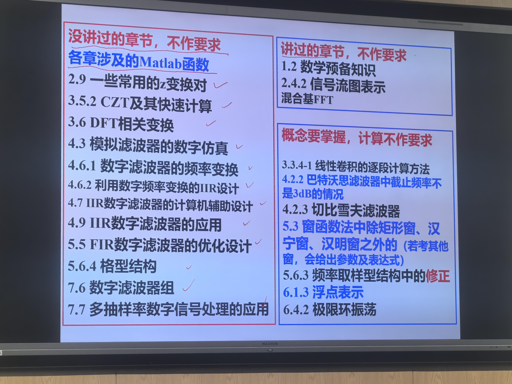

# 大三秋冬课程总结

> [!quote] 写在前面
> 迈入大三，我也逐渐开始更了解自己的学习方式和节奏了。这学期抛开了不少执念，除了 **矩阵论** 坚持去第一排听课 && 随堂整理了每节课笔记之外，其他每一节课几乎都没听过。再加上这个学期压力很大，大作业几乎拖到了学期末统一解决，导致这个学期的期末非常爆炸……
> 
> 以本篇致敬自己这一个月的从未放弃自己。

## 目录:

- 专业必修课:
	- 通信原理(英文班)
	- 信息、控制与计算
	- 数字信号处理
- 专业选修:
	- 矩阵论
	- 天线理论与设计
	- 计算机组成与设计
	- 算法设计与智能计算
- 短学期
	- 电子电路系统综合实验（忘完了，等记起来再补吧 ac01） 
- 思政课
	- 毛概
- 体育课
	- 乒乓球(中级班)
- 研究生课
	- 机器学习(hhj, 秋学期课程)
- 辅修课
	- 机器人技术与实践

## 专业必修课:

### 1. 通信原理 (英文班)

- 学分:3
- 教师: 刘安
- 上课时间: 周一早十
- 点名情况: 本学期有五次quiz和好像是三次QA(?) 其中五次quiz里有1次助教当堂讲掉了, 就当点名了

在学通原之前以为通原主要还是和信息论相关的，学了之后感觉通原主要还是把随过、信号等等这一切都串起来。从补天的感受来看，通原也是工科很典型的模块化和系统的思想，有相应的采样、量化、调制、解调模块，因此一个模块没学或者没听应该也不太影响下一个模块的学习。

lz选课时抽到了英文班，就简单讲讲英文班的体验。从纯上课体验来说，我认为英文班的**讲解顺序**非常奇怪，你搞不清到底它参考的是哪一本教材。展开来讲，它在前半学期（期中考前）完全参考了中文班的顺序，并且除了 **量化** 这个章节外完全就是中文班的内容。后半学期，英文班又突然开始用自己的教材上课，我个人认为是先很浅的讲了讲BASK，BPSK，BFSK等，然后因为和中文班差距甚远，开始通过 **打补丁** 的方式来补充一些章节，例如 Signal Space（星座图 & 施密特正交化），noncoherent的调制，... 等等。虽然我没有跟着老师的节奏来学通原，但在我期末翻看PPT自学时我感觉知识非常分散没有逻辑，额外梳理并且参考中文班资料、大题的命题顺序后才稍稍理出了头绪。不过如果面向考试的话也无需学很详细，引用班友的话，背误码率的时候感觉和数理统计真的挺像的，背出框图，Pe，带宽效率，相当一部分题就可以引刃而解了。

这门课有中英文班基本一致的小测、期中考试和期末考试。**小测上**，可以参考中文班的小测题和（可能有的）小测通知，英文班除了一次并不计分的小测以外，全部都和中文班同卷。**作业上** 英文班应该会有五次作业, 可以参考 [这个前辈](https://github.com/JaceyHuang/ISEE-zju/tree/main/%E5%A4%A7%E4%B8%89%E4%B8%8B/%E9%80%9A%E4%BF%A1%E5%8E%9F%E7%90%86) 的解答, 后续我也会上传我的作业 (相较于之前的答案, 补充了部分新增的题目)。 **思政报告** 应该是期中左右交，都是一些简答性的内容，简单AI一下抄个一两页问题应该不大，**课程设计** 的话如果要好好做可以尽早开始做，不过来不及的话纯vibe coding+参考前人也可以完成。因为时间不够，我几乎完全是vibe coding，还犯了一些小错误，所以就不放上来了，可以参考其他前辈的实现。

**期中和期末备考上**，期中因为内容少时间还算充足，除了量化之外，我直接参考了中文版资料，看完了中文班的课本和PPT，并做了一遍所有的例题，考场上的计算题总体就没啥问题，提前四十多分钟就做完了。但没想到因为几乎完全没看过英文班PPT，选择判断直接看不懂了QAQ  期末的时候因为大作业积压，复习时间很紧张，我主要是看了一遍英文班的PPT，过了几遍中文班的作业题基本掌握了计算，然后看了一遍前辈们留下的宝贵历年卷。没想到考试的计算题和作业题的题型差别还挺大的...考完感觉真的很差，但感觉老师应该捞了（？）

总结一下，在两次考试的复习准备上，如果是英文班的话，需要预留一定的时间，完整的过一下英文班PPT，了解细节 ~~不至于选填翻车~~  ，然后多做几遍中文班的作业题例题，看一看历年卷（但是不可全信，我感觉我们这届和之前的风格跳变不小）。以及最后的OFDM和Sychronization的理论题占比还是不小的，大概会考2-3题，大家还是要准备一下，别像我一样上去乱蒙qwq

### 2. 信息、控制与计算

- 学分: 3
- 教师: 张朝阳
- 上课时间: 周三早十
- 点名情况: 随机纸质签到，后面几乎次次签到 🤣🤣🤣 而且还查代签，有朋友被zzy抓到过代签

> zzy: 请大家务必来教室上课！错过后果不堪设想！

由于辅修的缘故，加上去年上信息理论的时候我非常痴迷于学习信息论，因此信控计这门课的所有内容我基本已经在课前全学过了。先聊 **信息论**，这门课的第二章（也就是信息的度量）我有做非常详细的针对初学的笔记： https://note.slowist.top/isee/information/ ，同时班友在去年修读信息理论时也有写相当优质的笔记： https://brucejqs.github.io/MyNotebook/blog/ACEE/Information%20Theory/  如果是外专业需要用到信息论的话，信控计中信息论部分前两章的知识已经完全够用了，香农的智慧在这两部分知识中也能完全地令人折服。

抛开这门课的设计不谈，单谈这门课涉及的知识，我认为这门课还是有很值得学习的点的。很幸运大二春夏的时候能听余老师讲信息论，从“自信息是不确定性的度量”出发，从而用一套信息论的语言来构建在概率和随机空间内发生的事情。随后事件x,y上升到随机变量X,Y，从而引入了熵的概念，这里信控计在讨论完熵的概念就没有讨论下去了，把它留在了一个数学上的概念，但个人最早被信息论吸引的其中一个点还是它与热力学第二定律里熵的统一，可以读读这个 https://www.zhihu.com/question/593271193/answer/3015378440 ，也可以看看 **麦克斯韦妖** 思想实验，对于一个在数理方面没啥悟性的人，第一次感觉到数学物理世界是这么统一的QAQ 之后信息论开始讲编解码，关于异字头码、Huffman码、香农定律，和学算法的感觉更类似一些，更多是介绍算法性质的，对 树 有一些了解之后学这些编码规则会更贯通一些，当然没有也完全不影响。

后面两章主要涉及信道编码定理（信道容量计算）、有噪信道编码定理（a.k.a. 率失真编码），这部分的理论确实有点难懂，感觉要彻底吃透有点超出我的理解上限了，上学期余老师在介绍的时候，也介绍了对应的研究，包括大名鼎鼎的IB理论、以及 MCR² 算法等等，都是基于率失真编码的推导的。信控计后续又讲解了粗浅的计算理论、机器学习、控制理论，后面这些私以为教了约等于没教，看个乐子就行🤣

这门课我有充足的时间（实则只有一天半🤣）复习，但信控计的内容又杂又多，猜测补天难度应该是不小的。因为之前信息论部分掌握的扎实，后面几章考的也不难，计算方面基本没啥问题，我自己考前把PPT从头到尾很仔细地过了一遍，做了一份较为详细的笔记，最后时间有点紧，小熬了一下看了三四张历年卷就去考了，我们今年的试卷：【信电ISEE】25-26 信控计 回忆 https://www.cc98.org/topic/6400240 总体试卷题量还挺大的，差点没做完…

zzy班今年完全没有小测，**作业** 可以完全参考 【信电ISEE】信控计作业解答 https://www.cc98.org/topic/5796732  不过控制部分可能有几题有点问题（可以参考我笔记里相应题目的解答（if 有） ，**课程设计** 是一个语音控制系统，zzy班是**考试后7天内提交**（其他班貌似是考后一天提交，只有我们班是在考试周结束之后交）。虽然前辈说这是信控计这门烂课里为数不多的精华，但我觉得这个大作业，尤其是在AI时代，好像也没啥意义🤣 而且我到现在都觉得这个大作业有点bug，如果要做到实时译码，按照它给的信道编解码似乎不太容易，究其根本是这个课程设计有点缝合怪的意味。圣遗物设计的语音控制系统大部分基于机器人移动，还有相当一部分没有真正实现到控制，考完有空就琢磨着设计了一个灯光控制系统，让AI糊了一个前端，不过不知道对错orz 请批判看待

最后关于信控计这门课，我的评价是教的都是挺好的且有用的东西，但这门课的考核沦为纯背书和细节怪，最后变得知识涣散，不成体统，zzy天天和同学打游击战式签到，绝对是咎由自取，就不喷更多了。zzy的讲课水平仁者见仁智者见智，作为一个已经学习过一遍坐在教室里听他讲相声的视角来看，zzy个人的理论水平和理解应该还是过关的，但是教的……实在是散而不成体系，而且智云不拿话筒，~~我教的应该比他好。~~

### 3. 数字信号处理

- 学分: 3
- 教师: 李建龙
- 上课时间: 周二双周早八，单周早十
- 点名情况: 本学期应该没签到，实际是我几乎没去

dsp是考试周感觉补天最痛苦的一门。这门课重点落在的是dft/fft,iir/fir,有限字长效应，抽样率转换，关于这门课的重点和学习方法我认为这位前辈讲的很好了 【信电ISEE】信电-信息工程-大三上专业课学习经验贴（dsp，通原，信控计） https://www.cc98.org/topic/5811057  作为学艺不精的补天选手就不多谈了。

补天的时候我把书都看了一遍，整理了一份笔记，所有涉及到过的例题作业题题型基本硬背也背过了一遍，考试时计算题基本全部做出来了。然后主要是刷了一遍ljl的PPT，补了一下小题的知识点，可是考的实在是太细了（无能狂怒）其实主要是时间不够，否则感觉最好还是把dsp这门课有限的历年卷和相关的资料都过一遍。补天的时候注意有些章节完全不考，有些章节不考计算，别搞错了：

ljl班的**作业**有很多莫名其妙的加题，我基本是乱做的，有一些别硬算，可以看看书后面的matlab函数求解。不过dsp双周的讨论课上都会讲解，也可以参考下面上传的资料（不排除有一些小错误ww）。**实验**有圣遗物参考且大体不难。作业和实验分扣的还是不少的，因此关于报名**讲题**，如果大家对平时分有要求也可以试一试，不过ljl会逐页审视你的PPT并且拷打，助教检查的不是特别仔细，我自己上去的时候PPT到处都是小错误，只能尴尬的脚趾扣地🤐

感觉dsp的几道大题当时自己做的还挺明白的，后来朋友考bsp的时候教了她一天，把自己也教通透了。不知道之后有没有机会录个视频讲一讲（挖坑ing）不过b站上也有几个不错的讲解视频了。

最后我觉得fft还是非常有意思的，深挖或者应用都很有说头，尤其是降卷积时间的时候，对这方面感兴趣的前辈也可以进一步了解一下。

## 专业选修

### 4. 矩阵论

- 学分: 2
- 教师: 程磊
- 上课时间: 周一/三 9/10节
- 点名情况: 本学期没有签到

神课！无需多言。从考核角度上看，作业分基本给满，讲作业加平时分，半开卷期末，期末考过完前几年的历年卷基本心里有数了；从上课角度上看，cl老师绝对是我大三这一学期被信电糟糕的课程折磨失望之时的一股清流，这是唯一一门我会主动坐到第一排听的课，~~也是唯一一门老师记住我的网名的课~~ 🤣；从上课内容看，这门课真的给了我很大启发，给了我一个新的视角，一些知识，优化领域譬如牛顿法、梯度下降，矩阵论部分譬如广义逆矩阵、EVD/SVD，我之后在机器人实验课上也有用到，对譬如矩阵、向量求导等知识点也不再是一知半解了。

这门课的内容可以参考philfan大佬的笔记 https://www.philfan.cn/Math/LinearAlgebra/index.html ，总体来讲分为 **矩阵的基本知识**（老师参考了MIT的线性代数，讲解了行视角、列视角下的矩阵，也引入了譬如随机变量、复数讨论下的矩阵，能带来不少新的理解）、**矩阵微分、梯度分析与最优化**（今年因为时间原因，感觉这部分的展开并不是很多，只讲了Armijo准则、一阶梯度下降、牛顿法、Lagrangian、罚函数）、**矩阵方程求解**（LS/DLS/TLS，Tiknohov正则化，老师还穿插了ML和MAP的不少思想）、**EVD** 和 **SVD**（这部分主要是介绍怎么做的，以及一些应用，不过可能是因为时间缘故，只能简单了解）。每章都有一次**作业**，最后一次作业不交但会讲，所有作业会在最后一次的习题课上由同学讲解。每年的作业可能有一些差别，但也能找到答案，而且ddl也比较宽松。

这门课我从第一节课开始就坚持每节课整理笔记，尽量把上课过程中老师提到或者自己想到的一些很妙的点用笔记下来，虽然克服不了遗忘曲线（指cl问我的问题除了英语单词外我好像回答上来了零个），但是在不断反刍和思考的过程中确实得到了相当多的启发，更重要的是换了一种视角去理解矩阵，几乎是完全克服了自己对线代的恐惧。有幸抽到了一次复习pre，于我而言也是一个很好的机会，当时刚好讲到Armijo准则步长选择.etc，准备了五个小时敲了一份PPT，重新梳理了一遍，最后讲的非常开心，在同学私发我说自己讲的不错的时候也很有成就感😋

最后，援引一下我结课时的小作文：

> 矩阵论结束了，稍微写点东西就投入大作业和复习
> 今天的精神其实不甚好，因此心情也不甚好，下午的算法和最后一节矩阵论，都有点脑雾雾的。感冒有一种神奇的魔力，他不会让人很困，但是会让人很累的想睡觉……
> 
> 虽然对矩阵论这门课没有太多信心，感觉考试务必尽力复习才不会砸……但还是很喜欢程老师上的这门课，推荐给 if 看到这里的学弟学妹。我之前极其讨厌线代，原因就是上大学来之后很难适应的线代的思维，硬记了很多公式和结论，成绩虽然好但是几乎是靠纯应试拿下的所有计算的分数。当时学这门课的最大感觉是，我这辈子真的再也不想学线代了，我甚至因此一开始无比的讨厌deeplearning。一碰到有线代的东西，就能成为我退却的理由，甚至其他课里碰到的所有的向量点积，我都会主动展开成 Σ 的形式再做。
> 
> 但是矩阵论说，矩阵/向量是一种建模语言，可以用simplify的思路，当成一种语法来打开他。后面讲的优化、最小二乘种种，贝叶斯视角等等，机器学习里也差不多学到恰好联上了动。可惜之后这样的开拓一种新思路的机会上学校的课估计是没有了，还是要保持开放的心态啊，感觉这样才能看到更多东西。
> 
> 秋学期也算是这么过完了。这半学期最开心的事情其中之一就是上了矩阵论，每次上矩阵论都很开心，就连做 [复习pre](https://interactivemeta.cmc.zju.edu.cn/#/replay?course_id=72937&sub_id=1702845&tenant_code=112)之前讲了两遍，紧张了一节算法课，之后也是很开心的，并且上完课每次都能和yq聊天，感觉是一周中最开心的几个晚上。By the way, 这次至少看起来完全不计分的复习pre应该是我上大学以来最满意的一个pre了，也可能是最后一个这么technical的pre了，我会怀念它的。

### 5. 天线理论与设计

- 学分: 2
- 教师: 王浩刚
- 上课时间: 周一早八，周四9/10
- 点名情况: 本学期没有签到，虽然老师吓人吓了一学期

曲终前辈所言极是 （手动ac06）懒得喷。
【信电ISEE】【2025-2026秋冬】信电电科大三秋冬课程总结（天线理论与设计/边缘计算开发实践/集成电路原理与设计（集电原）/计算机组成与设计（计组）/信息电子学物理基础（信电物）/射频电路与系统/习概/无线电测向） https://www.cc98.org/topic/6408504 

### 6. 计算机组成与设计

- 学分: 3.5
- 教师: 理论课是赵武锋，实验课是经典ty/qmj （虽然选课系统上只会标ty/qmj）
- 上课时间:  理论课周四上午3-5，实验课双周的周三早八
- 点名情况: 两次quiz，两次签到

这门课的情况曲终前辈已经说的很好了，【信电ISEE】【2025-2026秋冬】信电电科大三秋冬课程总结（天线理论与设计/边缘计算开发实践/集成电路原理与设计（集电原）/计算机组成与设计（计组）/信息电子学物理基础（信电物）/射频电路与系统/习概/无线电测向） https://www.cc98.org/topic/6408504 

我来多分享一个样本的数据，作为一个并不喜欢听课的选手，我突发奇想选择了面向计院的计组学习（手动ac01） 在实验和作业driven下，我读完了[NoughtQ](https://note.noughtq.top/sys/co/) 老师和[咸鱼暄](https://xuan-insr.github.io/computer_organization/) 前辈的笔记，事实证明基本是可以完全cover信电这部分的内容。其中计院的Arithmetic学的比信电稍稍多一点（但我也看完了，甚至还在lab30的ALU里自己实现了🤣），其他章节的要求基本是完全一样的。这门课的难点集中在Chap4 CPU和Chap5 Memory Hierachy部分，不过初学的时候我都花了将近一天的时间才慢慢理顺。

**实验课**占0.5学分，主要是自己基本是从0到1写一个pipeline CPU，跑通老师给的相应指令序列。由于在上学期数电的时候我就发现自己挺喜欢硬件的，做这学期的实验的时候就比较有追求的想要手搓lab30的CPU，不得不说这个决定给我带来了一定的麻烦，也是在这个过程中我认为这门课的实验设计的有点不合理。刚学完相关知识之后，一上来就写pipeline CPU确实难度感觉太大了，我个人一开始我试图先写一个单周期CPU，再把它改成流水线，最后又被老师给的框架和冗杂的变量名（因为是基于流水线给的）折磨的要死，最后不得不让AI帮忙debug了一下才让CPU跑通了起来，赶上了最后一次验收。

计组两次**小测**基本和往年一致，不过通过小测也能大致知道这门课平时考点什么，**Project**由往年的三选二改成了两个，因为期末周时间太紧张了我几乎没有细做。今年的第一个似乎是新编的，虽然我也没搞清楚它的意义和它和计组的联系到底是什么（不过出于难度考虑设计成这样也挺合理的，而且我也没啥发言权因为我实在来不及了什么bonus也没写qwq），第二个是经典的Cache Simulator，应该是csapp里改编来的实验，难度不大但对加深这方面的理解还挺有意义的，不过可能会碰到一些奇怪的C语言错误，可以自己写写玩玩加深一下理解。

**期末复习**因为实在来不及了，我一开始对着前人的A4抄了一版，发现空了好多位置，然后看到历年卷就傻眼了[ac01] 于是我把所有历年卷喂给Gemini 让他按章节整理题目和答案，虽然Gemini漏了很多但基本够我扫盲了，做到不会的就往A4上抄，最后我当时咬咬牙基本把这些客观题全写完了，虽然我最后A4也没抄满，但是该抄的也抄到了，还抄到不少原题，属于撞大运了（手动ac06）不过pipeline大题确实有点难做，感觉有点吃理解，感觉还是得平时好好看和梳理、做实验才能完全解出来。

这门课也有几次**作业**，除了Cache那次又多又难（对于当时的我 ac01）以外基本作业量还挺能接受的，也可以在祖传答案里翻一翻看看能不能找到。
### 7. 算法设计与智能计算

- 学分: 3
- 教师: 李东晓
- 上课时间:  周三678
- 点名情况: 除最后一节课pre外，每节课的第一节课下课数字点名，同时穿插上课提问

lz在上学期修了fds，修这门课主要更多是任务量小和混学分的目的，真没想到这课能设计的这么史。这门课从算法的角度依次进行介绍，将各种排序算法、查找算法和数据结构分成减治法、分治法等等，导致整体的逻辑相当混乱；每个算法又浅浅带过，没有任何上机实现的内容，只是每节课课后完成课后的奇怪的算数题，内容又多又杂，除了之前学了的fds，还有AVL Tree，B树，以及分支界定，还有LU分解等奇奇怪怪的数学知识插了进来。今年改成智能计算，主要就是后面改成了讲解仿生算法，主要是一众数模用到的启发式算法，例如模拟退火、蚁群算法、遗传算法等，有打过数模的同学肯定不陌生。这部分没有随堂作业，只需要完成一个组队大作业，ldx班是自定选题实现一个仿生智能算法的相关应用，我们组做了一个aco-ga混合实现tsp的project，靠同组大佬带飞应该直接拿满了。 这门课作业可以参考相应答案，因为我觉得这课太无聊了，很多作业都是AI水的，因此我自己做的答案可能会有错误，请谨慎参考。大作业是大概冬五周左右布置，ldx班是自由组队，一队三个人，最后一节课pre，虽然老师在布置的时候没说pre的时间，但是最后给每个同学都限时了五分钟（要求开计时模式，所以没法看备注qwq），我当时组完队填的太晚了，惨遭最后一个pre（ac01

因为dsp考完我只有一下午复习算法了，A4根本整理不完，所以我自己整理了一面，另一面只能打印了祖传A4（老师上课讲过，可以打印A4）。考试感觉就如ldx所说有点智商测试，复习时要注意涉及过的算法还是要看一遍都搞懂大致是怎么过的，设计题可以看看往年的题，考场上没思路的时候可以先蛮力做一下，做着做着就有思路了，不要空着，即使是蛮力法ldx说也会给一定分数。另外会稳定有一道dp，个人认为还是可以在学习动规上分一点时间。 

这门课还有一次小测，ldx班是在倒数第二节课。发现不会像概统一样完全占据整个窗口，就基本啥也没准备直接AI了，最后Gemini 3 Pro成功坠机了，喜提42/45，错哪里实在没看出来，看了一下全班平均分也大概就是42左右。 

至于这门课的讲课体验，难绷……体感是上课纯念PPT之外还放音量很大的小视频，指望从ldx口中学到什么是不可能了，他还随机抽人回答问题，不知道人不在到底会不会扣分，大家站起来也基本不知道他到底在问啥 

## 思政

### 9. 毛概

- 学分: 3
- 教师: 王立伟
- 上课时间:  周二678
- 点名情况: 本学期未点名

版内关于思政课的资源完全是过饱和的，例如：【学习天地】毛概资源汇总 https://www.cc98.org/topic/6181236  lz在这里只能提供一小些样本点。被队长带飞，感觉这学期毛概我们总体还是挺卷的（大pre拍了一个微电影，读书报告也拍了一个对话，调研报告也写的很认真，最后总体平时分95/96/95折95），如果同是wlw班的话可以参考一下给分。

期末我只有一天时间复习（下午五点—下午两点），相当紧张，感觉时间不够的话把大题背熟，然后可以背一背曲终前辈整理的几张时间表格，刷一刷历年的选择题（我又是Gemini大爹帮我整理了一份选择题，我直接刷刷刷完事orz），最后也得到了一个意料之外的分数。
## 体育课

### 10. 乒乓球（中级班）

- 学分: 1
- 教师: 叶亚金
- 上课时间:  周二910

lz不知天高地厚，一上来就选了中级班 orz 之前从来没学过乒乓球，只是小时候和山上练球的老大爷老大妈学了非常不标准的推球，并且不标准的打了若干年，结果一上来就受到了中级班的暴击(ac01

中级班的考核是一分钟一推一攻（一推一攻算一个），满分是30个，好像是10个开始有分（？）。个人感觉作为一个打的不好不坏的同学，老师教的还挺少的，更多还是自己琢磨，和搭子相互磨合，推球攻球搓球等基本都是上课一带而过。倒数几节课打比赛，因为自己是女生，在四个人里面打完循环赛之后，老师就说就不打了，当时有点小失落qwq 

这门课感觉一直练习一推一攻就太无聊了，不练又很担心期末考不过。不过在玉泉期末考是乒协的同学，或者自己找同学帮忙推球的，总体还算安心。 

最后，叶老师的十二分钟跑还挺严格的，介意的话可以稍微注意一下。 

## 研究生课

### 11. 机器学习（研究生课）

- 学分: 研究生的专业学位课 3学分
- 教师: 胡浩基
- 点名方式：每节课黑板数字点名，开45分钟（是的你没看错，就是45分钟）

关于本科生怎么选研究生课：【学习天地】本科生选研究生课，看这一篇就够了！(tag:选课/ 个性化 / 个性修读 / 个性学分/ 选修研究生课 /学分不够 ) https://www.cc98.org/topic/6111277 

上学期修了胡老师的信号，这学期不知天高地厚补选了胡老师的机器学习，一不小心在退课的最后一天突然选中了，于是开启了一个爆炸的学期……

这门课的前面的SVM和神经网络讲的还是挺不错的，我也写了笔记（ https://note.slowist.top/AI/ML/2/ 及 https://note.slowist.top/AI/ML/3/ ，好像SVM没写完（汗）后面直接面向CMU10-714了，自动微分和CNN我确实没听，也不予置评。

不过这门课的工作量还是挺大的，由于这学期胡老师中间生病拖了一些课时，因此大作业被恰好堆在了本科生的期末周。第一个实验是用SVM的一个上古库(libsvm)训一个手写数字识别，第二个是用提供的NN框架做一定修改，还是训MNIST，第三个是训一个CNN识别CIFAR10。大作业是三选一（人脸活体检测/微调Clip/RAG应用），组队作业上限三人，作为一个不知天厚的本科生我竟然当时脑子一抽选择了单挑，最后没时间做差点险遭挂科，这告诉我们不要随便选研究生课，以及随便单挑折磨自己 ToT

不过总体来看胡老师设计这门课还是相当用心的，到时候我也会整理一下我本学期的课程资料，作为一门机器学习入门课它还是相当可以的。不过感兴趣的同学可以去听一些更有名的公开课，没必要折磨自己。

最后是关于算力，这门课的大作业和训CNN的实验都需要用一些GPU资源，当时实在没时间折腾，直接去恒源云上买了30r的服务器，大作业又稍稍氪金买了一点deepseek的api，基本也能应付得过去。
## 辅修

### 12. 机器人技术与实践（辅修） 

从刚进入工高时就听说了大名鼎鼎的机器人课，虽然无心于具身智能和机器人方向，但依旧对这门课的强度充满了好奇，最后确实这学期有相当一部分课余时间砸在这门课上了，不过有不少是不明所以的调试，有点失落。 

这门课是先上2-3节理论课，再在下午就开始上实验课，虽然课表上标的是6-13，但基本没有拖到晚上的课时。实验部分和机器人的同学是平行的，主要讲授了基础的机器人学知识，并用Coppeliasim和solidworks带我们学习并完成了机器人建模，正逆运动学求解，雅可比矩阵求解等。由个人学习了基本知识和完成了基础实验之后，即组队开始完成画圆画方，以及物块搬运的任务，跑通仿真，在ZJU-I的实物机械臂上跑通，再完成一个空间站机器人的大作业（可以基本理解为换了一个模型，重新进行一遍正逆运动学建模，然后跑通仿真）。最后的大作业是用ROS控制机器人进行一个避障路径规划。总体而言，这门课的讲解及实验确实非常硬核，也有learn from scratch的意味，在骚扰助教，以及自己一点点几乎没依靠圣遗物和AI完全手搓的过程中学到了很多。先给助教磕一个😭

不过这门课还是有相当值得吐槽的点，首先不知道到底是我的水平太差，还是这个仿真软件真的琢磨不透，我实在到最后也很难理解Coppeliasim，解决不了这些奇怪的bug，很多bug最后实在没法解决，只能端给助教，最后大家都没办法只能到此结束。其次，这门课的组队人数让我觉得非常疑惑，一组五个人完成任务，作为我们组的组长，我实在不知道这门课的任务应该怎么平均分配给大家，但自己一个人做又让我觉得无法战胜。因此，在小组作业的时候，我碰到了一些奇怪的困难，例如：我们组有一个同学连续好几次实验负责写报告，有时候我真的觉得很不好意思，但我又实在不知道应该让她做什么，因为一直以来运动学建模都是我们来做的；我自己因为逆运动学求解卡住了导致整组的进度无法推进，而事实上逆运动学求解这一步又非常的难搞，完全不只是我一个人能完成的工作量，但我不知道应该怎么样才能让大家一起来做，因为正逆运动学建模相关的内容一直是我自己做了所有。有时候我不得不承认我自己是一个fw组长，不过也有时候会想这门课也许三个人一组，虽然工作量更大，但也许更合理一点。

总体上这门课还是让我收获很多的，在综合使用各种工具（无论是语言层面上的，matlab，python, C++，还是机器人学上的，Coppeliasim仿真，正逆运动学求解，轨迹规划）的过程中，我感觉自己debug的耐心和工程能力或许会有变强吧。

至于这门课的建议的话，首先可以多问助教多学，至少今年的助教人真的很好，感觉基本遇事不决就在麻烦助教了，跨年夜还在回我钉钉😭（再磕一个）。其次如果之后的实验安排还是一组五人的话，感觉甚至可以轮流做实验。最后之前的理论课还是得听一下大致弄懂，正逆运动学还是要掌握一下的，否则后面的实验还是有点难办。

## 写在后面

这学期在学业上实在过分难熬了，但同样确实收获很大。虽然感觉前途依旧和开学那样一片灰暗，但这半学期来自己能力和心态上的成长还是很明显的，有很大的成就感。

来玉泉之后感觉心静了很多，时常在图书馆或者教四就是坐一整天。在紫金港的时候常常坐在落地窗边上看着日光变暗，在玉泉更多就是走出来天就黑了。每周末固定的会一会在紫金港的朋友，几个月下来似乎也没之前那般亲密了，但在玉泉依旧能和新的朋友一起约乒乓球，几个人一拍即合跑出去唱K，也能和云辩的好朋友约期末周的自习，在十二点的智泉路上洒下放肆的笑声，在黑暗的期末周期待第二天看到她灿烂的笑容。

时常想人总是迷茫的，停留在当下就好了。但这一学期就是飞逝的很快，我来不及做太多准备，就被推着搡着走到了迷茫的关口。很讨厌自己焦虑，讨厌自己情绪化而很努力地披着理智冷静的外壳不为人知，却不得不在一次次近乎是焦虑症发作时平复自己的情绪，让自己理智下来，分析自己到底何去何从。但或许这又是成长带来的阵痛呢？或许捱过这段时间，就会觉得这段时间想通了很多事情，反而弥足珍贵，没那么苦了。

> 一些课程资料因为还没出分（其实更多是我还没整理），就慢慢再补了，反正也不急。orz