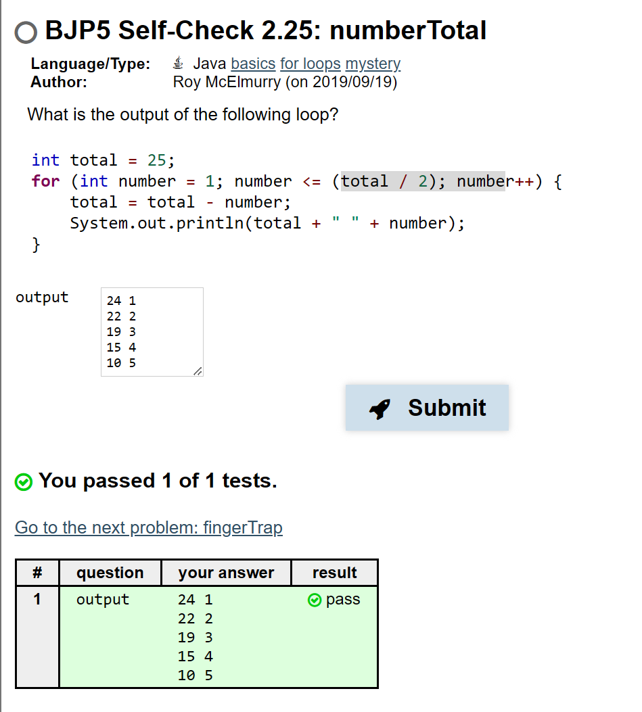

## BJP5 Self-Check 1.26: Confusing

What is the output from the following Java program?
```java
public class Confusing {
    public static void method1() {
        System.out.println("I am method 1.");
    }

    public static void method2() {
        method1();
        System.out.println("I am method 2.");
    }

    public static void method3() {
        method2();
        System.out.println("I am method 3.");
        method1();
    }

    public static void main(String[] args) {
        method1();
        method3();
        method2();
        method3();
    }
}
```

I am method 1.
I am method 1.
I am method 2.
I am method 3.
I am method 1.
I am method 1.
I am method 2.
I am method 1.
I am method 2.
I am method 3.
I am method 1.


## BJP5 Exercise 2.5: starTriangle

Write `for` loops to produce the following output:
```text
*
**
***
****
*****
```

```java
for (int i=0;i<5;i++){
		    for (int j=0;j<i;j++){
			    System.out.print("*");
		    }
		    System.out.println('*');
	    }
```

## BJP5 Self-Check 2.25: numberTotal



- total will **be changing** during the process. while the number is mounting / total is dropping -> as the number increases to 6, the sum will dropp to 4,which is smaller than the number
## BJP5 Exercise 3.23: printIndexed

Write a method called `printIndexed` that accepts a `String` as its parameter and prints the String's characters in order followed by their indexes in reverse order. For example, the call of `printIndexed("ZELDA");` should print `Z4E3L2D1A0` to the console.
This is a **method problem.** Write a Java method as described. Do not write a complete program or class; just the method(s) above.

```java
public static void printIndexed(String s){
	for (int i=0;i<s.length();i++){
		System.out.print(s.charAt(i)+String.valueOf(s.length()-i-1));
	}
}
```

**What I've learned? **
- a Method: `public static void printIndexed(String s)`
- `s.charAt(i)`: same as `s[i]` in python
- `String.valueOf()` : same as `str()` in python
- remember: `java` is a language which is object-oriented. So we use `s.length` to mark the length of `s`
## BJP5 Exercise 4.17: stutter

method problem√

Write a method called `stutter` that accepts a parameter and returns the `String` with its characters returns repeated twice. For example, ``stutter("Hello!") `returns` "HHeelllloo!!"``

```java
public static String stutter(String s){
    String str="";
    for (int i=0;i<s.length();i++){
        char c = s.charAt(i);
        String result = String.format("%c%c",c,c);
        str+=result;
    }
    return str;
}
```

**what have learned?**
- `String result = String.format("%c%c",c,c);` means double the string, using the format method

```java
public static int quadrant(double x, double y){
    if (x==0.0 || y==0.0){
	    return 0;
    }
    else if (x>0.0 && y>0.0){
	    return 1;
    }
    else if (x<0.0 && y>0.0){
	    return 2;
    }
    else if (x<0.0 && y<0.0){
	    return 3;
    }
    else{
	    return 4;
    }
}
```

**Note**:

- `else if` instead of `elif` in python
- `or` → `||`
- `0.0` is actually `double`


