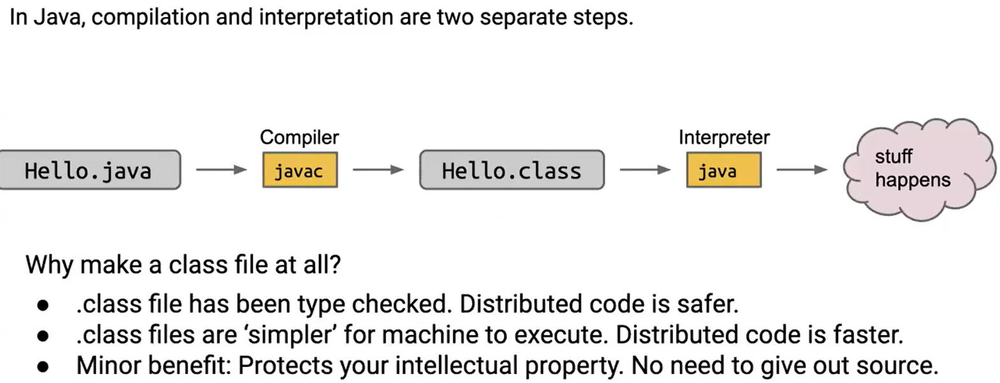

# 1 Make a Class

`print("hello world")`
- JAVA: error: class, interface enum or record expected
	- class(类) is expected in JAVA
$\Rightarrow$  JAVA is an object-oriented(面向对象) programming language


```java
public class HelloWorld{ //define
//main method is written in class
	public static void main(String[] args){
	
	}
}
```

- This equals to the blank program written in python $\rightarrow$

```python

```


the whole program is $\rightarrow$

```java
public class HelloWorld{ //define
//main method is written in class
	public static void main(String[] args){
		System.out.println("Hello world");//print hello world
	}
}
```

- In Java, all code must be part of a class, which defines with `public class`
- inside must be `public static void main(String[] args){` and `}`

# 2 Hello Number

we need to help Java **find** `x`

In Java, you have to **declare that it exists** first
(Actually make it easier to read the code ~~maybe a bit longer~~ )
 
```java
public class HelloWorld{ 
	public static void main(String[] args){
		int x;
		x=0;
		while(x<10){
			System.out.println(x);
			x=x+1;
		}
	}
}
```

- variable has types. it is NOT admitted to say `x='horse'` after you declare `int x;`
	- Actually python has types as well. You can't add horse and 5:

```python
x='horse'+5
print(x)
```

$\Rightarrow$ `Invalid Syntax`

in Java, code can't even run...

# 3 function

```java
public class HelloWorld{ 
	public static int larger(int x, int y){
		if (x>y){
			return x;
		}
		else{
			return y;
		}	
	}
	public static void main(String[] args){
			System.out.println(larger(-5,10));
		}
	}

```

- to define a function we use `public static`
- it can only return ONE value

# 4 how Java functions?



# 5 Features of Object-Oriented Programming

- Modularity(模块化)
	- interact with the module without knowing what's inside
	- how?
		- we write a **class** to build a module
		- write codes inside to **create instances**(创建实例) of that class

in Python, you write:

```python
Class car:
	def __init__(self,m):  
	# constructor, to create a new instance
		self.model = m
		self.wheels = 4
	def drive(self):
		if self.wheels<4:
			print(self.model + "break down")
			return;
		print(self.model + "booooooooooooooom")
	def getNumWheels(self):
		return self.wheels
	def driveintoDitch(self,wheelsLost):
	# wheelsLost represents the num lost by driving into ditch
		self.wheels=self.wheels-wheelsLost
	# That means: in a class, you can also change the object itself:

c1 = Car("c1")
c2 = Car("c2")
c1.drive()
c1.driveIntoDitch(2)
c1.drive()
print(c2.getNumWheels())
```


in Java, it's: 

...pay attention to `this`

```java
public class Car{
	public String model;
	public int wheels;
	public Car(String m){
		this.model=m;
		this.wheels=4;
		// "this" is a reference to the current object being created here
	}
	public void drive(){
		if (this.wheels<4){
			System.out.println(this.model+"break down");
			return;
		}
		System.out.println(this.model+"boooooooooooom")
	}
	public int getNumWheels(){
		return this.wheels;
	}
	public void driveIntoDitch(int wheelsLost){
		this.wheels = this.wheels - wheelsLost
	}
	public static void main(String[] args){
	// to execute, put it in function main

	// firstly, declare that c1&c2 exists
		Car c1;
		Car c2;
		c1 = new Car("c1");
		c2 = new Car("c2"); //new helps Java know that you're creating a new object
		c1.drive();
		c1.driveIntoDitch(2);
		c1.drive();
		System.out.println(c2.getNumWheels());
}
```

- Tips:

```java
	public int getNumWheels(){
		return this.wheels;
	}
```

in this function, actually `this`  is optional -> there's only ONE wheel in this script


# 6 Some Syntax

- Some boolean operators are as follows:

| Python | Java |     |
| ------ | ---- | --- |
| `and`  | `&&` |     |
| `or`   | `    |     |
| `not`  | `!`  |     |
| `==`   | `==` |     |

-  Exponentiation

| Python      | Java                       |
| ----------- | -------------------------- |
| `x = 2**10` | `int x = Math.pow(2, 10);` |

Note that `^` in Java is the "XOR" operator, not the exponentiation operation. That is, `2 ^ 10` is valid code, but it will return `8`, not `1024`.