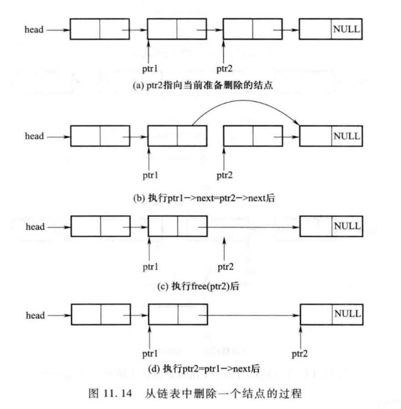

# 链表  

## 一、使用结构嵌套定单向列表节点

### 示例：

```c
struct stud_node{
    int num;
    char name[20];
    int score;
    struct stud_node *next;
}
```

- 结构的递归定义  
- `next`是一个结构指针，指向链表中的下一个节点

### 动态存储分配   

```c
struct stud_node *p; //声明指针变量p
p=(struct stud_node*)malloc(sizeof(struct stud_node)); 
```
!!! note "第二行的意思"
    新申请到的**空间首地址**被强制类型转换成`struct stud_node`型指针，并保存到指针变量`p`中
    若申请成功，`p`指向被分配的内存空间的起始地址

## 二、常用操作

### 2.1 按输入顺序建立单向链表

```c
struct stud_node *Create_Stu_Doc(){
    int num, score; 
    char name[20]; //用来暂存输入量的一些变量
    int size = sizeof(struct stud_node);
    struct stud_node *head, *tail, *p; //头指针，尾指针，一般用来遍历的指针
    head=tail=NULL;
    printf("Input num, name and score:\n");
    scanf("%d%s%d",&num,name,&score);
    while(num!=0){
        p=(struct stud_node*)malloc(size);
        p->num=num;     
        strcpy(p->name,name);
        p->score=score;
        p->next-NULL;
        if(head==NULL) //头指针
            head=p;
        else
            tail->next=p;
        tail=p;
        scanf("%d%s%d",&num,name,&score);
    }
    return head;
}
```

### 2.2 链表的遍历

- `ptr=ptr->next`

### 2.3 链表结点插入


### 2.4 链表结点删除



```c
ptr1->next=ptr2->next;
free(ptr2);
```