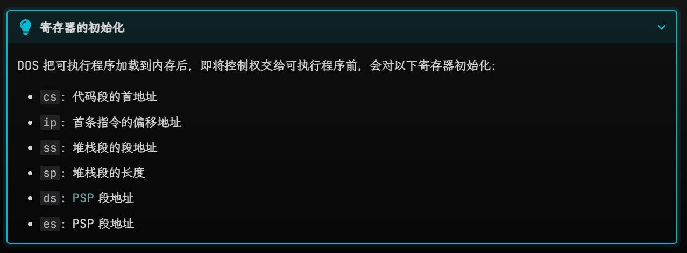
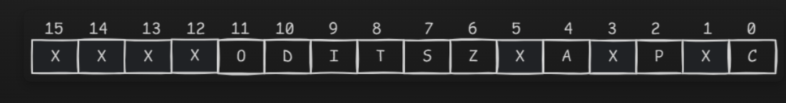
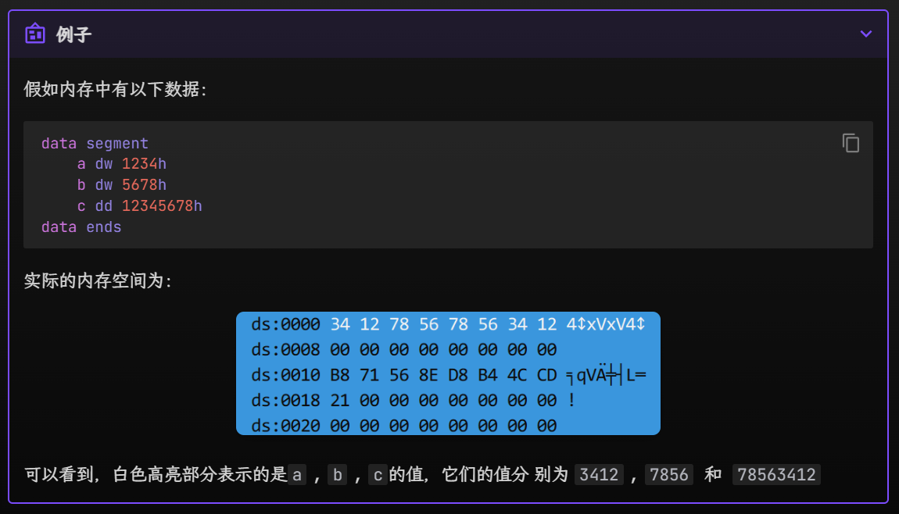

# 汇编复习提纲

!!! abstract "考前补天的幻想"
     背完它，理论考拿下!!!  
	 本章只是我自己的cheatsheet，但我基本啥也没背，所以仅限于有基础的前提下回顾知识点

## 一、数据组织


| 名称  | 英文             | 关键词（定义/ptr） | 内存大小    | 类型(对标C语言)            |
| --- | -------------- | ----------- | ------- | -------------------- |
| 字节  | byte           | db/byte     | 1字节，8位  | `char`               |
| 字   | word           | dw/word     | 2字节，16位 | `short int`          |
| 双字  | double word    | dd/dword    | 4字节，32位 | `float`,`long`       |
| 四字  | quadruple word | dq/qword    | 8字节，64位 | `double`,`long long` |
命名规则：
- 关键词：`d`+英文首字母
- `ptr`：
	- 单个单词：本身
	- 多个单词：第一个单词首字母+第二个单词本身
## 二、寄存器

### 2.1 通用寄存器（4数据+4变址+2指针）

#### 1. 数据寄存器

- `ax`: 累加器，常用于累加：
	- 特殊用法：
		- 乘除法：
			- 乘法: `mul src`:
				- `src` 8位： `ax = al*src`
				- `src` 16位： `dx:ax = al*src`
			- 除法：`div op`
				- `op` 8位：`ah = ax/op`, `al=ax%op`
				- `op` 16位： `ax=(dx:ax)/op,dx=(dx:ax)%op`
- `bx`: 基址寄存器：常用来存放寻址的基址
- `cx`: 计数寄存器，循环中用作计数器
- `dx`：数据寄存器：存放I/O端口地址 // 双子运算中，作为`ax`扩展的高十六位


#### 2. 变址寄存器

- si -> source index 源变址寄存器
- di ->destination index 目的变址寄存器

注意！
- 只有四种寄存器：`bx`、`si`、`di`、`bp`是可以在`[]`内存在的
- 两两一组，只有四种组合：
	- `bx`和`si`
	- `bx`和`di`
	- `bp`和`si`
	- `bp`和`di`

#### 3. 指针寄存器

- `bp`: 只要在`[]`中使用`bp`, 但没有显性给出段地址，段地址默认在`ss`中，比如：
	- `mov ax, [bp]` 即`(ax)=((ss)*16+(bp))`
	- 【其他的段地址默认在`ds`】
- `sp`：**堆栈指针**寄存器：`ss:sp`指向堆栈的顶端

### 2.2 段寄存器：

作用：表示**段地址**
- `cs`: 代码段寄存器，存放代码段的段地址
	- **不能**用mov赋值，只能用`call`/`jmp`/`retf`/`int`/`iret`指令间接改变值
- `ds`: 数据段寄存器，存放数据段的段地址【若没有特意指定，是默认的段地址】
- `es`: 附加段寄存器
- `ss`: 堆栈段寄存器

`ds`、`es`、`ss`可以用`mov`赋值，但源操作数只能是寄存器/变量（八个通用寄存器）

> **CPU 执行指令的流程**
>1. CPU 从`cs:ip`指向的内存单元读取指令，该指令会进入指令缓冲器
>2. `ip = ip + length_of_instruction`，即指向下一条指令
>3. 执行指令，跳到步骤 a，重复这个过程"
>4. 8086CPU 通电或复位后，`cp = ffffh, ip = 0000h`

>"`retf`指令复习"
```c
back_ip = word ptr ss:[sp];
back_cs = word ptr ss:[sp+2];
sp += 4;
if (idata16)
	sp += idata16;
ip = back_ip;
cs = back_cs;
```

### 2.3 偏移地址寄存器

作用：表示偏移地址（段地址：偏移地址）

- `ip`
	- `cs:ip`, 不能直接出现在任何指令中
	- 可以通过`jmp reg`跳转指令等<u>控制转移指令</u>来修改`ip`的内容

>控制转移指令(回头再补)

- `sp`
	- `ss:sp` 指向堆栈顶端
	- [!!] `sp` 不是变址寄存器！不能用在`[]`里面！别记混了！！
- `bx`（通用寄存器）、`bp`、`si`、`di`
	- 能用`[]`间接寻址，也能参与算术、逻辑、移位运算



### 2.4 标志寄存器

作用：存储标志位
寄存器: `fl`，其内部结构如下：


| 指令名称                       | abbr. | 适用范围          |                                                                                         | 相关指令                               |
| -------------------------- | ----- | ------------- | --------------------------------------------------------------------------------------- | ---------------------------------- |
| 进位标志(carry flag)           | `cf`  | 仅对**无符号数**有意义 | `cf`->1:  <br>- 相加产生进位<br>- 相减产生借位<br>- 相乘超过`src`大小<br>- 移位指令最后移出的1位保存在`cf`中            |                                    |
| 零标志(zero flag)             | `zf`  |               | 结果为0：`zf=0` 否则为1                                                                        |                                    |
| **符号标志**(sign flag)        | `sf`  | 仅对**符号数**有意义  | 表示运算结果正负？运算结果+, `sf=0` -，`sf=1`                                                         |                                    |
| **溢出标志**(overflow flag     | `of`  |               | 某些溢出情况->1: <br>- 两个负数相加得正<br>- 两个正数相加得负<br>- 相乘后乘积宽度>被乘数宽度 <br>- 仅移动1位后移动后最高位`!=`移动前最高位 |                                    |
| **奇偶校验标志**(parity flag)    | `pf`  |               | 当运算结果低 8 位中`1`的个数为偶数时，pf = 1，否则 pf = 0（偶校验）                                             |                                    |
| **辅助进位标志**(auxiliary flag) | `af`  |               | `af=0->1` ① 加法时，第3位向第4位进位 ② 减法时，第4位向第3位借位 【和`BCD`码调整指令相关！】                              |                                    |
| **方向标志**(direction flag)   | `df`  |               | 当`df=0`时，字符串操作从低->高，每次操作后`si`,`di`递增<br>当`df=1`时，字符串操作从高->低，每次操作后`si`,`di`递减            | `cld`: 使`df=0` `std`: 使 `df=1`     |
| **中断标志**(interrupt flag)   | `if`  |               | `if = 0`：禁止硬件中断<br>`if = 1`：允许硬件中断                                                      | `cli`（使 if = 0）<br>`sti`（使 if = 1） |
| **陷阱标志**(trap flag)        | `tf`  |               | `tf = 0`：常规模式，连续执行指令<br>`tf = 1`：**单步模式**，每执行一条指令后都会跟随执行`int 01h`中断指令，用于调试              |                                    |


> 移位指令：`shr` & `shl` & `sal` & `sar` & `rol` & `ror` & `rcl` & `rcr`, c里的`>>`

> `BCD`码调整指令/十进制码调整指令

和`tf`有关的指令：`pushf`,`popf`  这是样例程序：

```asm
; 令 tf = 1
pushf           ; 将fl压入堆栈中
pop  ax         ; 从堆栈中弹出`fl`的值并保存到ax中
or   ax, 100h   ; 把ax的第8位置1
push ax
popf            ; 从堆栈中弹出ax的值并保存到fl中，此时tf = 1

; 令 tf = 0
pushf
pop  ax
and  ax, 0FEFFh  ; 把ax的第8位清零
push ax
popf             ; 从堆栈中弹出ax的值并保存到fl中，此时tf = 0
```

结合`pushf`和`popf`指令，可以实现对标志寄存器的访问

- `pushf`
	- 功能：把`fl`压入栈中
	- 等价操作：
```asm
sp-=2;
word ptr ss:[sp]=fl;
```

`popf`

- 功能：从栈中弹出一个字给`fl`
- 等价操作：
```asm
    fl = word ptr ss:[sp];
	sp += 2;
```

- 格式：`popf`

## 三、相关知识点

### 3.1 数据存放 — 小端规则



