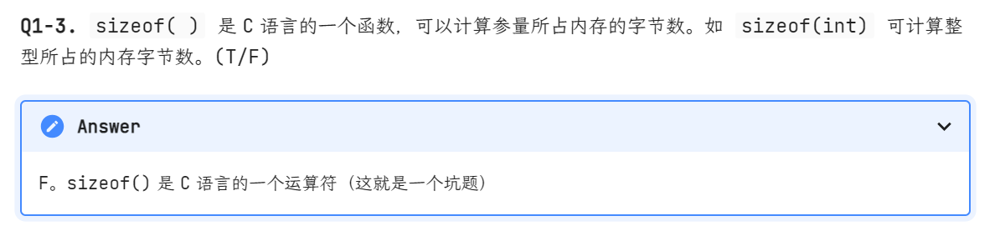
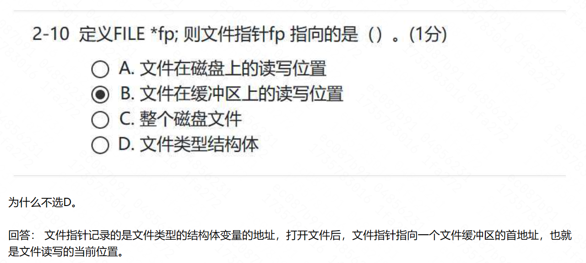

## 运算符




## 链表：
```c
1.下面程序段的运行结果是（ ）。
int x[5] = {2, 4, 6, 8, 10}, *p, **pp;
p = x;
pp = &p;
printf("%d", *(p++));
printf("%d\n", **pp);
```
A.4 4

B.2 4

C.2 2

D.4 6

答：B

解析：

题目中先定义了 int 类型的数组 x，又定义两个指针。

然后 p = x，表示将 x 的基地址赋值给 p，所以 p 指向数组中第一个元素。

第一次打印 *(p++)，获取 p 指向的元素，打印 2， 然后指针位置向后移动一个位置。


因为 pp = &p，表示将 p 的地址赋值给 pp，所以 pp 指向 p，p 经过上次打印时的 ++，已经向后一定一个，所以第二个打印 **pp，打印的就是 4。


5.下面程序段输入一行字符，按输入的逆序建立一个链表。
```c
struct node
    {
        char info;
        struct node *link;

    } * top, *p;
    char c;
    top = NULL;
    while ((c = getchar()) != '\n')
    {
        p = (struct node *)malloc(sizeof(struct node));
        p->info = c;
        ___________;
        top = p;
    }
```

A. top->link=p

B. p->link= top

C. top=p->link

D. p=top->link

答：B

解析：

因为要逆序建立链表，所以让 p->link 赋值为 top，然后 top赋值为 p。

2.下面程序段的输出结果是（ ）。
```c
const char *st[] = {"Hello", "world", "!"}, **p = st;
p++;
printf("%s-%c\n", *p, **p);
(*p)++;
printf("%s-%c-%c\n", *p, **p, (**p) + 1);
```

答：

world-w

orld-o-p

解析：

首先定义了指针数组 st，存储的是 3 个字符串的地址。然后又定义了二级指针变量 p，这里 p 存储的是 st 的基地址。

然后 p++，那么指向了里面的第二个字符串的地址。\*p打印该字符串。world，\*\*p，打印字符 w。

然后 (\*p)++，那么指针向后移动一位，从 o 开始，打印 orld，\*\*p打印 o，(\*\*p) + 1 先取 \*\*p 就是 o 然后再加 1，就是 p。

## 文件

2.缓冲文件系统的文件缓冲区位于（ ）。
A.磁盘缓冲区中
B.磁盘文件中
C.内存数据区中
D.程序文件中

答：C

解析：

文件缓冲区是用以暂时存放读写期间的文件数据而在内存区预留的一定空间

3.定义 FILE *fp;则文件指针 fp 指向的是（ ）。
A.文件在磁盘上的读写位置
B.文件在缓冲区上的读写位置
C.整个磁盘文件
D.文件类型结构

~~答：D~~

~~解析：~~

~~语句 `FILE *fp;`，定义了一个 FILE 结构指针， FILE 是 C 语言为了具体实现对文件的操作而定义的一个包含文件操作相关信息的结构类型。~~

【有争议！】  



