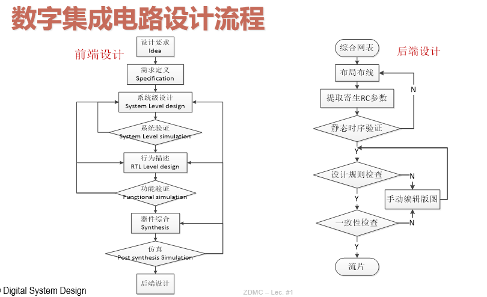
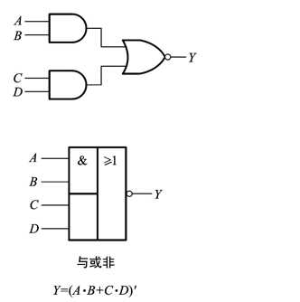
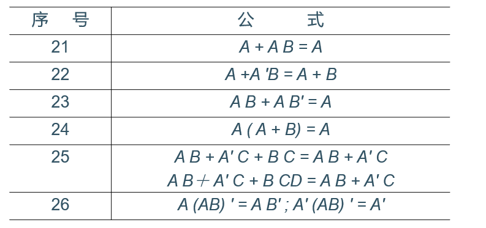

# 1 基础理论知识

## 1 布尔代数

- 与|或|非
- 与或非：AND-NOR

- 异或 | 同或
- A+BC=(A+B)(A+C)

## 2 基本定理

### 2.1 代入定理

在任何一个包含A的逻辑等式中，若以另外一个逻辑式代入式中A的位置，等式依然成立

例如：
由 A+BC = (A+B)(A+C) ，可推出 $\Rightarrow$ A+B(CD)=(A+B)(A+CD)=(A+B)(A+C)(A+D)

### 2.2 反演定理

- $Y \Rightarrow Y', + \Rightarrow \cdot , \cdot \Rightarrow +$
- 原变量 $\Rightarrow$ 反变量
- 反变量 $\Rightarrow$ 原变量

例如：

$Y=A(B+C)+CD$
则按上述规则取反：
$Y'=(A'+B'C')\cdot (C'+D')$
再进行化简：
$Y'=A'C'+A'D'+B'C'+B'C'D'$
$= A'C'+A'D'+B'C'(1+D')$
$=A'C'+A'D'+B'C$

## 3 逻辑函数及其表示方法

- 逻辑式/逻辑图/波形图
- 卡诺图

几种表达方式，需要进行互相转换。此部分同高中技术暂略

### 3.2 逻辑函数的两种标准形式

#### 3.2.1 最小项之和

- 最小项 m :
	- m是乘积项
	- 包含n个因子
	- n个变量均以原变量河反变量的形式在m中出现一次
- 最小项的编号：

- 最小项的性质：
	- 每一项都在
	- 有且仅有一个最小项的值为1
	- 全体最小项之和为1
	- 任何两个最小项之积为0
	- 两个相邻最小项之和可以合并，消去一对因子，只留下公共因子

任何逻辑函数：都可以利用公式(A+A'=1),化作【最小项之和 $\sum m_i$ 】的形式。

例如：

$Y(A,B,C)=ABC'+BC=ABC'+BC(A+A')=ABC'+ABC+A'BC$
$=\sum m(3,6,7)$

#### 3.2.2 最大项之积

- 最大项：
	- M 是相加项
	- 包含 n 个因子
	- n个变量均以原变量和反变量的形式在M中出现一次
- 最大项的性质:

由最小项到最大项表达的推导：

$Y=\sum m_i \Rightarrow Y' = \sum_{k \neq i} m_k$

$\therefore Y=(\sum_{k \neq i} m_k)'$

由反演定理，

$\therefore Y= \Pi_{i \neq k} m_k' = \Pi_{i \neq k} M_k$

因此，一个逻辑表达式既可以表达成最小项之和，又可以表达成最大项之积。

## 4 逻辑表达式的化简

### 4.1 公式化简法

略

### 4.2 卡诺图化简法
### 4.2.1 卡诺图介绍

> 以$2^n$个小方块分别代表$n$变量的所有最小项，并将它们排列成矩阵，而且使**几何位置相邻**的两个最小项在**逻辑上也是相邻的**（只有一个变量不同），就得到表示$n$变量全部最小项的卡诺图

例如：

tips: 所谓的几何关系上的相邻，指的是只有一位的0、1状态进行了变化

### 4.2.2 卡诺图化简

Steps：
1. 将函数表示为最小项之和的形式$\sum m_i$
（实际操作中，可以直接根据逻辑表达式填1的位置）

2. 在卡诺图上与这些最小项对应的位置上填入1, 其余地方填0

3.  具有相邻性的最小项合并，消去不同因子

- 合并原则
	- 两个相邻最小项可合并为一项，消去一对因子
	- 四个排成矩形的相邻最小项可合并为一项，消去两对因子
	- 八个相邻最小项可合并为一项，消去三对因子
- 化简原则：
	- 化简后的乘积项应包含函数式的所有最小项， 即覆盖图中所有的1
	- 乘积项的数目最少，即圈成的矩形最少
	- 每个乘积项因子最少，即圈成的矩形最大

==**注意：**== 由于圈项的方式不一样，化简结果不唯一

在保证上述条件的情况下，可以有冗余，比如：

#### 4.2.3 无关项在化简逻辑函数中的应用

- 无关项：0或1：用x表示

