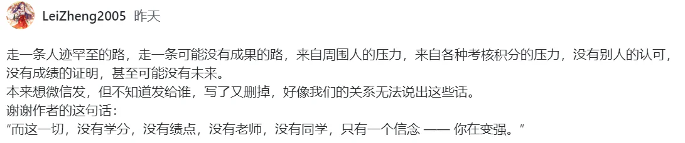

# Slowist's Notebook! 

!!! info "About"
    - 👋 Hi, I'm Slowist from ZheJiang University
    - ✨ ZJU 本科23级 iseer & aceer
    - :heart: 喜欢做梦/写东西
    - Welcome to My [Navigation](https://slowist-lee.github.io/navigation/)!

!!! inline warning "正在整理的笔记"
    - [计算机组成](cs/system/CO/index.md)
    - [Verilog](cs/system/DD/verilog/Language.md)
    - Constructing...

!!! inline tip "较完善的内容"
    - [复变函数与积分变换](Math/complex.md)
    - [英语口译](English/Interpretation/index.md)
    - [电子电路基础](isee/elec/index.md)

!!! stastic "站点统计"
    - :material-file-document: {{ pages }} pages
    - :material-circle-edit-outline: {{ words }} words
    - :fontawesome-solid-code: {{ codes }} lines

??? plan "更新计划"
    - 默认适应系统主题问题
    - giscus明暗主题问题（目前只支持日间主题）   

> quote from `csdiy`  

- 一个人要像一支队伍(｡･ω･｡)  
- Follow My Heart!( ง `ω´ )۶  

-----

